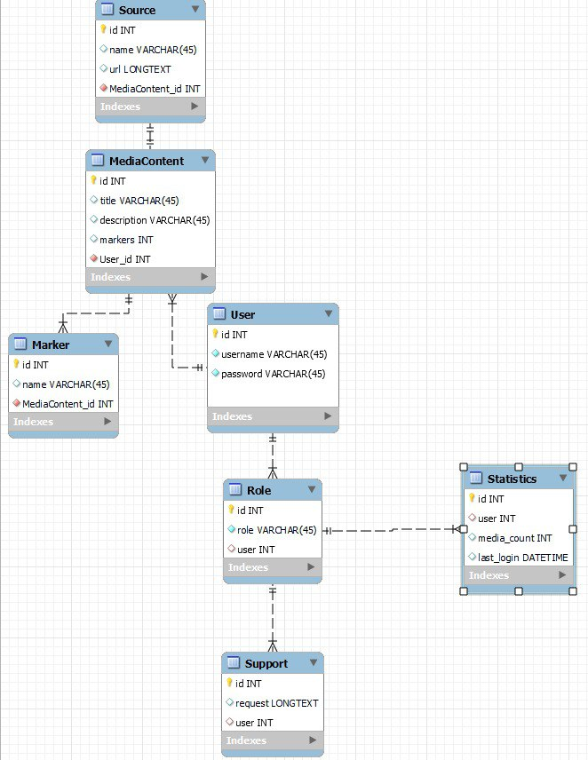

# Проєктування бази даних

В рамках проекту розробляється: 
- модель бізнес-об'єктів 
 

@startuml

entity User 
entity User.id
entity User.name
entity User.email
entity User.password
entity User.role

User.id --* User
User.name --* User
User.email --* User
User.password --* User
User.role --* User

entity Role
entity Role.id
entity Role.name
entity Role.username

Role.id --* Role
Role.name --* Role
Role.username -r-* Role

User "1,1" -- "0,*" Role

entity Support
entity Support.id
entity Support.request
entity Support.message

Support.id -u-* Support
Support.request -u-* Support
Support.message -u-* Support

Role "0,*" -- "1,1" Support

entity Statistics
entity Statistics.id
entity Statistics.user_id
entity Statistics.media_count
entity Statistics.last_login

Statistics.id -u-* Statistics
Statistics.user_id -u-* Statistics
Statistics.media_count -u-* Statistics
Statistics.last_login -u-* Statistics

Role "0,*" -- "1,1" Statistics

entity MediaContent
entity MediaContent.id
entity MediaContent.title
entity MediaContent.description
entity MediaContent.markers
entity MediaContent.timestamp

MediaContent.id --* MediaContent
MediaContent.title --* MediaContent
MediaContent.description --* MediaContent
MediaContent.markers --* MediaContent
MediaContent.timestamp --* MediaContent

User "0,*" -- "1,1" MediaContent

entity Marker
entity Marker.id
entity Marker.name

Marker.id -u-* Marker
Marker.name -u-* Marker

Marker "0,*" -u- "1,1" MediaContent

entity Source
entity Source.id
entity Source.name
entity Source.url

Source.id -u-* Source
Source.name -u-* Source
Source.url -u-* Source

MediaContent "1,1" -- "1,1" Source

@enduml

- ER-модель

@startuml

!define ADMIN_COLOR #FF7700
!define USER_COLOR #00A0FF

entity "Source" as source <<E, ADMIN_COLOR>> {
  +id: int
  --
  name: string
  url: string
}

entity "MediaContent" as media <<E, FFA500>> {
  +id: int
  --
  title: string
  description: string
  markers: string
  timestamp: datetime
}

entity "Marker" as marker <<E, FFA500>> {
  +id: int
  --
  name: string
}

entity "User" as user <<E, USER_COLOR>> {
  +id: int
  --
  username: string
  password: string
  role: int
}

entity "Role" as role <<E, ADMIN_COLOR>> {
  +id: int
  --
  name: string
}

entity "Support" as support <<E, ADMIN_COLOR>> {
  +id: int
  --
  user_id: int
  request: string
}

entity "Statistics" as statistics <<E, ADMIN_COLOR>> {
  +id: int
  --
  user_id: int
  media_count: int
  last_login: datetime
}

source "1,1"--"1,1" media
media "1,1"--"0,*" marker
media "0,*"--"1,1" user
role "0,*"--"1,1" statistics
user "1,1"--"0,*" role
role "0,*"--"1,1" support

@enduml

- реляційна схема

