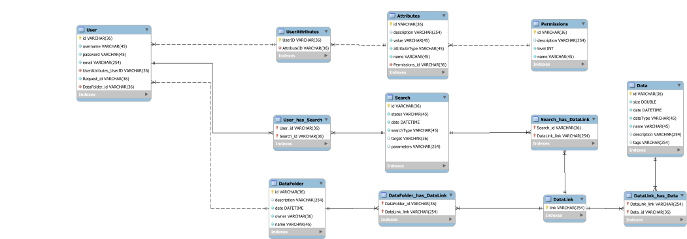

# Проєктування бази даних

В рамках проекту розробляється:

- модель бізнес-об'єктів

@startuml
entity User  #190482
entity User.password  #C2D9FF
entity User.email #C2D9FF
entity User.username #C2D9FF
entity User.id #C2D9FF

entity User_has_Search #190482
entity User_has_Search.User_Id  #C2D9FF
entity User_has_Search.Search_id  #C2D9FF

entity Search #190482
entity Search.id   #C2D9FF
entity Search.status   #C2D9FF
entity Search.searchType  #C2D9FF
entity Search.target  #C2D9FF
entity Search.parameters  #C2D9FF

entity Search_has_DataLink #190482
entity Search_has_DataLink.User_Id  #C2D9FF
entity Search_has_DataLink.DataLink_link  #C2D9FF

entity Attributes  #190482
entity Attributes.description  #C2D9FF
entity Attributes.value #C2D9FF
entity Attributes.attributeType #C2D9FF
entity Attributes.name #C2D9FF
entity Attributes.id #C2D9FF

entity DataFolder  #190482
entity DataFolder.description  #C2D9FF
entity DataFolder.date #C2D9FF
entity DataFolder.owner #C2D9FF
entity DataFolder.name #C2D9FF
entity DataFolder.id #C2D9FF

entity DataFolder_has_DataLink #190482
entity DataFolder_has_DataLink.DataFolder_id  #C2D9FF
entity DataFolder_has_DataLink.DataLink_link  #C2D9FF

entity DataLink #190482
entity DataLink.link  #C2D9FF

entity DataLink_has_Data #190482
entity DataLink_has_Data.Data_id  #C2D9FF
entity DataLink_has_Data.DataLink_link  #C2D9FF

entity Permissions  #190482
entity Permissions.id  #C2D9FF
entity Permissions.name #C2D9FF
entity Permissions.description #C2D9FF
entity Permissions.level #C2D9FF

entity Data  #190482
entity Data.size  #C2D9FF
entity Data.date  #C2D9FF
entity Data.dataType #C2D9FF
entity Data.name #C2D9FF
entity Data.id #C2D9FF
entity Data.description #C2D9FF
entity Data.tags #C2D9FF

entity UserAttributes  #190482
entity UserAttributes.UserID  #C2D9FF
entity UserAttributes.AttributeID #C2D9FF

User.password -d-* User
User.email -d-* User
User.username -d-* User
User.id -d-* User

Data.size -d-* Data
Data.date -d-* Data
Data.dataType -d-* Data
Data.id -d-* Data
Data.name -d-* Data
Data.description -d-* Data
Data.tags -d-* Data

DataFolder.description -d-* DataFolder
DataFolder.date -d-* DataFolder
DataFolder.owner -d-* DataFolder
DataFolder.name -d-* DataFolder
DataFolder.id -d-* DataFolder

UserAttributes.UserID -u-* UserAttributes
UserAttributes.AttributeID -u-* UserAttributes

User_has_Search.User_Id -u-* User_has_Search
User_has_Search.Search_id -u-* User_has_Search

Attributes.description -d-* Attributes
Attributes.value -d-* Attributes
Attributes.attributeType -d-* Attributes
Attributes.name -d-* Attributes
Attributes.id -d-* Attributes

Permissions.description -u-* Permissions
Permissions.level -u-* Permissions
Permissions.name -u-* Permissions
Permissions.id -u-* Permissions

DataFolder_has_DataLink.DataFolder_id  -u-* DataFolder_has_DataLink
DataFolder_has_DataLink.DataLink_link  -u-* DataFolder_has_DataLink

DataLink.link  -u-* DataLink

DataLink_has_Data.Data_id  -u-* DataLink_has_Data
DataLink_has_Data.DataLink_link  -u-* DataLink_has_Data

Search.id  -u-* Search
Search.status  -u-* Search
Search.searchType  -u-* Search
Search.target  -u-* Search
Search.parameters  -u-* Search

Search_has_DataLink.User_Id  -u-* Search_has_DataLink
Search_has_DataLink.DataLink_link  -u-* Search_has_DataLink

User "1,1" -u- "0,*" UserAttributes
User "1,1" -d- "0,*" User_has_Search
User_has_Search "0,*" -d- "1,1" Search
User "1,1" -r- "0,*" DataFolder
Search "1,1" -d- "0,*" Search_has_DataLink
Search_has_DataLink "0,*" -l- "1,1" DataLink
UserAttributes "0,*" -u- "1,1" Attributes
Attributes "1,1" -u- "0,*" Permissions

DataFolder "1,1" -r- "0,*" DataFolder_has_DataLink
DataFolder_has_DataLink "0, *" -r- "1,1" DataLink 
DataLink "1,1" -r- "0, *" DataLink_has_Data
DataLink_has_Data "0, *" -r- "1,1" Data
@enduml

- ER-модель

@startuml

	entity User  {
		id: UUID
		password: TEXT
		username: TEXT
		email: TEXT
	}

	entity UserAttributes  {
		UserID: UUID
		AttributeID: UUID
	}

	entity Search  {
		id: UUID
		status: TEXT
		searchType: TEXT
		target: TEXT
		parameters: TEXT
	}
	
	entity Search_has_DataLink {
		Search_id: UUID 
		DataLink_link: TEXT
	}
	
	entity User_has_Search  {
		User_id: UUID
		Search_id: UUID
	}

	entity DataFolder  {
		id: UUID
		description: TEXT
		date: DATETIME 
		owner: TEXT
		name: TEXT
	}
	
	
	entity DataFolder_has_DataLink  {
		DataFolder_id: UUID
		DataLink_link: UUID
	}

	entity Data  {
		id: UUID
		size: DOUBLE
		date: DATETIME 
		dataType: TEXT
		name: TEXT
		description: TEXT
		tags: TEXT
	}
	
	entity DataLink_has_Data  {
		Data_id: UUID
		DataLink_link: UUID
	}

	entity Attributes  {
		id: UUID
		description: TEXT
		value: TEXT
		attributeType: TEXT
		name: TEXT
	}

	entity Permissions  {
		id: UUID
		description: TEXT
		level: INT
		name: TEXT
	}

	entity DataLink  {
		link: TEXT
	}

User "1,1" --> "0,*" UserAttributes
User "1,1" --> "0,*" User_has_Search
User_has_Search "0,*" --> "1,1" Search
User "1,1" --> "0,*" DataFolder
Search "1,1" --> "0,*" Search_has_DataLink
Search_has_DataLink "0,*" --> "1,1" DataLink
UserAttributes "0,*" --> "1,1" Attributes
Attributes "1,1" --> "0,*" Permissions

DataFolder "1,1" --> "0,*" DataFolder_has_DataLink
DataFolder_has_DataLink "0, *" --> "1,1" DataLink 
DataLink "1,1" --> "0, *" DataLink_has_Data
DataLink_has_Data "0, *" --> "1,1" Data

@enduml

- реляційна схема

