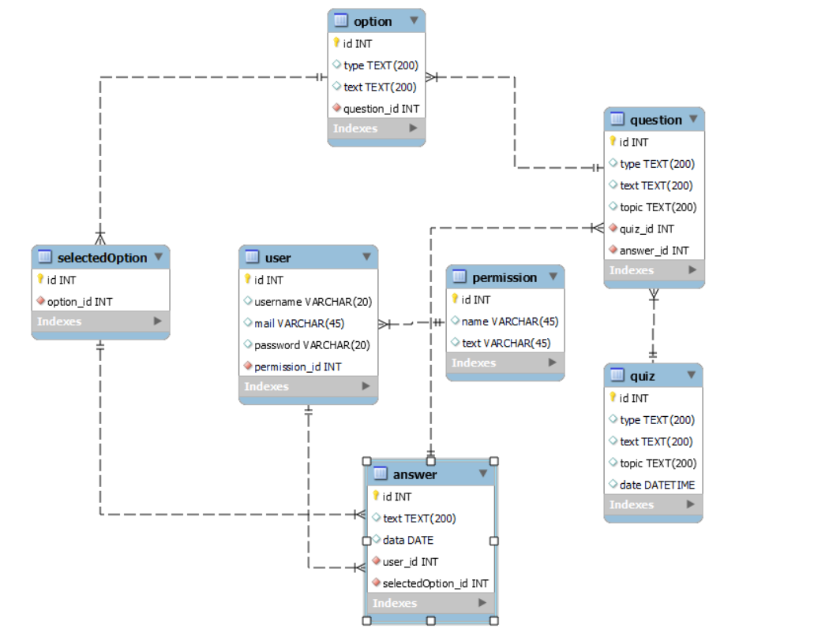

# Проєктування бази даних

## Модель бізнес-обʼєктів

@startuml
  
  entity SelectedOption <<ENTITY>>

  entity Option <<ENTITY>>
  entity Option.id <<NUMBER>> #ffffff
  entity Option.text <<TEXT>> #ffffff
  entity Option.type <<TEXT>> #ffffff

  entity Answer <<ENTITY>>
  entity Answer.id <<NUMBER>> #ffffff
  entity Answer.text <<TEXT>> #ffffff
  entity Answer.date <<DATE>> #ffffff
  entity Answer.userId <<NUMBER>> #ffffff
   

  entity Question <<ENTITY>>
  entity Question.id <<NUMBER>> #ffffff
  entity Question.text <<TEXT>> #ffffff
  entity Question.type <<TEXT>> #ffffff

  entity Quiz <<ENTITY>>
  entity Quiz.id <<NUMBER>> #ffffff
  entity Quiz.text <<TEXT>> #ffffff
  entity Quiz.type <<TEXT>> #ffffff
  entity Quiz.topic <<TEXT>> #ffffff
  entity Quiz.date <<DATE>> #ffffff
	entity Quiz.state <<TEXT>> #ffffff
 
 

  Option.id -u-* Option
  Option.text -u-* Option
  Option.type -u-* Option

  Answer.id -u-* Answer
  Answer.text -u-* Answer
  Answer.date -u-* Answer
  Answer.userId -u-* Answer
  
  Question.id -u-* Question
  Question.text -u-* Question
  Question.type -u-* Question

  Quiz.id -d-* Quiz
  Quiz.text -d-* Quiz
  Quiz.type -d-* Quiz
  Quiz.topic -d-* Quiz
  Quiz.date -d-* Quiz
	Quiz.state -d-* Quiz

  
  Question"1,1"-l- "0,*" Answer
  Quiz "1,1" -d- "0,*" Question
  Question "1,1" -d- "0,*" Option
  Answer"1,1" -u- "0,*" SelectedOption
  SelectedOption"1,1"-u- "0,*"Option
@enduml

@startuml

  entity User <<ENTITY>>
  entity User.username <<TEXT>> #ffffff
  entity User.mail <<TEXT>> #ffffff
  entity User.password <<TEXT>> #ffffff
  entity User.id <<NUMBER>> #ffffff

  entity Permission <<ENTITY>>
  entity Permission.id <<NUMBER>> #ffffff
  entity Permission.name <<TEXT>> #ffffff
  entity Permission.text <<TEXT>> #ffffff

  User.username -u-* User
  User.mail -u-* User
  User.password -u-* User
  User.id -u-* User
  Permission "1,*" -u- "1,1" User
  Permission.id --* Permission
  Permission.name --* Permission
  Permission.text --* Permission

@enduml

## ER-модель

@startuml
	entity User <<ENTITY>> {
    id:INT
    usersname:TEXT
    mail:TEXT
    password:TEXT
  }
    entity Permission <<ENTITY>> {
    id: INT
    name: TEXT
    text: TEXT
  }
  User "0,*" ->  "1,1" Permission
  
  entity Quiz <<ENTITY>>{
    id:INT
    text:TEXT
    type:TEXT
    topic:TEXT
    date:DATE
  }
  
  entity Question <<ENTITY>>{
    id:INT
    type:TEXT
    text:TEXT
    min: int
    max: int
  }

  entity Option <<ENTITY>>{
		id:INT
    type:TEXT
    text:TEXT    
	}

  entity Answer <<ENTITY>> {
    userId:INT
    id:INT
    text:TEXT
    data:DATE
  }
  
  entity SelectedOption {
		id: INT
  }

  Question "1, 1"<-u- "0, *" Option
  Answer "0, *" <-u- "1, 1" Question
  Quiz "1, 1" -u-> "0, *" Question
  Answer "0, *" <-u- "1, 1" User
  Answer "1, 1" <-u- "0, *" SelectedOption
  SelectedOption "1, 1" <-u- "0, *" Option
@enduml

## Реляційна схема

