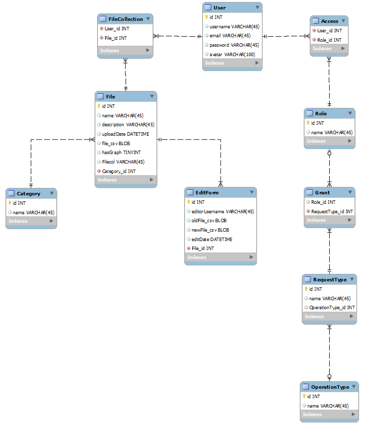

# Проєктування бази даних

### В рамках проекту розробляється: 

## модель бізнес-об'єктів 

@startuml
entity User
entity User.id #ffffff
entity User.username #ffffff
entity User.email #ffffff
entity User.password #ffffff 
entity User.avatar #ffffff

entity Role
entity Role.name #ffffff
entity RegularUser #ffffff
entity Editor #ffffff
entity Administrator #ffffff

entity Access
entity Grant

entity RequestType
entity RequestType.name #ffffff

entity OperationType
entity Read #ffffff
entity Delete #ffffff
entity Upload #ffffff
entity Edit #ffffff
entity ManageEditors #ffffff
entity Donate #ffffff
entity OperationType.name #ffffff

entity FileCollection

entity File
entity File.name #ffffff 
entity File.id #ffffff 
entity File.description #ffffff 
entity File.file_csv #ffffff 
entity File.uploadDate #ffffff
entity File.hasGraph #ffffff

entity EditForm
entity EditForm.editorUsername #ffffff
entity EditForm.editorUserid #ffffff
entity EditForm.oldFile_csv #ffffff
entity EditForm.newFile_csv #ffffff
entity EditForm.editDate #ffffff

entity Category
entity Category.name #ffffff
entity Category.id #ffffff

User.username -d-* User
User.id -d-* User
User.email -d-* User 
User.password -d-* User 
User.avatar -l-* User

User "1,1" -l- "0,*" Access
Access "0,*" -l- "0,1" Role
Role "0,1" -d- "0,*" Grant
Grant "0,*" -d- "1,1" RequestType
RequestType "0,*" -d- "0,1" OperationType
Role.name -r-* Role
RegularUser ..> Role : instanceOf
Editor ..> Role : instanceOf
Administrator ..> Role : instanceOf

RequestType.name -l-* RequestType

OperationType.name -l-* OperationType
Read .r.> OperationType : instanceOf
Delete  .u.> OperationType : instanceOf
Upload .u.> OperationType : instanceOf
Edit .u.> OperationType : instanceOf
ManageEditors .u.> OperationType : instanceOf
Donate  .u.> OperationType : instanceOf

User "1,1" ---d- "0,*" FileCollection
FileCollection "0,*" -d-- "1,1" File

EditForm "0,*" --u- "1,1" File
Category "1,1" --u- "0,*" File
 
File.name -d-* File
File.id -d-* File
File.description -r-* File
File.file_csv -d-* File
File.uploadDate -d-* File
File.hasGraph -l-* File

Category.name -u-* Category
Category.id -u-* Category

EditForm.editorUsername -l-* EditForm
EditForm.editorUserid -r-* EditForm
EditForm.oldFile_csv -u-* EditForm
EditForm.newFile_csv -u-* EditForm
EditForm.editDate -u-* EditForm
@enduml

## ER-модель

@startuml 

entity User <<ENTITY>> {
    id: UUID
    username: TEXT
    email: TEXT
    password: TEXT
    avatar: TEXT
}

entity FileCollection

entity Role <<ENTITY>> {
    name: TEXT
}
object RegularUser #ffffff
object Editor #ffffff
object Admin #ffffff

entity Grant
entity Access

entity RequestType <<ENTITY>> {
    name: TEXT
}

entity OperationType <<ENTITY>> {
    name: TEXT
}
object Read #ffffff
object Donate #ffffff
object Edit #ffffff
object Upload #ffffff
object Delete #ffffff
object ManageEditors #ffffff

entity File <<ENTITY>> {
    id: NUMBER
    name: TEXT 
    description: TEXT 
    file_csv: TEXT
    uploadDate: DATE
    hasGraph: BOOL  
}

entity Category <<ENTITY>> {
    id: NUMBER
    name: TEXT
}

entity EditForm <<ENTITY>> {
    editorUserid: UUID
    editorUsername: TEXT
    oldFile_csv: TEXT
    newFile_csv: TEXT
    editDate: DATE
}

Role "0,1" -u- "0,*" Access
Access "0,*" -l- "1,1" User
RegularUser ..> Role : instanceOf
Editor ..> Role : instanceOf
Admin ..> Role : instanceOf
Grant "0,*" -u- "0,1"  Role
RequestType "1,1" -u- "0,*"  Grant
RequestType "0,*" -- "0,1" OperationType
Read .u.> OperationType : instanceOf
Donate .u.> OperationType : instanceOf
Edit .u.> OperationType : instanceOf
Upload .u.> OperationType : instanceOf
Delete .u.> OperationType : instanceOf
ManageEditors .u.> OperationType : instanceOf
User "1,1" -d- "0,*" FileCollection
FileCollection "0,*" -d- "1,1" File
EditForm "0,*" -u- "1,1" File
Category "1,1" -u- "0,*" File

@enduml 

## Опис Моделей

### User

Сутність, яка являє собою обліковий запис користувача з особистою інформацією.
Має поля:
- userid - id користувача
- username - ім'я користувача.
- email - адреса електронної пошти користувача.
- password - пароль користувача.
- avatar - фотографія профілю користувача.

### Role

Сутність, яка використовується для визначення прав користувача.
Має поля:
- name - Назви ролей

Роль може не мати прав, або може мати скільки завгодно.
Роль може не мати доступів, або може мати скільки завгодно.

### RequestType

Сутність, яка містить в собі об'єкт (унікальний id в системі), якому надають певний доступ, і сам доступ, який забезпечується словником OperationType.

### OperationType

Словник, який зберігає в собі перелік дій, які можуть бути виконані над сутністю системи.
- name - назва дії.

### Access

Сутність-асоціація, яка зберігає в собі сукупність ролей, які надані користувачу. В таблиці може існувати необмежена кількість сутностей, які стосуються одного користувача і які стосуються однієї ролі.

### Grant

Сутність-асоціація, яка зберігає сукупність прав, які має певна роль. В таблиці може існувати необмежена кількість сутностей, які стосуються ролі і які стосуються виконуваної дії над певним об'єктом.

### FileCollection

Сутність-асоціація, яка зберігає в собі сукупність файлів з даними для користувача. В таблиці може існувати необмежена кількість сутностей, які стосуються одного користувача і які стосуються одного файлу.

### File

Сутність, яка являє собою файл з набором певних статистичних даних.
Має поля:
- name - назва файлу.
- id - id файлу.
- description - опис змісту файлу.
- file_csv - формат відображення даних.
- uploadDate - дата завантаження файлу.
- hasGraph - чи є візуалізація графіком.

### EditForm

Сутність, яка являє собою форму для редагування даних у файлі.
Має поля:
- editorUsername - ім'я редактора, який вніс зміни у файл.
- editorUserid - id редактора, який вніс зміни у файл.
- oldFile_csv - старий незмінений файл.
- newFile_csv - новий змінений файл.
- editDate - дата зміни файлу.

### Category

Сутність, яка являє собою категорію до якої належить файл даних.
Має поля:
- name - назва категорії.
- id - id категорії.

## реляційна схема

