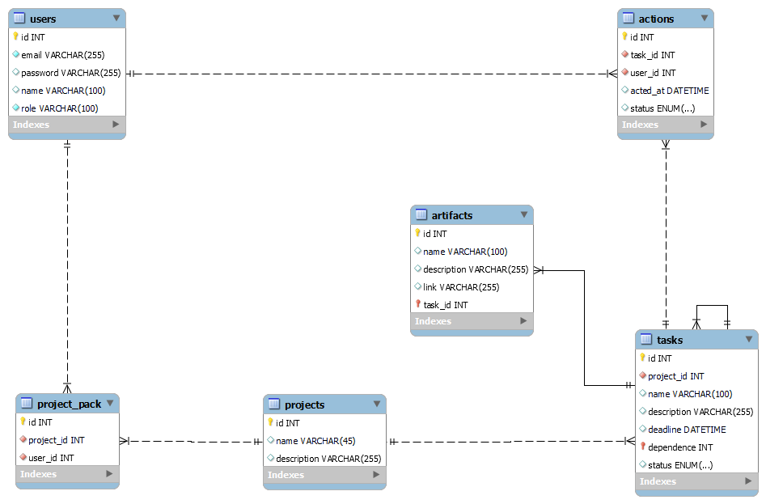

# Проєктування бази даних

В рамках проекту розробляється: 
## Модель бізнес-об'єктів

  ### Узагальнена схема
@startuml
entity User {
}

entity Project {
}

entity Action {
}

entity Task{
}

entity Action.name{
}

entity Action.status{
}

entity Action.actedAt{
}

entity Project.name{
}

entity Project.description{
}

entity User.password{
}

entity User.Role{
}

entity User.email{
}

entity Task.status{
}

entity Task.deadline{
}

Entity Task.description{
}

entity Task.name{
}

Entity Artifact{
}

entity Artifact.name{
}

entity Artifact.description{
}

entity Artifact.link{
}

entity ProjectPack{
}

Class Task.dependence{
}

User "(0,*)" -- "(1,1)" Project
User "(1,1)" <--> "(0,*)" ProjectPack
Project "(0,*)" <--> "(1,1)" ProjectPack
Action "(1,1)" -- "(0,*)" Task
Action "(0,*)" -- "(1,1)" User
Task "(1,1)" -- "(0,*)" Project
Artifact "(0,*)" -- "(1,1)" Task

Artifact.link *-- Artifact
Artifact.description *-- Artifact
Artifact.name *-- Artifact

Action *-- Action.status
Action *-- Action.actedAt

Task *-- Task.name
Task *-- Task.deadline
Task *-- Task.status
Task *-- Task.description
Task *-- Task.dependence

User *-- User.password
User *-- User.Role
User *-- User.email

Project *-- Project.name
Project *-- Project.description

@enduml

  ### Детальна Схема
@startuml
entity User {
}

entity Project {
}

entity Action {
}

entity Task{
}

entity Action.name{
}

entity Action.status{
}

entity Action.actedAt{
}

entity Project.name{
}

entity Project.description{
}

entity User.password{
}

entity User.Role{
}

entity User.email{
}

entity Task.status{
}

entity Task.deadline{
}

Entity Task.description{
}

entity Task.name{
}

Entity Artifact{
}

entity Artifact.name{
}

entity Artifact.description{
}

entity Artifact.link{
}

entity ProjectPack{
}

Class Task.dependence{
}

abstract created{
}

abstract completed{
}

abstract resolved{
}

abstract closed{
}

abstract reopened{
}

abstract ToDo{
}

abstract inProgress{
}

abstract done{
}

abstract RESOLVED{
}

abstract completed

User "(0,*)" -- "(1,1)" Project
User "(1,1)" <--> "(0,*)" ProjectPack
Project "(0,*)" <--> "(1,1)" ProjectPack
Action "(1,1)" -- "(0,*)" Task
Action "(0,*)" -- "(1,1)" User
Task "(1,1)" -- "(0,*)" Project
Artifact "(0,*)" -- "(1,1)" Task

Artifact.link *-- Artifact
Artifact.description *-- Artifact
Artifact.name *-- Artifact

Action *-- Action.status
Action *-- Action.actedAt

Task *-- Task.name
Task *-- Task.deadline
Task *-- Task.status
Task *-- Task.description
Task *-- Task.dependence

User *-- User.password
User *-- User.Role
User *-- User.email

Project *-- Project.name
Project *-- Project.description

ToDo ..> Task.status
inProgress ..> Task.status
done ..> Task.status
RESOLVED ..> Task.status
created ..> Action.status
completed ..> Action.status
resolved ..> Action.status
closed ..> Action.status
reopened ..> Action.status

@enduml

## ER-модель
@startuml
entity User {
email: TEXT
password: TEXT
name: TEXT
role: TEXT(enum:"TEAMLEAD", "PROJECT MANAGER", "DEVELOPER", "USER")
}

entity Project {
name: TEXT
description: TEXT
}

entity ProjectPack {
}

entity Action {
actedAt: DATETIME
status: TEXT(enum:"TO DO", "IN PROGRESS", "RESOLVED", "DONE")
}

entity Task{
name : TEXT
description: TEXT
dependence: INT
deadline: DATE
}

Entity Artifact{
name: TEXT
description: TEXT
link: TEXT
}

User "(0,*)" -- "(1,1)" Project
User "(1,1)" <--> "(0,*)" ProjectPack
Project "(0,*)" <--> "(1,1)" ProjectPack
Action "(1,1)" -- "(0,*)" Task
Action "(0,*)" -- "(1,1)" User
Task "(1,1)" -- "(0,*)" Project
Artifact "(0,*)" -- "(1,1)" Task

@enduml

## Реляційна схема

