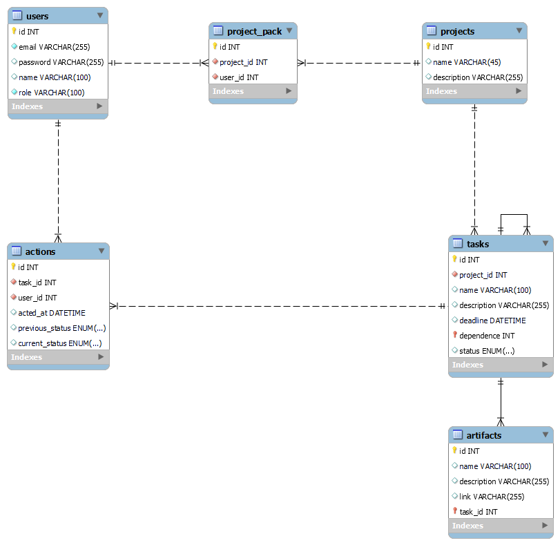

# Проєктування бази даних

В рамках проекту розробляється: 
## Модель бізнес-об'єктів
@startuml 
class User { }

class Project { }

class Action { }

class Task{ }

entity Action.actedAt{ }

entity Project.name{ }

entity Project.description{ }

entity password{ }

entity User.Role{ }

entity User.email{ }

entity Task.status{ }

entity Task.deadline{ }

Entity Task.description{ }

entity Task.name{ }

Class Artifact{ }

entity Artifact.name{ }

entity Artifact.description{ }

entity Artifact.link{ }

Class Role{ }

entity Task.dependence{ }

Enum role
{
TeamLead
ProjectManager
Developer
}

enum status
{
ToDo
InProgress
Done
RESOLVED
}

entity Action.previous_status

entity Action.curent_status

User "(0,)" -- "(1,1)" Project
User "(1,1)" <--> "(0,)" Role
Project "(0,)" <--> "(1,1)" Role
Action "(1,1)" -- "(0,)" Task
Action "(0,)" -- "(1,1)" User
Task "(1,1)" -- "(0,)" Project
Artifact "(0,)" -- "(1,1)" Project

Artifact.link-- Artifact 
Artifact.description -- Artifact 
Artifact.name-- Artifact

Action -- Action.curent_status
Action-- Action.previous_status
Action -- Action.actedAt

role -- User.Role

status --* Action.curent_status
status --* Action.previous_status
status --* Task.status

Task -- Task.name 
Task-- Task.deadline 
Task -- Task.status 
Task-- Task.description 
Task -- Task.dependence

User-- password 
Role -- User.Role 
User-- User.email

Project -- Project.name 
Project-- Project.description

@enduml
 

## ER-модель
@startuml
class User {
email: TEXT
password: TEXT
name: TEXT
}

class Project {
name: TEXT
description: TEXT
}

class Role {
user.role: (ENUM:"TEAMLEAD", "PROJECT MANAGER", "DEVELOPER")
}

class Action {
actedAt: DATETIME
curent_status: (ENUM:"TO DO", "IN PROGRESS", "RESOLVED", "DONE")
previous_status: (ENUM:"TO DO", "IN PROGRESS", "RESOLVED", "DONE")
}

class Task{
name : TEXT
description: TEXT
dependence: INT
deadline: DATE
status: (ENUM:"TO DO", "IN PROGRESS", "RESOLVED", "DONE")

}

class Artifact{
name: TEXT
description: TEXT
link: TEXT
}

User "(0,*)" -- "(1,1)" Task
User "(1,1)" <--> "(0,*)" Role
Project "(0,*)" <--> "(1,1)" Role
Action "(1,1)" -- "(0,*)" Task
Action "(0,*)" -- "(1,1)" User
Task "(1,1)" -- "(0,*)" Project
Artifact "(0,*)" -- "(1,1)" Project

@enduml

## Реляційна схема

