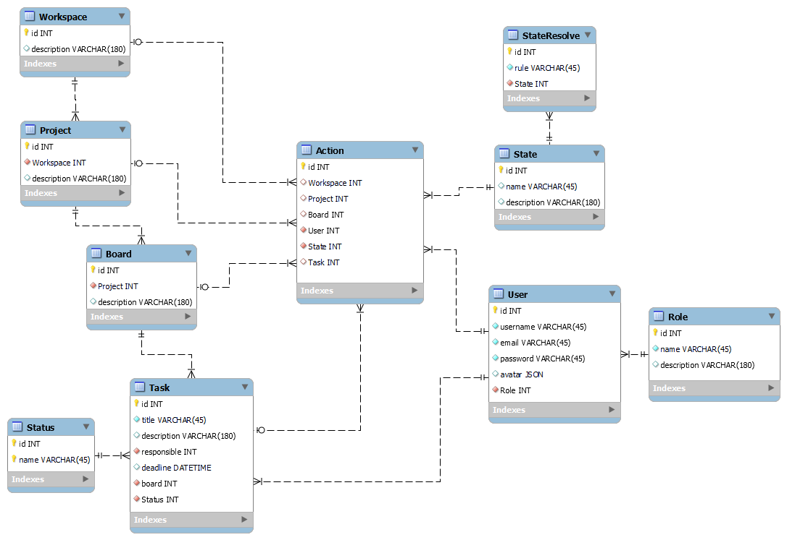

# Проєктування бази даних

В рамках проекту розробляється: 
- модель бізнес-об'єктів 
- ER-модель
- реляційна схема

## Модель бізнес-об'єктів
@startuml

entity Quiz
entity Quiz.type
entity Quiz.text
entity Quiz.id
entity Quiz.title
entity Quiz.datetime

entity Question
entity Question.id
entity Question.content
entity Question.type

entity User
entity User.email
entity User.password
entity User.username
entity User.id

entity Permission
User.email --* User
User.password --* User
User.username --* User
User.id --* User
Permission "1,*" -u- "1,1" User
Permission.id --* Permission
Permission.name --* Permission
Permission.text --* Permission

entity Option
entity Option.id
entity Option.text
entity Option.type

entity ChosenOption
entity Answer
entity Answer.id
entity Answer.text 
entity Answer.datetime

Quiz *--- Quiz.id
Quiz *--- Quiz.text
Quiz *--- Quiz.type
Quiz *--- Quiz.title
Quiz *--- Quiz.datetime

Question *--- Question.id
Question *--- Question.content
Question *--- Question.type

Option *--- Option.id
Option *--- Option.text
Option *--- Option.type

Answer *--- Answer.id
Answer *--- Answer.text
Answer *--- Answer.datetime

Quiz "1,1"--l-- "0,*" Question
Question "1,1" --- "0,*" Option
Question "1,1" --l-- "0,*" Answer
Option "0,*" --- "1,1" ChosenOption
ChosenOption "0,*" --- "1,1" Answer

@enduml

## ER-модель

@startuml

  
entity Quiz{
    id: INT
    text: TEXT
    title: TEXT
    datetime: DATETIME
}

entity QuizType <<ENUMERATION>>{
    id: INT
    name: TEXT
}

entity User{
    id: INT
    email: TEXT
    password: TEXT
    username: TEXT
}
  
entity Question{
    id: INT
    content: TEXT
}

entity QuestionType <<ENUMERATION>>{
    id: INT
    name: TEXT
}

entity Answer{
    id: INT
    text: TEXT
    datetime: DATETIME
}

entity Option{
    id: INT
    text: TEXT
}

entity OptionType <<ENUMERATION>>{
    id: INT
    name: TEXT
}

entity ChosenOption{
    id: INT
}

entity Permission <<ENUMERATION>> {
    id: INT
    name: TEXT
    text: TEXT
}

User "0,*" ->  "1,1" Permission

Quiz *--- Quiz.id
Quiz *--- Quiz.text
Quiz *--- Quiz.type
Quiz *--- Quiz.title
Quiz *--- Quiz.datetime

Question *--- Question.id
Question *--- Question.content
Question *--- Question.type

Option *--- Option.id
Option *--- Option.text
Option *--- Option.type

Answer *--- Answer.id
Answer *--- Answer.text
Answer *--- Answer.datetime

Quiz "1,1"--l-- "0,*" Question
Question "1,1" --- "0,*" Option
Question "1,1" --l-- "0,*" Answer
Option "0,*" --l-- "1,1" ChosenOption
ChosenOption "0,*" -----l---- "1,1" Answer

QuizType "1,1" <-- "0,*" Quiz
QuestionType "1,1" <-- "0,*" Question
OptionType "1,1" <-- "0,*" Option
Answer "0,*" <-- "1,1" User
@enduml

## Реляційна схема

