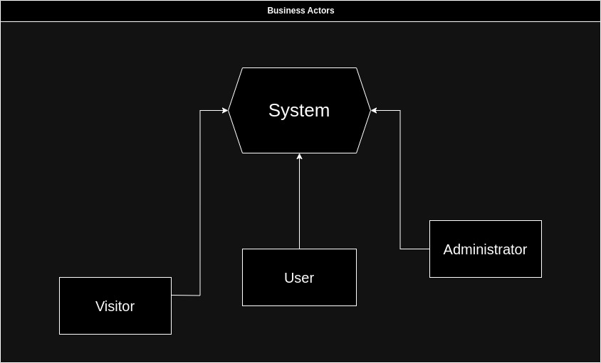

# Запити зацікавлених осіб

## Вступ

"Запити зацікавлених осіб" грають важливу роль у вивченні роботи системи управління відкритими даними. Цей документ є відзеркаленням функціональністі продукту, цільової аудиторії та конкретні завдання, які він повинен виконувати під час роботи. Це важливий документ для усіх бізнес-акторів, який сприяє оптимізації та вдосконаленню продукту не тільки на користь користувачам але й розробникам системи.

### Мета

 Метою цього документу є відображення сутності проекту та його значення, для подальшої розробки та втілення в життя системи управління відкритими даними , яка у свою чергу повинна бути створена для забезпечення доступності, прозорості та використання публічних даних для сприяння інноваціям, розвитку відкритого суспільства та покращенню якості життя громадян. 

### Контекст

 У документі "Запити зацікавлених осіб" визначена мета створення та впровадження системи управління відкритими даними. Відображено аналіз ймовірних сценаріїв взаємодії між різними групами зацікавлених осіб, включаючи відвідувачів, редакторів, адміністраторів та саму систему проекту. Визначена загальна характеристика категорій користувачів та ідентифіковано вплив кожного індивіду - між собою, чи на систему. У закінченні наведені технічні потреби, вимоги і очікування до програмного продукту.

### Основні визначення та скорочення

*[Розділ містить визначення всіх термінів та скорочень, необхідних для правильного
тлумачення вимог. Можна зробити посилання на документ, в якому поданий аналіз предметної області.]*

### Посилання

*[Розділ містить повний список всіх документів, про які згадується.]*

## Короткий зміст

*[Розділ містить опис того, про що йдеться в еій частині цього документу, що залишилася. 
Також тут описана структура документу.]*

## Характеристика ділових процесів

### **Гість**

| **ID:**                | GuestSearch                                                                                      |
|------------------------|--------------------------------------------------------------------------------------------------|
| **НАЗВА:**             | Отримання інформації або даних гостем у системі через пошуковий бар |
| **УЧАСНИКИ:**          | Гість, Система |
| **ПЕРЕДУМОВИ:**        | Гість не має відповідних даних на головній сторінці |
| **РЕЗУЛЬТАТ:**         | Знаходження відповідної інформації та даних у системі |
| **ВИКЛЮЧНІ СИТУАЦІЇ:** | Введені пошукові дані не відповідають з наявними у системі - DataNotFinded |
| **ОСНОВНИЙ СЦЕНАРІЙ:** | 1. Гість вибирає опцію "Пошук даних" на головній сторінці сайту.   2. Гість вводить назву даних чи опис інформації, яку він хоче знайти.   3. Система перевіряє наявність відповідних даних у базі даних, які відповідають введеній інформації.   4. Система переправляє гостя на сторінку з даними, яка задовольняє умови пошуку. |

| **ID:**                | GuestDownload                                                                                    |
|------------------------|--------------------------------------------------------------------------------------------------|
| **НАЗВА:**             | Завантаження гостем файлу даних з системи |
| **УЧАСНИКИ:**          | Гість, Система |
| **ПЕРЕДУМОВИ:**        | Гість не має файлу даних з системи |
| **РЕЗУЛЬТАТ:**         | Завантаження файлу з даними у відповідному форматі з системи |
| **ВИКЛЮЧНІ СИТУАЦІЇ:** | Відповідного формату файлу з даними не існує в системі - DataFormatNotAvailable   Швидкість завантаження та якість під'єднання не дозволяють завантажити файл - BadConnection|
| **ОСНОВНИЙ СЦЕНАРІЙ:** | 1. Гість обирає опцію "Завантажити" на сторінці з даними під попереднім переглядом файлу.   2. Гість обирає формат даних файлу, який йому потрібно завантажити.   3. Система шукає відповідний формат файлу у базах даних.   4. Система розпочинає передачу файлу на комп'ютер користувача системи у відповідному форматі.   5. Система виводить на екран користувача прогрес завантаження файлу у відсотках.   6. Система успішно закінчує завантаження файлу на комп'ютер користувача.   7. Система виводить на екран користувача інформацію, що файл успішно завантажено та дякує за користування системою. | 

### **Користувач**

| **ID:**                | UserRegistration                                                                                  |
|------------------------|--------------------------------------------------------------------------------------------------|
| **НАЗВА:**             | Реєстрація акаунту користувача у системі |
| **УЧАСНИКИ:**          | Користувач, Система |
| **ПЕРЕДУМОВИ:**        | Користувач не має облікового запису у системі |
| **РЕЗУЛЬТАТ:**         | Успішна реєстрація облікового запису користувачем у системі |
| **ВИКЛЮЧНІ СИТУАЦІЇ:** | Пусті для обов'язкового заповнення рядки для реєстрації у системі - UnfilledRegistrationRowsВусті   Введене ім'я користувачем не відповідає умовам реєстрації - IncorrectUserName   Введений пароль користувачем не відповідає умовам реєестрації|
| **ОСНОВНИЙ СЦЕНАРІЙ:** | 1. Користувач вибирає опцію "Реєстрація" на головній сторінці веб-сайту.   2. Система переправляє користувача на сторінку з формою реєстрації.   3. Користувач заповнює обов'язкові поля реєстраційної форми, такі як ім'я, електронна пошта, пароль та надсилає форму реєстрації до системи.   4. Система перевіряє, чи введені дані є унікальними та відповідають умовам реєестрації, чи не існує облікового запису з такою самою електронною поштою чи ім'ям користувача.   5. Система додає введені дані користувачем у базу даних, таким чином створюючи аккаунт користувача у системі.   6. Система повідомляє користувача про успішну реєстрацію, та надсилає відповідний лист з успішною реєстрацією на електрону скринку користувача.   7. Система перенаправляє користувача на сторінку створеного облікового запису. |

| **ID:**                | DataVisulization                                                                                 |
|------------------------|--------------------------------------------------------------------------------------------------|
| **НАЗВА:**             | Візуалізація та графічне представлення даних |
| **УЧАСНИКИ:**          | Користувач, Система |
| **ПЕРЕДУМОВИ:**        | Користувач не має відповідного графічного представлення даних |
| **РЕЗУЛЬТАТ:**         | Успішне відображення даних у відповідному графічному вигляді |
| **ВИКЛЮЧНІ СИТУАЦІЇ:** | Система не має можливості відображати дані у певному форматі графічного представлення - DataVisualizationFormatNotAvailable|
| **ОСНОВНИЙ СЦЕНАРІЙ:** | 1. Користувач обирає опцію "Вибір візуалізації".   2. Система відображає доступні види візуалізації даних.    3. Користувач обирає тип візуалізації даних, який найкраще відповідає його потребам, з переліку: графік, діаграма, карта, словесна хмара або будь-який інший тип візуального представлення даних.   4. Система відображає дані у графічному вигляді на екрані користувача. | 

| **ID:**                | DataModification                                                                                 |
|------------------------|--------------------------------------------------------------------------------------------------|
| **НАЗВА:**             | Відображення даних у відповідному форматі, який обран користувачем  |
| **УЧАСНИКИ:**          | Користувач, Система |
| **ПЕРЕДУМОВИ:**        | Дані надані системою мають стандартний вигляд та не відповідають баченню користувача |
| **РЕЗУЛЬТАТ:**         | Успішне редактування та управління даними користувачем. Збереження змінених даних у профілі користувача. |
| **ВИКЛЮЧНІ СИТУАЦІЇ:** | Система не має можливості змінити дані у режимі редагування, так як бажає користувач - DataModificationNotSupported   Користувач не зареєстрований у системі - UserNotRegistred |
| **ОСНОВНИЙ СЦЕНАРІЙ:** | 1. Користувач обирає опцію "Редагування даних".   2. Система перевіряє чи користувач зареєстрований.    3. Користувач вибирає конкретний запис або елемент даних, який він бажає змінити, та відкриває його для редагування.    4. Система відображає поточні дані цього запису у формі або на панелі редагування.   5. Користувач редагує необхідні поля або додає нову інформацію відповідно до своїх потреб. Це може бути зміна текстової інформації, вибір іншого значення зі списку, сортування або фільтрація даних.   6. Користувач натискає кнопку "Зберегти".   7. Система перевіряє дані, зберігає оновлену інформацію у базі даних та повідомляє користувача про успішне збереження даних.

| **ID:**                | DataDownload                                                                                     |
|------------------------|--------------------------------------------------------------------------------------------------|
| **НАЗВА:**             | Завантаження даних користувачем у систему |
| **УЧАСНИКИ:**          | Користувач, Система |
| **ПЕРЕДУМОВИ:**        | Система управління відкритими даними дозволяє завантажувати нові дані користувачем у системиу |
| **РЕЗУЛЬТАТ:**         | Успішне завантаження та публікація нових даних у системі |
| **ВИКЛЮЧНІ СИТУАЦІЇ:** | Формат даних не відповідає вимогам системи - DataFormatNotSupported |
| **ОСНОВНИЙ СЦЕНАРІЙ:** | 1. Користувач переходить до розділу або сторінки, призначеної для завантаження нових даних.   2. Користувач обирає опцію "Завантажити нові дані".   3. Cистема відкриває вікно з формою для завантаження файлів та даних.    3. Користувач натискає кнопку "Оберіть файл" та вибирає файл із свого комп'ютера або іншого пристрою.   4. ССистема перевіряє формат файлу та структуру даних. Якщо дані коректні, система продовжує до наступного кроку. Якщо виникають помилки чи невідповідності, система повідомляє користувача про помилку та можливі шляхи її виправлення.   5. Після підтвердження параметрів користувач натискає кнопку "ОК".   6. Система обробляє завантажені дані та зберігає їх у системній базі даних.   7. Система відправляє повідомлення користувачу про успішне завантаження та що він може перейти до розділу, де його нові дані тепер відображаються.

### **Адміністратор**

| **ID:**                | DataDelete                                                                                    |
|------------------------|--------------------------------------------------------------------------------------------------|
| **НАЗВА:**             | Видалення даних завантажені користувачами системи |
| **УЧАСНИКИ:**          | Адміністратор, Система |
| **ПЕРЕДУМОВИ:**        | Деякі дані не відповідають вимогам якості даних у системі |
| **РЕЗУЛЬТАТ:**         | Успішне видалення даних з системи |
| **ВИКЛЮЧНІ СИТУАЦІЇ:** | Дані які намагаються видалити не існує в базах даних - DataDoesNotExist |
| **ОСНОВНИЙ СЦЕНАРІЙ:** | 1. Адміністратор входить до системи за допомогою свого адміністраторського облікового запису.   2. Адміністратор переходить до розділу або сторінки, де можна переглядати та керувати даними.   3. Адміністратор обирає опцію "Управління даними" та знаходить запис чи елемент даних, який він бажає видалити.    4. Після знаходження потрібного запису, адміністратор обирає опцію "Видалити" чи "Видалити запис".   5. Система може виводить підтверджуюче повідомлення, щоб переконатися, що адміністратор впевнений у своєму рішенні видалити дані.   6. Адміністратор натискає "Так", тобто підтверджує свій намір видалити запис.   7. Система перевіряє чи обраний файл наявний у базах даних та видаляє вибраний запис з бази даних. Під час цього процесу система може також виконати додаткові дії, наприклад, видалити зв'язані дані або оновити статистику.   8. Система повідомляє адміністратора про успішну операцію видалення та може відобразити підтвердження на екрані.

## Короткий огляд продукту

Наш продукт - це інноваційна веб-платформа для управління відкритими даними, яка пропонує потужні можливості, порівнюючи з іншими аналогами. Система збору аналізу заснована на принципах веб-скрапінгу та краудсорсингу дозволяє, не тільки ефективно та швидко оновлювати інформацію вже з наявних джерел завдяки веб-скрапінгу, а й завдяки краудсорсингу приймати відкриті дані зі сторони користувачів, забезпечуючи різнобарв'я вже наявних даних у системі. Ефективні методи обробки даних та аналізу даних, дозволяють вже зареєстрованим користувачам змінювати та доповнювати вже наявні дані у особистому середовищі та використовувати великий інструментарій графічного представлення даних. Незареєстровані користувачі також мають можливості користування нашим сервісом, завантаження та перегляд даних не потребує реєстрації у системі. А відповідальна команда адміністраторів завжди допомагає у вирішенні проблем користувачів та видаленні неправомірних і неякісних даних створеними або завантаженими користувачами. Заснований на відкритому вихідному коді, наш продукт сприяє прозорості та співпраці, забезпечуючи широкі можливості налаштування та розширення для задоволення потреб користувачів. Ми пропонуємо високоякісну технічну підтримку, спільноту розробників і користувачів, та інтуїтивний інтерфейс, що допомагає нашим користувачам легко управляти великими обсягами даних та використовувати їх для прийняття найефективніших рішень.

## Функціональність

| **Гість**     |
|---------------|
|Перегляд загальної інформації та статистичних даних, без необхідності реєстрації|
|Пошук та фільтрація для знаходження конкретних даних за ключовими словами, категоріями, датами тощо|
|Перегляд графічних візуалізацій даних, використовуючи весь інструментарій візуалізації даних наданий системою|
|Завантаження публічно доступних даних у відповідних форматах бажаними користувачем на комп'ютер|

| **Користувач** |
|----------------|
|Cтворення особистого облікового запису у системі, який відкриває нові можливості недоступні гостям|
|Створення власних статистичних даних на основі існуючих у бази даних системи|
|Оцінка даних та можливість коментування даних інших користувачів системи|
|Завантаження власних даних у базу даних системи|
|Опублікування публікацій з використанням статистичних даних з системи|
|Редагування даних у наданому системою режимом редагування|

| **Адміністратор** |
|-------------------|
|Контроль якості статистичних даних та публікацій у системі, які були створені користувачами, заборона публікування статей чи статистичних даних|
|Блокування користувачей чи обмеження доступу до систему через порушення правил використання системи|
|Оцінка публікацій та даних наданими користувачами, висвітлення найкращих публікай на головній сторінці|
|Cтворення публікацій та статей від імені продукту|
|Надання технічної допомоги користувачам|
|Cтворення та публікація технічної документації щодо використання системи|
|Керування категоріями та тегами даних|

## Практичність

|**Usability**|
|-------------|
|Точний та розширений пошук за різними критеріями, такими як ключові слова, дата, категорія, що спрощує знаходження необхідних даних|
|Фільтрація даних за різними параметрами та сортування за релевантністю або часом|
|Адаптивність роботи на різних пристроях, або "кросплатформеність" для зручності використання на будь-яких платформах користувачами|
|Легка та інтуїтивна навігація в системі для швидкого доступу до потрібних даних або публікацій|
|Зручний для використання інтерфейс користувачами або гостями системи|
|Круглодобова технічна підтримка для вирішення проблем та відповіді на запитання користувачів|
|Докладна та зрозуміла документація, для допомаги користувачам у використанні сервісом та її можливості|

## Надійність

|**Reliability**|
|---------------|
|Резервні сервери, або хмарні технології, для видобування даних у випадку відмови головного серверу|
|Журнали зміни даних, для збереження цілісності даних та відновлення усіх змін|
|Шифрування особистих даних користувачів під час передачі та зберігання самих даних, для захисту конфіденційності особистої інформації|
|Безперервна та постійна доступність системи управління відкритими даними, без планових або непланових зупинок|
|Резервні копії даних користувачів, для відновлення їх у разі втрати, або випадкового видалення|

## Продуктивність

|**Performance**|
|---------------|
|Ефективна оптимізація бази даних та запитів для мінімізації часу виконання та швидкості завантаження інформації|
|Оптимальний алгоритм масштабування системи для оптимальної продуктивності навіть під великими навантаженнями|
|Масштабовані бази даних або технології нереляційних баз даних, якщо очікується велике навантаження на систему|
|Оптимізація бази даних, включаючи індексацію та видалення непотрібних даних, для забезпечення ефективності та продуктивності|
|Постійне тестування баз даних, або інших функцій системи для підвищення ефективності та швидкості роботи|
|Ефективні інструменти графічного відображення та перегляду даних, які використовують мало ресурсів як зі сторони серверу так зі сторони користувачів|

## Експлуатаційна придатність

|**Supportability**|
|------------------|
|Докладна документація щодо користування нашим веб-проектом|
|Активна участь у спільноті користувачів, прийняття їх пропозицій та врахування їхніх потреб для подальшого вдосконалення системи|
|Open-source підхід у розробці та вдосконалення системи, відкритий вихідний код сприяє прозорості проекту та покращенню проекту|
|Технічна підтримка у разі виникнення багів, або інших проблем під час користування системою|
|Форум у якому спільнота та адміністратори можуть відповідати на запитання та допомогати вирішувати проблеми| 