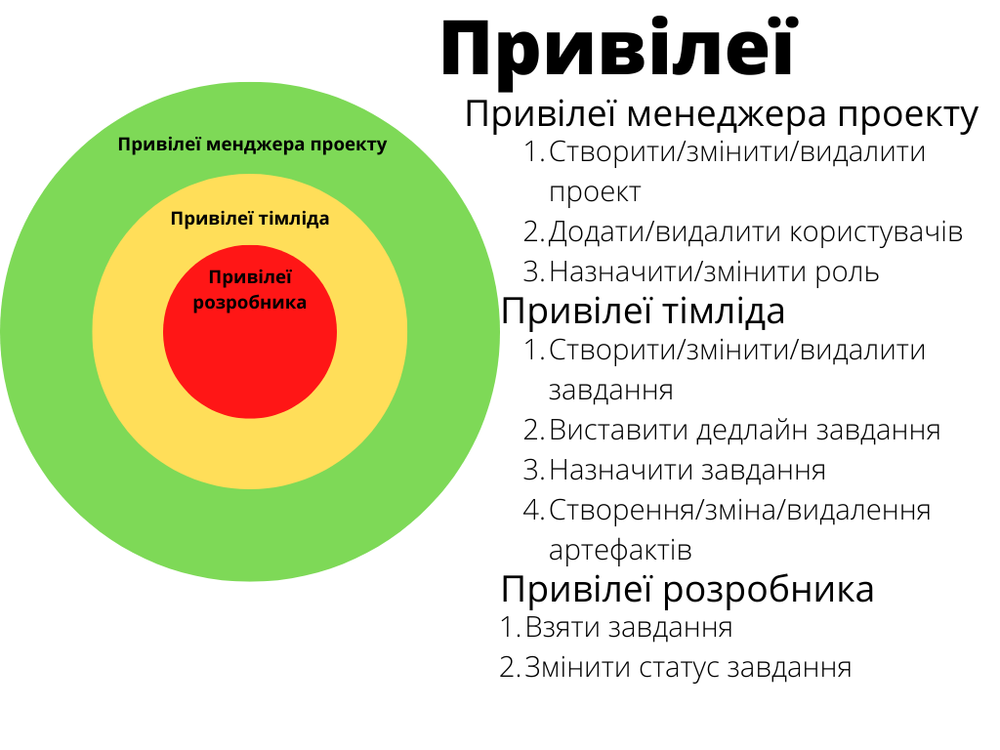

# Запити зацікавлених осіб

## Вступ

Цей документ створений для ознайомлення зацікавлених осіб до цього проекту під назвою " project_control_system", тема проекту "Система управління проектами"

### Мета

1. Розробити детальний план можливостей та цілей проекту.
2. Отримати розуміння про подальші кроки розробкиЇ
3. Створення документації для зручного користування
4. Реалізація ідеї на папері

### Контекст

Даний документ створений для зацікавлених людей до проекту, та ознайомлює їх з функціоналом проекту. Створює опис "project_control_system" 

### Основні визначення та скорочення

  1. Артефакт - майже любий елемент або об'єкт в програмному забезпеченні (ПЗ)
  2. Дедлайн - крайній термін виконання завдання чи роботи, певний момент часу, якого має бути досягнуто мету чи завдання.
  3. Зацікавлені особи - організації, що надають послуги з розроблення програмного забезпечення, сайтів, мобільних застосунків.
  4. Бекап - тобто створювати резервну копію. Резервні копії даних або програм дозволяють швидко відновити плоди багатьох місяців праці у разі атаки хакера або системного збою.

### Посилання

 - Лекції Болдака А.О. 
 - Загальнодоступна інформація з Інтернету
  
  
## Короткий зміст

 - Характеристика ділових процесів - загальна характеристика діяльності, та сценарії дій.
 - Короткий огляд продукту - Загальна характеристика категорій користувачів
 - Функціональність - вимоги щодо функціоналу
 - Надійність - вимоги щодо надійності
 - Практичність - вимоги щодо зручності
 - Продуктивність - вимоги щодо продуктивності
 - Експлуатаційна придатність - вимоги щодо підтримки

## Характеристика ділових процесів

В ділових процесах беруть участь система управління проєктами та користувачі. В межах проєкту користувачі можуть мати такі ролі: *менеджер проєкту*, *тімлід* та *розробник*.

При створенні проєкту користувач отримує роль *менеджера проєкту*. Менеджер проєкту може запрошувати других користувачів приєднатися до проєкту, змінювати ролі учасників проєкту, управляти завданнями та артефактами, спостерігати за розвитком проєкту. 

Після підтвердження запиту на приєднання до проєкту, корирстувач стає *розробником* або *тімлідом*, в залежності від того, яку роль вибрав менеджер проєкту. Тімлід і розробники беруть активну участь в розробці проєкту, виконуючи поставленні завдання. Тімлід, як і менеджер проєкту, управляє завданнями і артефактами. Також, за необхідності, тімлід може закріплювати завдання за розробниками. Варто зауважити, що менеджер проєкту може бути одночасно і тімлідом.

### Ділові процеси

***ID:*** BP-1

***НАЗВА:*** Реєстрація користувача в системі.

***УЧАСНИКИ:*** користувач, система.

***ПЕРЕДУМОВИ:*** користувач не увійшов в обліковий запис.

***РЕЗУЛЬТАТ:*** створення облікового запису.

***ВИКЛЮЧНІ СИТУАЦІЇ:***
- RegisrationException - в системі вже існує обліковий запис з заданими даними.

***ОСНОВНИЙ СЦЕНАРІЙ:***
1. Користувач вводить реєстраційні дані.
2. Система перевіряє на наявність облікових записів зі вказаними даними.
3. Система створює обліковий запис.

---

***ID:*** BP-2

***НАЗВА:*** Cпроба авторизації.

***УЧАСНИКИ:*** користувач, система.

***ПЕРЕДУМОВИ:*** користувач не увійшов в обліковий запис.

***РЕЗУЛЬТАТ:*** авторизація користувача.

***ВИКЛЮЧНІ СИТУАЦІЇ:***
- AuthorizationException1 - відсутній обліковий запис з заданими даними.
- AuthorizationException2 - неправильно введені дані запису.
***ОСНОВНИЙ СЦЕНАРІЙ:***
1. Користувач вводить дані облікового запису.
2. Система перевіряє наявність облікового запису за вказаними даними.
3. Система надає доступ користувачу до функцій облікового запису.

---

***ID:*** BP-3

***НАЗВА:*** Створення проєкту.

***УЧАСНИКИ:*** користувач, система.

***ПЕРЕДУМОВИ:***
- користувач увійшов в обліковий запис;

***РЕЗУЛЬТАТ:*** створення проєкту.

***ОСНОВНИЙ СЦЕНАРІЙ:***
1. Користувач вводить необхідні дані для створення проєкту.
2. Система реєструє проєкт.

---

***ID:*** BP-4

***НАЗВА:*** Створення завдання.

***УЧАСНИКИ:*** користувач , система.

***ПЕРЕДУМОВИ:*** 
- наявність проєкту;
- користувач увійшов в обліковий запис;

***РЕЗУЛЬТАТ:*** прикріплення завдання до проєкту.

***ОСНОВНИЙ СЦЕНАРІЙ:***
1. Користувач вводить необхідні дані для створення завдання.
2. Система створює завдання в проєкті.

---

***ID:*** BP-5

***НАЗВА:*** Взяття завдання.

***УЧАСНИКИ:*** користувач (розробник), система.

***ПЕРЕДУМОВИ:***
- наявність незакріпленого завдання;
- користувач увійшов у обліковий запис;
- користувач є розробник в проєкті.

***РЕЗУЛЬТАТ:*** розробник бере завдання.

***ОСНОВНИЙ СЦЕНАРІЙ:***
1. Користувач вибирає завдання, яке він хоче взяти.
2. Користувач вибирає себе в якості виконувача завдання.
3. Система закріплює завдання за користувачем.

---

***ID:*** BP-6

***НАЗВА:*** Закріплення завдання.

***УЧАСНИКИ:*** користувач, система.

***ПЕРЕДУМОВИ:***
- наявність завдання;
- користувач увійшов у обліковий запис;
- користувач є тімлідом в проєкті.

***РЕЗУЛЬТАТ:*** тімлід закріплює завдання за розробником.

***ОСНОВНИЙ СЦЕНАРІЙ:***
1. Користувач вибирає завдання, яке він хоче закріпити.
2. Користувач вибирає за ким буде закріплено завдання .
3. Система закріплює завдання відповідно за користувачем або за розробником.

---

***ID:*** BP-7

***НАЗВА:*** Створення артефакту.

***УЧАСНИКИ:*** користувач, система.

***ПЕРЕДУМОВИ:***
- користувач увійшов у обліковий запис;

***РЕЗУЛЬТАТ:*** створений артефакт.

***ОСНОВНИЙ СЦЕНАРІЙ:***
1. Користувач вводить необхідні дані, прикріплює файл.
2. Система створює артефакт.

## Короткий огляд продукту

*Система управління проектом дозволяє контролювати багато різних аспектів розробки, а саме: постановку завдання
проекту, розподіл ресурсів, організацію , контроль якості, планування, а також допомагає визначати й відстежування
проблеми та ризики.Основним завданням системи є забезпечення ефективної взаємодії між менеджером продукту,
розробником і тімлідом .*

*Опис FURPS:*
- *Функціональність: одна з найважливіших частин яка визначає, яким має бути продукт взалежності від потреб клієнтів*
- *Практичність: забезпечення ефективної взаємодіїї користувача з системою*
- *Надійність: здатність продукту протистояти важким умовам таким як: несподівана або навмисно зловмисна поведінка користувача,продукти сторонніх розробників і збої обладнання.*
- *Продуктивність: оптимальний баланс між швидкістю роботи і задіяними ресурсами, який необхідний для ефективної роботи системи*
- *Експлуатаційна придатність:усунення помилок,налаштовування, контроль та оновлювлення продукту, необхідне для забезпечення його відповідності всім вимогам.*

## Функціональність

*Можливості менеджера проекту:*
- *Створити проект*
- *Модифікувати існуючий проект*
- *Видалити проект*
- *Додати користувачів до проекту*
- *Видалити користувачів з проекту*
- *Назначити роль користувача*
- *Змінити роль користувача*

*Можливості тімліда:*
- *Виставлення артефактів на загальний проект*
- *Зміна артефактів*
- *Видалення артефактів*
- *Створити завдання*
- *Змінити завдання*
- *Видалити завдання*
- *Виставлення дедлайнів завдань*
- *Відправка завдань розробникам (назачити розробника на завдання)*

*Можливості розробника:*
- *Взяти завдання*
- *Змінити статус завдання*

## Діаграма привілей

## Практичність

- *Зручний та зрозумілий інтерфейс.*
- *Мінімалізм*
- *Простота*
- *Створення артефактів*

## Надійність

- *Бекапи раз у деякий час*
- *Обмежена кількість учасників*
- *Обмежена кількість задач та артефактів прив'язаних до задачі*
- *DDOS захист (у виді обмеження кількості запитів з одного джерела)*

## Продуктивність

- *Обслуговування великої кількості проектів та задач*
- *Правильне використання ресурсів серверів, оптимізація*
- *Підтримка проектів*

## Експлуатаційна придатність

- *Усунення знайдених помилок*
- *Оптимізція*
- *Оновлення програмного забезпечення з можливістю покращення продукту, або потенціальним відкатом до попередньої версії у разі невподобання або недоробки продукту*
