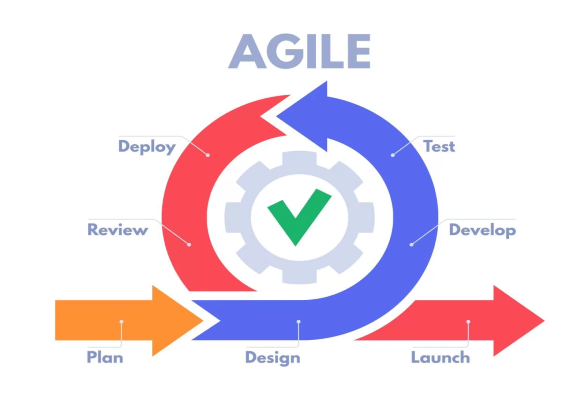

# Аналіз предметної області

## Вступ

*У цьому документі розглянуто актуальність і аспекти, що пов'язані з даною сферою, вирішення її проблем, взаємозв'язок з іншими сферами творення проектів та засоби для вирішення проблем від час процесу керування розвитком проекту.*

---

## Основні визначення

***Проект*** — *це певний захід (або процес) з чітко визначеними термінами, мета якого — створити унікальний продукт або отримати певні інноваційні результати. У бізнесі метою проекту часто називають рішення конкретних завдань. Відповідно, управління проектами (або, як прийнято це називати, Project Management) — це конкретна діяльність, мета якої — реалізувати всі поставлені проектом завдання.*

***Управління проектами (або проектний менеджмент)*** *як раз і допомагає швидко і ефективно досягати поставлених цілей. Крім того, в процесі цього формується ціла система комплексів, які можуть бути використані для досягнення загальних цілей компанії, а також розробляється схема розумного розподілу ресурсів.
На даний момент* ***управління проектами*** *— ціла наука, яка обросла системою знань, правил і стандартів. Найбільш відомий ресурс — PMBOK. Це певна «книга знань» в сфері проектного менеджменту, в якій описані кращі практичні поради і тематичні знання.*

***Системи управління проектами*** *— це певний інструмент в руках керівника і команди, який дозволяє робити всю діяльності компанії максимально прозорою. Кожен може побачити часові та фінансові витрати на певні проекти, своє навантаження і навантаження колег.*

***Планування*** 
*Однією з найбільш поширених можливостей менеджменту проекту є планування подій і керування завданнями. Вимоги можуть відрізнятися в залежності від того, як використовується інструмент. Найбільш поширеними є:*

- *планування різних подій, що залежать одна від одної;*
- *планування розкладу роботи співробітників і керування ресурсами;*
- *розрахунок часу, необхідного на рішення кожної з задач;*
- *сортування завдань залежно від термінів їх завершення;*
- *керування декількома проєктами одночасно.*

***Життєвий цикл проекту*** *– це період часу від задуму проекту до його закінчення, який може характеризуватися моментом здійснення перших витрат за проектом (поява проекту) й отриманням останньої вигоди (ліквідація проекту).*

***Базовий план (Baseline)*** – *затверджений план із зазначеними фазами в часі (проєкту, елементів ієрархічної структури робіт, пакета робіт або планової операції); Зазвичай позначає поточний базовий план. Часто вживається з уточненням (наприклад «базовий план за вартістю», «базовий план розкладу», «базовий план виконання», «базовий план технічної частини»).*

***Декомпозиція (Decomposition)*** – *метод планування, що ґрунтується на розбитті змісту проєкту й результатів постачання проєкту на дрібніші й легко керовані елементи доти, поки роботи проєкту, пов'язані з виконанням змісту проєкту й забезпеченням результатів постачання, не стануть визначеними досить докладно для їх виконання, відстежування й моніторингу.*

***Артефакт*** *– це результат певної роботи, який можна використовувати в процесі розробки програм, або який є кінцевою метою розробки. Це поняття є досить абстрактним, але на практиці під ***артефактами*** розуміють і діаграми, і  бібліотеки, які необхідні для розробки проекту, і модулі, з яких складається проект, і сам проект у готовому для використання вигляді теж вважається артефактом. Артефакт є побічним продуктом розробки програмного забезпечення. Це все, що створюється для розробки певного програмного забезпечення. Це може включати такі речі, як моделі даних, діаграми, сценарії налаштування — список можна продовжувати. «Артефакт» — це досить широкий термін, коли йдеться про розробку програмного забезпечення. Більшість програмного забезпечення мають багато артефактів, які необхідні для їх запуску. Деякі артефакти пояснюють, як повинна працювати частина програмного забезпечення, тоді як інші фактично дозволяють цій програмі працювати.*

***Ціль (Objective)***  *Tе, на що спрямовано роботи, стратегічна позиція, яку варто зайняти, завдання, яке варто вирішити, результат, якого варто досягти, продукт, який варто зробити або послуга, яку варто зробити.*

***Ві́ха*** *— термін, що використовується в управлінні проєктами і означає важливе місце, ключовий етап, перехід на нову стадію розвитку проєкту. Зазвичай, цим важливим етапом є завершення якогось ключового завдання, підписання важливих документів або ж будь-які інші важливі дії, що передбачаються планом проєкту. Перехід цієї контрольної точки призводить до змін у всьому проєкті.*

***Система керування конфігурацією (Configuration Management System)***  
*Підсистема загальної системи керування проєктами. Набір формальних процедур, що використовується для застосування технічного й адміністративного керування й супроводу, щоб: ідентифікувати й документувати фізичні й функціональні характеристики продукту, результату, послуги або елемента; управляти будь-якими змінами цих характеристик; реєструвати й доводити до відома зацікавлених осіб кожну зміну й перебіг її проведення; виконувати аудит продуктів, результатів або елементів для верифікації їх відповідності вимогам. Вона містить у собі документацію, системи відстежування й певні рівні, на яких відбувається авторизація змін. У більшості областей застосування система керування конфігурацією включає систему керування змінами.*

***Цикл життя продукту (Product Life Cycle)***  *Набір зазвичай послідовних фаз продукту, що не перекриваються, назва й кількість яких визначається виробничими й управлінськими потребами організації. Зазвичай остання фаза циклу життя продукту — це загибель або руйнування продукту. Цикл життя проєкту зазвичай укладається в один або кілька циклів життя продукту.*

***Статут проєкту (Project Charter)***   *Документ, випущений ініціатором або спонсором проєкту, що формально узаконює існування проєкту й надає менеджерові проєкту повноваження використовувати організаційні ресурси в операціях проєкту.*

***Цикл життя проєкту (Project Life Cycle)***  
Набір зазвичай послідовних фаз проєкту, кількість і склад яких визначається потребами керування проєктом організацією або організаціями, що беруть участь у проєкті. Цикл життя можна документувати за допомогою методології.

---

## Підходи та способи вирішення завдання

### Опис моделей розробки ПЗ

У програмного забезпечення, як у живої істоти є свій життєвий цикл. Життєвий цикл ПЗ - стадії, що проходить програмний продукт від появи ідеї до її реалізації в коді, імплементації у бізнес і подальшої підтримки. Моделі життєвого циклу багато в чому зумовлюють і методології розробки ПЗ.

Зазвичай до етапів життєвого циклу відносять:

1.  Аналіз вимог
2.  Проектування
3.  Програмування
4.  Тестування і налагодження
5.  Експлуатацію, супровід і підтримку

Але це не повний перелік.

Існує деяка варіативність у проходженні етапів ЖЦ під час розробки та впровадження продукту на ринок. Для кожного продукту це відбувається по-своєму, але щоб цим якось керувати були сформульовані моделі життєвого циклу ПО - спрощене й узагальнене уявлення про те, як розвивається продукт. У реальності життя продукту не відповідає моделі.

Серед моделей життєвого циклу програмного забезпечення найбільш відомі такі:

-   Каскадна модель (вона ж "водоспадна" - waterfall)
-   Ітераційні модель
-   Інкрементна модель
-   Спіральна модель

#### Waterfall (каскадна модель)

Основна суть моделі Waterfall у тому, що етапи залежать один від одного і наступний починається, коли завершений попередній, утворюючи таким чином поступальний (каскадний) рух уперед. 
Паралелізм етапів у каскадній моделі, хоч і обмежений, але можливий для абсолютно незалежних між собою робіт. При цьому інтеграція паралельних частин все одно відбувається на якомусь наступному етапі, а не в рамках одного. Команди різних етапів між собою не комунікують, кожна команда відповідає чітко за свій етап. 
Недоліками цієї моделі є отримання результату по проходженню всіх етапів і складність виявлення помилок. Повертатися назад важко. Не зрозуміло що повертати: якщо стався збій на якомусь етапі, його наслідки видно тільки в кінці.

#### Ітераційна модель

Ітераційна модель  передбачає розбиття проекту на частини (етапи, ітерації) і проходження етапів життєвого циклу на кожному з них. Кожен етап є закінченим сам по собі, сукупність етапів формує кінцевий результат.
На кожній ітерації ми працювали з одним і тим же продуктом і в кінці кожної ітерації отримували результат, яким можна користуватися (звісно з певними обмеженнями).
З кожним етапом розробка наближається до кінцевого бажаного результату або уточнюються вимоги до результату по ходу розробки, і відповідно в будь-який момент поточна ітерація може виявитися останньою або черговою на шляху до завершення.

#### Спіральна модель

Усі етапи життєвого циклу при спіральної моделі йдуть витками, на кожному з яких відбуваються проектування, кодування, дизайн, тестування і т. д. Такий процес відображає суть назви: піднімаючись, проходиться один виток (цикл) спіралі для досягнення кінцевого результату. Причому не обов'язково, що один і той же набір процесів буде повторяться від витка до витка. Але результати кожного з витків ведуть до головної мети.

#### Інкрементна модель

Принцип, що лежить в основі інкрементной моделі, має на увазі розширення можливостей, добудовування модулів і функцій програми. Буквальний переклад слова інкремент: «збільшення на один». Це «збільшення на один» застосовується в тому числі для позначення версій продукту.
Якщо в каскадній моделі по суті є двома стани продукту: «нічого» і «готовий продукт», то з появою ітераційних моделей стало застосовуватися версіонування продукту. Кожна ітерація позначається цифрою: 1,2,3 і відповідно продукт після кожної ітерації має версію з відповідним номером: v.1, v.2, v.3. Числами після слова версія позначають масштабні зміни в ядро продукту.

### Опис підходу розробки ПЗ - Agile

Основі ідеї:
- Люди та взаємодія набагато важливіші процесів та інструментів.
- Продукт, що працює, важливіший за документацію.
- Співпраця з замовником є важливішою за обговорені умовиконтракту.
- Готовність до змін важливіше за слідування початкового плану.

Принципи:
1. Задовільнити клієнта ранньою та безперебійною поставкою цінногопрограмного забезпечення.
2. Адекватно сприймати зміни вимог навіть у кінці розробки, що можепідвищити конкурентну спроможність продукту.
3. Постійна поставка робочого ПЗ, з частотою у місяць/тиждень.
4. Тісне та щоденне спілкування замовника з розробниками протягомвсієї тривалості проекту.
5. Проектом займаються мотивовані особистості, які забезпечені
необхідними умовами роботи, підтримкою та довірою.
6. Рекомендований метод передачі інформації – особиста розмова (faceto-face).
7. Робоче ПЗ – найкращий вимірювач прогресу.
8. Спонсори, розробники та користувачі мають мати можливістьпідтримувати постійний темп на невизначений термін.
9. Постійна увага сприяє покращенню технічному майстерству тазручному дизайну.
10. Простота – мистецтво не робити зайвої роботи.
11. Найкращі технічні вимоги, дизайн та архітектура створюються усамоорганізованої команди.
12. Постійна адаптація до обставин, що змінюються. Командазобов’язана систематично аналізувати можливі способи покращення ефективності та відповідно корегувати стиль своєї роботи.

#### Методології базовані на Agile

__Scrum__ – це набір принципів, на яких будується процес розробки, який дозволяє в чітко фіксовані та не довготривалі ітерації, які називаються спринтами. Скомпоновані принципи надають кінцевому користувачу робоче ПЗ з новими можливостями та для них визначено найбільший пріоритет. Можливості ПЗ під час реалізації на поточному спринті визначаються на початку спринту(етап планування) та не можуть змінюватись протягом виконання всього етапу(плану). Зафіксована чітка та невелика тривалість спринту, що надає процесу розробки передбачуваність та гнучкість.

__OpenUP__ – це ітеративно-інкрементний метод розробки ПЗ. Він розділяєжиттєвий цикл проекту на чотири фази: початкова, уточнення, конструювання тапередачі. Життєвий цикл проекту забезпечує представлення зацікавленим особамта членам колективу періоди для перегляду та прийняття рішень протягом всієї розробки проекту. Такий процес дозволяє ефективно контролювати ситуацію тавчасно приймати рішення щодо доцільності результатів, що отримують. Планпроекту визначає життєвий цикл, а кінцевим результатом є кінцевий продукт.

__Kanban__ - це метод в основу якого входить:
 - виробнича станція має план виробництва деталей (Backlog). План дійвідсортовано відповідно до пріоритету та може бути зміненим в будь-який час(наприклад, конвеєр, який виробляє багато деталей для однієї сторони, має матиможливість перемикатись на виробництво деталей іншої сторони);
 - одночасно обмежується кількість задач, які виконуються на виробництві (тобто виготовляти вказану кількість необхідних деталей). Це обмеженнястворено для контролю швидкості виробництва на станції та швидкістюреагування на зміну плану.

### Артефакти у розробці ПЗ

Як правило, команда розробників програмного забезпечення складає список необхідних артефактів для частини програмного забезпечення, перш ніж щось кодувати. Сюди входять такі речі, як оцінка ризику, вихідний код, діаграми та варіанти використання. Це робиться під час етап дослідження проекту.

Розробити програмне забезпечення без будь-якого з цього все одно, що будувати будинок без креслень. Процес був би величезним безладом, і важливі частини неминуче були б опущені. Таким чином, об’єднання всіх ваших артефактів є однією з найважливіших частин життєвого циклу розробки програмного забезпечення.

Після того, як усі початкові артефакти зібрані, команда розробників може почати програмувати та створювати фактичну програму. Протягом цього процесу можуть бути розроблені додаткові артефакти. Вони можуть з’явитися в будь-який час і включати все, від нових ескізів до випадків використання.

Деякі артефакти, як-от угода кінцевого користувача, може знадобитися створити після завершення програмного забезпечення для повної точності. Вони можуть бути додані до того, як програма буде зібрана та надіслана для споживання.

## Порівняльна характеристика існуючих засобів вирішення завдання

*Існує досить велика кількість методів, як здійснюється управління проектами. Крім класичного, який ми якраз і описали вище, використовується Agil — коли один великий проект ділиться на масу міні-проектів з поетапною реалізацією; Scrum — поділ проекту на складові частини; Lean — розподіл проекту на дрібні пакети робіт; Kanban — варіант для проектів, не обмежених по дедлайнах, адже їх можна ставити на паузу. У кожної з методик є багато власних нюансів, переваг і недоліків. Вибір підходящої системи залежить від специфіки організації і команди, яка буде працювати над конкретним проектом.*

### [*Trello*](https://trello.com/?&aceid=&adposition=&adgroup=122903883068&campaign=9869404283&creative=484133050545&device=c&keyword=%2Bproject%20%2Bmanagement&matchtype=b&network=g&placement=&ds_kids=p59240472896&ds_e=GOOGLE&ds_eid=700000001557344&ds_e1=GOOGLE&gclid=Cj0KCQiAjc2QBhDgARIsAMc3SqQ19oD_sRo6Kc2XxW04ICexGEIgP6JxanrcF41Lve8Y9OUPMQm0qOEaAnG3EALw_wcB&gclsrc=aw.ds)

*Безплатна багатоплатформна система управління проєктами, розроблена Trello Enterprise. Вона використовує парадигму керування проєктами, відому як канбан. Проєкти зображуються дошками, що містять списки. Списки містять картки, якими зображуються задачі. Картки повинні переходити з попереднього списку до наступного (за допомогою перетягування), таким чином зображаючи рух якоїсь функції від ідеї, аж до тестування. Картці може бути присвоєно відповідальних за неї користувачів. Користувачі та дошки можуть об'єднуватись в команди.*

### [*GitHub Projects*](https://github.com/features/issues)

***GitHub Projects*** *- це функція управління issues в GitHub, яка допомагає вам організовувати issues та розміщувати pull requests на дошці стилю Kanban для кращої візуалізації та визначення пріоритетів роботи. Ви можете створити скільки завгодно проектів у сховищі. Інтерфейс GitHub Projects дозволяє візуалізувати прогрес та завдання проекту, який можна використовувати разом із issues та pull requests, щоб відстежувати роботу, яку необхідно виконати. Система є зручною у використанні та при цьому легко розуміються користувачами.*

### [*Basecamp*](https://basecamp.com/)

***Basecamp*** — *інструмент для управління проєктами, який розповсюджується по публічно-хмарній моделі. Використовується для командної роботи над проєктами та задачами. Дана система дуже проста у використанні, але разом з простотою їй гостро бракує життєво важливого функціонала для того, щоб її можна було використовувати в серйозних, більш-менш великих проєктах. Розробники з 37signals спростили все, що тільки можна було спростити: немає системи баг-трекінга — немає взагалі такого поняття як баг, неможливо простежити за станом проєкту, тільки за загальним прогресом і так далі.*

### [*Asana*](https://asana.com/)

***Asana*** — *програмне забезпечення для веб і мобільних пристроїв, призначене для спільної роботи над проектами без електронної пошти, як послуга призначений для поліпшення співпраці команд та управління роботою. Це допомагає командам управляти проектами та завданнями за допомогою одного інструменту. Команди можуть створювати проекти, доручати роботу товаришам по команді, вказувати терміни та спілкуватися про завдання безпосередньо в Асані. Він також включає інструменти звітування, вкладення файлів, календарі тощо.*

### [*Wrike*](https://www.wrike.com/)

***Wrike*** — *корпоративний онлайн-сервіс для сумісної роботи і управлінню проектами. Він дозволяє користувачеві планувати проекти, розкривати пріоритетні завдання, відстежувати графік їх виконання та взаємодіяти з командою.
Функції Wrike діляться на дві основні категорії: управління проектами та спільна робота. До проектних відносяться можливості, які дозволяють команді візуалізувати проекти (наприклад, у формі діаграми Ганта або канбан-дошки), відстежувати терміни і витрачений час, встановлювати залежності завдань в проектах, призначати виконавців і розподіляти робочі ресурси. Wrike дозволяє створювати шаблони типових проектів, описувати процес за допомогою індивідуального набору статусів і полів в задачах і автоматичного призначення виконавців на завдання з характерними ознаками.
Функції спільної роботи включають інтеграцію з електронною поштою для роботи з завданнями з листів, управління групами користувачів, форми вхідних запитів, коментування завдань, повідомлення, обговорення, узгодження і редагування текстів, графіки і відеоматеріалів, а також систему повідомлень про зміни в проектах команди.*

Вимога | Критерій | Asana | GitHub Projects | Trello | Basecamp | Wrike
:------------|:----------------|:------|:----------------|:-------|:---------|:-------
__Functionality__||||||
||Система нагадувань|✅|✅|✅|✅|✅
||Наявність API|✅|✅|✅|✅|✅
||Можливість задати дедлайни|✅|✅|✅|✅|✅
||Можливість задати дедлайни|✅|✅|✅|✅|✅
||Історія редагування завдань|✅|✅|✅|✅|✅
||Розширений пошуковий фільтр|✅|✅|✅|✅|✅
||Підтримка артефактів|❌|❌|❌|❌|❌
||Offline доступ|❌|✅|❌|❌|❌
||Instant Messaging|✅|✅|❌|✅|✅
__Usability__|||||
||Наявність мобільного додатку|✅|❌|✅|✅|✅
||Кросплатформеність|❌|✅|❌|❌|❌
||Багатомовність|❌|❌|✅|✅|✅
||User-friendly інтерфейс|✅|✅|✅|✅|✅
||Інтеграція з GitHub|✅|✅|✅|❌|❌
__Reliability__|||||
||Регулярні оновлення системи|✅|✅|✅|✅|✅
||Можливість резервного копіювання|✅|✅|✅|✅|❌
||Конфіденційність приватної інформації|✅|✅|✅|✅|✅
__Performance__|||||
||Стійкість до збоїв|✅|✅|✅|✅|✅
||Швидкість інтерфейсу|✅|✅|✅|✅|✅
__Supportability__|||||
||FAQ|✅|✅|✅|✅|✅
||Зворотній зв’язок|✅|✅|✅|✅|✅
||Цілодобова онлайн підтримка|✅|✅|✅|✅|✅
## Висновки

*Провівши аналіз предметної області ми отримали усю потрібну інформацію, щоб мати загальну картину проекту та способи його реалізації. За основу як приклад взято GitHub Projects, але ця система не підтримує артефакти, які ми плануємо використовувати у нашому проекті. Через це також потрібно буде розробити власну нову систему для їх підтримки.*

## Посилання

*[Планування проекту](https://ela.kpi.ua/bitstream/123456789/23689/1/NP_ZP_ta_R_IT-proektiv.pdf)*

*[Моделі і підходи](https://evergreens.com.ua/ua/articles/software-development-metodologies.html)*

*[Все про артефакти](https://artifacts.ai/what-is-an-artifact/)*

*[FURPS](https://ru.wikipedia.org/wiki/FURPS)*

*[Артефакти](https://naukam.triada.in.ua/index.php/konferentsiji/33-chetverta-vseukrajinska-praktichno-piznavalna-internet-konferentsiya/41-stvorennya-klyuchovikh-artefaktiv-biznes-proektiv-case-zasobami#:~:text=%D0%A6%D0%B5%20%D0%BF%D0%BE%D0%BD%D1%8F%D1%82%D1%82%D1%8F%20%D1%94%20%D0%B4%D0%BE%D1%81%D0%B8%D1%82%D1%8C%20%D0%B0%D0%B1%D1%81%D1%82%D1%80%D0%B0%D0%BA%D1%82%D0%BD%D0%B8%D0%BC,%D0%B2%D0%B8%D0%BA%D0%BE%D1%80%D0%B8%D1%81%D1%82%D0%B0%D0%BD%D0%BD%D1%8F%20%D0%B2%D0%B8%D0%B3%D0%BB%D1%8F%D0%B4%D1%96%20%D1%82%D0%B5%D0%B6%20%D0%B2%D0%B2%D0%B0%D0%B6%D0%B0%D1%94%D1%82%D1%8C%D1%81%D1%8F%20%D0%B0%D1%80%D1%82%D0%B5%D1%84%D0%B0%D0%BA%D1%82%D0%BE%D0%BC.)*

*[Управління проектами](http://pev.kpu.zp.ua/journals/2019/6_17_ukr/26.pdf)*

*[WRIKE](https://www.wrike.com/)*

