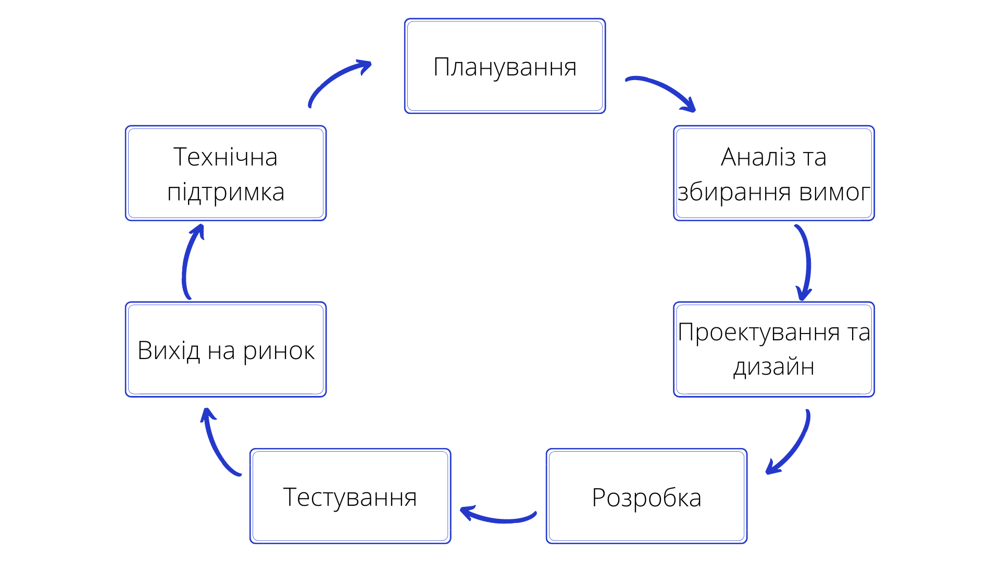
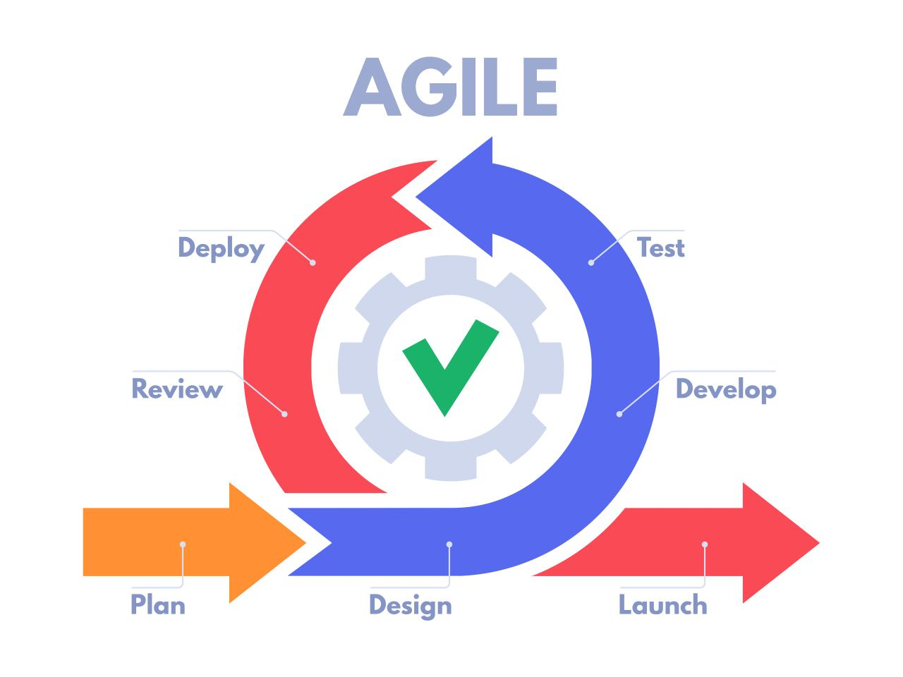
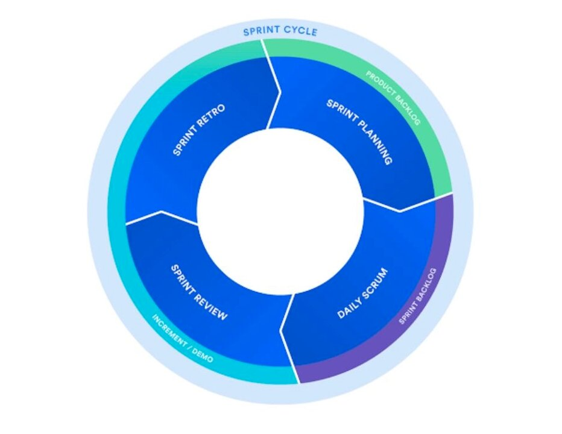
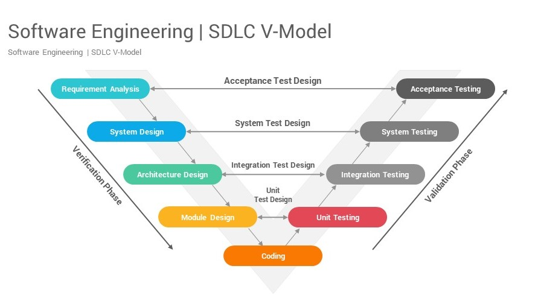
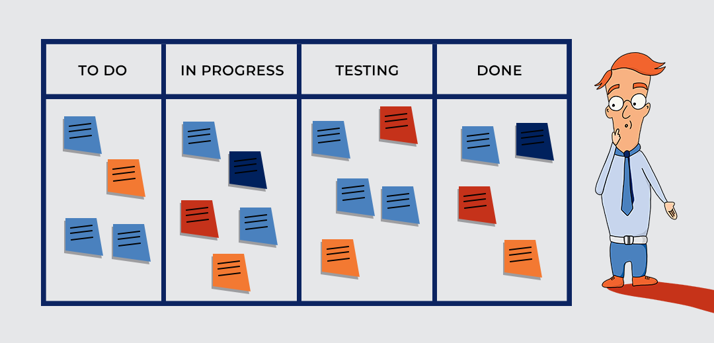

# Аналіз предметної області

## Вступ

Даний документ містить **_аналіз сучасних способів вирішення поставленого завдання_**, у ньому розглядаються основні етапи життєвого циклу програмного забезпечення, кейси використання тої чи іншої методології розробки ПЗ, їхні переваги та недоліки, також наводиться **_порівняльна характеристика існуючих систем управління проектами_**, щоб визначити, чого в них не вистачає, що є зайвим, які характеристики можна покращити та що має бути реалізовано в нашій системі.

## Основні визначення

[Методологія управління проєктами](https://nt.ua/blog/methodology-of-project-management#:~:text=%D0%9C%D0%B5%D1%82%D0%BE%D0%B4%D0%BE%D0%BB%D0%BE%D0%B3%D1%96%D1%8F%20%D1%83%D0%BF%D1%80%D0%B0%D0%B2%D0%BB%D1%96%D0%BD%D0%BD%D1%8F%20%D0%BF%D1%80%D0%BE%D1%94%D0%BA%D1%82%D0%B0%D0%BC%D0%B8%20%E2%80%93%20%D1%86%D0%B5%20%D0%BF%D1%80%D0%B0%D0%BA%D1%82%D0%B8%D0%BA%D0%B0,%D1%86%D0%B8%D0%BA%D0%BB%20%D0%BF%D1%80%D0%BE%D1%94%D0%BA%D1%82%D1%83%20%D0%BF%D1%80%D0%B0%D0%B2%D0%B8%D0%BB%D1%8C%D0%BD%D0%BE%20%D1%81%D1%82%D1%80%D1%83%D0%BA%D1%82%D1%83%D1%80%D0%BE%D0%B2%D0%B0%D0%BD%D0%B8%D0%BC%D0%B8%20%D0%B5%D1%82%D0%B0%D0%BF%D0%B0%D0%BC%D0%B8.) – це практика або техніка, яка допоможе вам успішно керувати проєктом і виконувати його. Вона описує, як взятися за проєкт і як виконати покрокові інструкції щодо його завершення. Крім того, вона обмежує життєвий цикл проєкту правильно структурованими етапами.

[Моделі розробки програмного забезпечення](https://www.encyclopedia.com/books/educational-magazines/software-development-models#:~:text=Software%20development%20models%20are%20formal,lost%20favor%20in%20different%20eras.) — це формальні методи організації та управління процесом створення програмного забезпечення. Велика їх частина - це і є методології управління проєктами.

[Життєвий цикл розробки програмного забезпечення](https://icstudio.online/post/etapi-zhittyevogo-ciklu-rozrobki-pz) (SDLC - Software Development Life Cycle) — це послідовність кроків розробки, необхідних для створення проекту, від його первинної ідеї до виходу продукту на ринок і подальшої його підтримки.

[Lean](https://thedigitalprojectmanager.com/projects/pm-methodology/project-management-methodologies-made-simple/) —  з англ. "ощадливий", це методологія управління проектами, зосереджена на ефективності, тобто на досягненні більшого з меншими витратами. 

[MVP, мінімально життєздатний продукт](https://uk.wikipedia.org/wiki/%D0%9C%D1%96%D0%BD%D1%96%D0%BC%D0%B0%D0%BB%D1%8C%D0%BD%D0%BE_%D0%B6%D0%B8%D1%82%D1%82%D1%94%D0%B7%D0%B4%D0%B0%D1%82%D0%BD%D0%B8%D0%B9_%D0%BF%D1%80%D0%BE%D0%B4%D1%83%D0%BA%D1%82) (англ. Minimum viable product — MVP) — продукт з мінімальним функціоналом, який можна дати користувачам для використання.

[Scrum](https://uk.wikipedia.org/wiki/%D0%A1%D0%BA%D1%80%D0%B0%D0%BC) (англ. "штовханина; сутичка") — підхід управління проєктами для гнучкої розробки програмного забезпечення, де робиться акцент на якісному контролі процесу розробки.Підхід вперше описали Гіротака Такеучі та Ікуджіро Нонака в статті The New New Product Development Game (Гарвардський Діловий Огляд, січ-лют 1986). Вони відзначили, що проєкти, над якими працюють невеликі, крос-функціональні команди, зазвичай систематично продукують кращі результати, і пояснили це, як «підхід регбі». У регбі scrum - сутичка, в якій м'яч вкидається між двома групами із восьми гравців, і ті намагаються вибороти його, відштовхуючи групу супротивника.

[Спринт](https://uk.wikipedia.org/wiki/%D0%A1%D0%BA%D1%80%D0%B0%D0%BC#cite_note-5) (англ. sprint -  ривок; кидок; біг на коротку дистанцію) — у scrum-методології 15-30 денний період (тривалість визначається командою), протягом якого працівники створюють функціональний ріст програмного забезпечення.

[Product backlog](https://uk.wikipedia.org/wiki/%D0%A1%D0%BA%D1%80%D0%B0%D0%BC#cite_note-5) — це документ, який має список вимог до функціональності, які упорядковані згідно зі ступенем важливості. Product backlog представляє список того, що повинно бути реалізовано.

[Предметна сфера](https://buklib.net/books/34104/) — це сукупність продуктів і послуг, вироб­ництво яких повинно бути забезпечене в рамках здійснюваного проекту.

[Тайм-менеджмент, керування часом](https://uk.wikipedia.org/wiki/Керування_часом) (англ. Time-management) — сукупність методик оптимальної організації часу для виконання поточних задач, проектів та календарних подій. Типовими підходами в керуванні часом є постановка пріоритетів, розбиття великих завдань та проектів на окремі дії та делегування іншим людям.

[Мережевий протокол](https://deltahost.ua/ua/tipi-merezhevix-protokoliv-i-ih-priznachennya-http-ip-ssh-ftp-pop3-mac.html) — це комплекс установок, завдяки яким визначається і регулюється процес інформаційного обміну між комп’ютерами, підключеними до інтернету.

[RUP](https://uk.wikipedia.org/wiki/Rational_Unified_Process) (англ. Rational Unified Process - RUP) — процес розробки програмного забезпечення створений Rational Software - підрозділом американської корпорації-виробника комп’ютерів - IBM.

[Інкремент](https://uk.wikipedia.org/wiki/Оператори_інкременту_та_декременту) (лат. Incrementum - зростання) — операція збільшення значення змінної, найчастіше на 1.

[Ітерація](https://uk.wikipedia.org/wiki/Ітерація) (лат. Iteratio - повторювання) — повторне застосування математичної операції для вирішення задачі; повторний виклик функції в програмному коді тощо.

[Система керування версіями](https://git-scm.com/book/uk/v2/Вступ-Про-систему-контролю-версій) — це система, що записує зміни у файл або набір файлів протягом деякого часу, щоб користувач мав змогу повертатися до певних раніших версій свого проєкту.

[Репозиторій](https://uk.wikipedia.org/wiki/Репозиторій_програмного_забезпечення) (англ. repository - сховище) — спеціальний сервер, на якому зберігається програмне забезпечення і документи разом з історією їх зміни та іншою службовою інформацією. Найчастіше дані в репозиторії зберігаються у вигляді файлів, доступних для завантаження і подальшого розповсюдження по мережі.

[Гнучка́ розро́бка програ́много забезпе́чення](https://uk.wikipedia.org/wiki/Гнучка_розробка_програмного_забезпечення) (англ. Agile software development, agile-методи) — клас методологій розробки програмного забезпечення, що базується на ітеративній розробці, в якій вимоги та розв'язки еволюціонують через співпрацю між багатофункціональними командами здатними до самоорганізації; засіб для підвищення продуктивності розробників програмного забезпечення.

[TLS](https://uk.wikipedia.org/wiki/Transport_Layer_Security) (англ. Transport Layer Security — захист на транспортному рівні), як і його попередник SSL — криптографічний протокол, що надає можливості безпечної передачі даних в інтернеті для навігації, отримання пошти, спілкування, обміну файлами, тощо.

[UML](https://uk.wikipedia.org/wiki/Unified_Modeling_Language) (англ. Unified Modeling Language) — це мова графічного опису для об'єктного моделювання в галузі розроблення програмного забезпечення, моделювання бізнес-процесів, системного проектування та відображення організаційних структур.

[API](https://uk.wikipedia.org/wiki/Прикладний_програмний_інтерфейс) (англ. Application Programming Interface - прикладний програмний інтерфейс) — набір визначень підпрограм, протоколів взаємодії та засобів для створення програмного забезпечення; набір чітко визначених методів для взаємодії різних компонентів. Використовується для веб-базованих систем, операційних систем, баз даних, апаратного забезпечення, програмних бібліотек.

[Артефакт](https://uk.wikipedia.org/wiki/Артефакт_(UML)) (англ. artifact) — в UML окремий шматок інформації, що використовується чи з'являється в процесі розробки програмного забезпечення, наприклад файл з кодом, модель, частина документації, чи повідомлення електронної пошти тощо. На відміну від компонентів і класів, артефакти — це фізичні сутності, які розміщуються у фізичних вузлах (девайсах або середовищах розробки).

[Кросплатформність, багатоплатформність](https://uk.wikipedia.org/wiki/Багатоплатформність) —  властивість програмного забезпечення працювати більш ніж на одній програмній/операційній системі або апаратній платформі; технології, що дозволяють досягти такої властивості. 

[FAQ](https://uk.wikipedia.org/wiki/FAQ) (англ. Frequently Asked Questions) — підбірка часто задаваних питань на певну тему та відповідей на них, яка створюється для вільного доступу до інформації користувачами та економії часу розробників системи.

## Підходи та способи вирішення завдання

### Опис моделей та методологій розроблення ПЗ

Створення якісного продукту в IT починається з визначення його життєвого циклу. Це є приблизно однакові етапи, якими проходить вся розробка програмного забезпечення.
До них відносять:

- Планування;
- Аналіз вимог;
- Проектування;
- Розробка;
- Тестування і налагодження;
- Технічна підтримка.
  

Проте для полегшення організації роботи над проектом, існують різні методології, які чітко визначають процес розробки ПЗ.[[1]](https://icstudio.online/post/etapi-zhittyevogo-ciklu-rozrobki-pz)

Вибір моделі розроблення ПЗ є важливим етапом у розробці будь-якого проекту. Нижче перераховані деякі причини, для чого потрібно обирати модель розроблення ПЗ:

- **Якість продукту:** Вибір правильної моделі дозволяє розробникам зосередитися на ключових етапах розробки, що забезпечує високу якість продукту;
- **Строки виконання проекту:** Вибір правильної моделі дозволяє розробникам планувати свій час так, щоб вони могли виконувати проект у відповідний термін;
- **Ефективність використання ресурсів:** Вибір правильної моделі дозволяє зменшити витрати на ресурси (час, гроші, людські ресурси) та збільшити їх ефективність.
- **Відповідність вимогам клієнта:** Вибір правильної моделі дозволяє розробникам виконувати вимоги клієнта та забезпечувати задоволеність клієнта продуктом;
- **Прозорість процесу розробки:** Вибір правильної моделі дозволяє розробникам зрозуміти процес розробки та контролювати кожен етап.

### Приклади моделей розроблення ПЗ

#### **_Каскадна або водоспадна модель (waterfall model)_**[[2]](https://evergreens.com.ua/ua/articles/software-development-metodologies.html)

Це є одна із найстаріших моделей розробки ПЗ. Основна суть моделі Waterfall у тому, що етапи залежать один від одного і наступний починається, коли завершений попередній, утворюючи таким чином поступальний (каскадний) рух уперед.

Паралелізм етапів у каскадній моделі, хоч і обмежений, але можливий для абсолютно незалежних між собою робіт. При цьому інтеграція паралельних частин все одно відбувається на якомусь наступному етапі, а не в рамках одного.

Команди різних етапів між собою не комунікують, кожна команда відповідає чітко за свій етап.

**Недоліками цієї моделі є** отримання результату по проходженню всіх етапів і складність виявлення помилок. Повертатися назад важко. Не зрозуміло що повертати: якщо стався збій на якомусь етапі, його наслідки видно тільки в кінці.

Для замовників дана модель виглядає лінійно і з боку досить просто: за завершеним етапом проектування слідує програмування, а потім тестування - і так крок за кроком поки не буде досягнута фінальна точка і мета, заради якої ведеться розробка.

Однак уявлення про простоту каскадної моделі є ілюзорним. Воно з'являється через обмежене бачення клієнтом всього процесу, адже дана модель не має на увазі залучення замовника в деталі процесів розробки і демонструє зрозумілий і кінцевий результат роботи тільки на контрольних точках і в кінці проекту.

У реальності каскадну модель не можна назвати простою, на практиці нею складно керувати. Внесення замовником значних змін під час процесу розробки по waterfall або спрацьовування серйозних, непередбачених проектом ризиків несуть руйнівний характер для всього процесу - модель доводиться перебудовувати, графіки перепланувати.

#### **_Інкрементна модель (incremental model)_**[[3]](https://wezom.com.ua/ua/blog/metodologija-razrabotki-programmnogo-obespechenija)

Інкрементна модель розробки програмного забезпечення підходить у тому випадку, якщо **є чіткий план дій**, але продукт потрібно запустити досить швидко, а зміни можна буде вносити потім. Її суть полягає в тому, що спочатку розробляється план дій та сегментується на невеликі завдання. Далі кожен блок розробляється за традиційною каскадною моделлю. Спочатку робиться «базовий» продукт з мінімальними, але важливими функціями. Поступово він доповнюється завдяки розробці інших компонентів, які називаються інкрементами. **Процес зациклюється**, доки не буде повністю зібраної єдиної системи.

Кожна частина роботи в такому проекті є готовим елементом. Іноді його можна використовувати окремо. Як правило, він розробляється таким чином, щоб потім його не переробляти. Саме тому й використовується каскадна модель всередині інкрементної моделі.

Що пропонує така методологія розробки програмного забезпечення? Насамперед, мінімізуються ризики, забезпечується швидкий реліз та запуск продукту. Крім того, базовий функціонал вже працюватиме й приноситиме користь для бізнесу, а за необхідності завжди можна впровадити нові сформовані інструменти.

#### **_Ітеративна або ітераційна модель (iterative model)_**[[3]](https://wezom.com.ua/ua/blog/metodologija-razrabotki-programmnogo-obespechenija)

Такий підхід за своєю конструкцією дещо нагадує попередній. Суть ітеративної методології розробки програмного забезпечення полягає в тому, щоб **створити базовий функціонал та поступово його покращувати**. Поки що звучить схоже з попереднім варіантом, але є різниця.

Інкрементну модель можна порівняти з пазлом, де всі елементи викладаються один за одним й поступово збираються до єдиної картинки.

Такий метод підходить для великих проектів, у якому визначаються основні завдання та є загальне уявлення, що має вийти. **Але при цьому деталі не зрозумілі, не до кінця зрозуміло, як працюватиме та чи інша функція**. За таким методом розробляються, наприклад, соціальні мережі, великі корпоративні платформи. Загальний функціонал зрозумілий, але кількість функцій та можливості не визначені до кінця. Такий підхід дозволяє поступово додавати нові компоненти та покращувати наявні.

#### **_Спіральна модель (spiral model)_**[[3]](https://wezom.com.ua/ua/blog/metodologija-razrabotki-programmnogo-obespechenija)

Усі етапи життєвого циклу при спіральної моделі **йдуть витками, на кожному з яких відбуваються проектування, кодування, дизайн, тестування**. Такий процес відображає суть назви: піднімаючись, проходиться один виток (цикл) спіралі для досягнення кінцевого результату. Причому не обов'язково, що один і той же набір процесів буде повторяться від витка до витка. Але **результати кожного з витків ведуть до головної мети**.

#### **_Гнучка модель (agile model)_**[[2]](https://evergreens.com.ua/ua/articles/software-development-metodologies.html)

**Основні ідеї Agile:**

- Люди і взаємодія важливіші за процеси та інструменти;
- Працюючий продукт важливіший за вичерпну документацію;
- Співпраця з замовником важливіше узгодження умов контракту;
- Готовність до змін важливіше проходження попереднім планом.

Один з принципів - **взаємодія** - має на увазі, що замовник взаємодіє з командою, команда з замовником - усі між собою. Це дозволяє обмінюватися досвідом між учасниками команди і клієнтом, і кожному з них впливати на прийняття рішень. За рахунок такого підходу знижуються ризики втрати часу і грошей і підвищується здатність команди вирішувати складні нестандартні завдання з високим ступенем невизначеності.

Однак взаємодії всіх і з усіма можуть вилитися у хаос, що впливає на всі сфери розробки. Тому використовуючи Agile **потрібно розуміти обмеження:** команди повинні бути невеликі, учасники повинні бути компетентні та мотивовані, ітерації короткі з максимально зрозумілими цілями, встановлені чіткі обмеження за часом і кінцевий результат повинен бути очевидним.

Agile чудово справляється з невизначеністю, зумовлюючи майбутнє на більш короткий період. Правило таке: чим вища невизначеність - тим коротша ітерація, причому її тривалість може бути навіть у рамках 24 годин, як і відбувається на хакатоні. На початку кожної ітерації неминуче виконується контроль, ретроспектива, оцінка та аналіз результатів, планування наступної ітерації.

**У внутрішньому плануванні та у продуктовій розробці без цього принципу й елементів Agile не обійтися.**

#### **_Lean_**[[2]](https://evergreens.com.ua/ua/articles/software-development-metodologies.html)

Ідея підходу Lean полягає в тому, що ми **ощадливо ставимося до ресурсів (у тому числі часу) і вирішуємо завдання найпростішим способом**.

Коли доходить до розробки продукту, або робиться якесь поліпшення, виробниче або інженерне, ми спочатку робимо його MVP (minimum viable product). MVP - така версія продукту, що виконує свою головну функцію і при цьому її не відхиляють клієнти і визнають її корисність. Звичайно, її можна покращувати і покращувати, але загалом продукт на стадії MVP повинен бути корисним, зрозумілим клієнтові і таким, щоб можна було прийняти рішення про його подальших поліпшень або визнати експеримент невдалим і тестувати нову гіпотезу, витративши при цьому якомога менше ресурсів.

Загалом Lean підхід **орієнтується на тестування потреб і цінностей і потрапляння в очікування ринку мінімальними засобами**. Lean-підхід не про "технічні" проблеми і їхні рішення інженерними засобами, а про **підприємницькому підході до вирішення завдань**. Lean передбачає, що команда шукає найпростіше рішення для досягнення результату: технічно, організаційно, спрощуючи все, що не є дійсно важливим.

#### **_SCRUM_**[[4]](https://brander.ua/blog/skram-shcho-tse-take-ta-yak-tsym-korystuvatysya)

**Scrum** — одна з найпопулярніших гнучких методологій розробки програмного забезпечення з сімейства Agile.

**Особливості Scrum**

Scrum методологія ґрунтується на понятті спринту (sprint), протягом якого виконується робота над продуктом. Перед початком кожного спринту проводиться планування (Sprint Planning), на якому проводиться оцінка вмісту списку завдань із розвитку продукту (Product Backlog) і формування беклога на спринт (Sprint Backlog), у рамках яких і діє команда. Для спринту завжди існують обмеження по часу, зазвичай від тижня до місяця. Життя продукту таким чином розбита на рівні по тривалості спринти.

Робота над проектом розбивається на невеликі підзадачі. Команда з 5-7 осіб виконує кожну з них у фіксований термін (1-4 тижні).Протягом роботи над одним підзавданням проводиться 5 типів нарад.Отриманий результат роботи над кожним підзавданням має цінність для замовника.

**Плюси**

1.Гнучкість. Scrum — просто ідеальна система управління проектами, які ростуть і масштабуються, а це буквально будь-яка мобільна або веб-додаток, і навіть сайти. Сьогодні ви додали нову функцію, подивилися, як вона працює, і вже у наступному спринті можете почати її вдосконалювати, міняти чи прибрати.

2.Видимі результати. Підсумок кожного спринту — щось реальне. Нова функція або виправлення помилки не так важливо, як можливість бачити, що робота йде, і йде успішно.

**Мінуси**

1.Мотивація. Хотіти дотримуватися принципів Agile і робити це насправді — дві великі різниці.Тільки від скрам-майстра залежить, чи працюватиме Scrum для команди. Зробити так, щоб співробітники якщо не дружили, то поважали один одного, та розуміли важливість спільної роботи, може бути дуже складно.

2.Невідповідність мети та інструменту. Scrum безумовно хороший для багатьох завдань, навіть не пов'язаних із розробкою. Але, при цьому, всі методології сімейства Agile об'єднує не просто терпимість, а любов до змін. Якщо вашому проекту заявлена ​​гнучкість ні до чого, та ви впевнені, що точно знаєте, як має виглядати проект від початку й до кінця, краще вибрати класичне проектне управління, що буде значно ефективнішим.

#### **_RUP_**[[2]](https://evergreens.com.ua/ua/articles/software-development-metodologies.html)

**RUP**(Rational Unified Process) - розробка продукту за даним методом складається з чотирьох фаз (початкова стадія, уточнення, побудова, впровадження), кожна з яких включає в себе одну або декілька ітерацій. RUP величезна методологія, котру важко описати одним абзацом тексту, але методи, рекомендовані RUP засновані на статистиці комерційно успішних проектів.

RUP використовує ітеративну модель розробки. В кінці кожної ітерації (в ідеалі що триває від 2 до 6 тижнів) проектна команда повинна досягти запланованих на дану ітерацію цілей, створити або допрацювати проектні артефакти і отримати проміжну, але функціональну версію кінцевого продукту. Ітеративний підхід розробки дозволяє швидко реагувати на зміни вимог, виявляти і усувати ризики на ранніх стадіях проекту, а також ефективно контролювати якість створюваного продукту.

#### **_V-подібна модель (V-model)_**[[5]](https://qalight.ua/baza-znaniy/v-model-v-model/)

V-модель – це покращена версія класичної каскадної моделі. Тут **на кожному етапі відбувається контроль поточного процесу**, для того, щоб переконатися в можливості переходу на наступний рівень. У цій моделі тестування починається ще зі стадії написання вимог, причому для кожного наступного етапу передбачений свій рівень тестового покриття.

У V-моделі **кожному етапу проектування і розробки системи відповідає окремий рівень тестування**. Тут процес розробки представлений низхідною послідовністю в лівій частині умовної літери V, а стадії тестування – на її правому ребрі. Відповідність етапів розробки і тестування показано горизонтальними лініями.

**Плюси**

- строга етапність;
- планування тестування і верифікація системи виробляються на ранніх етапах;
- покращений, в порівнянні з каскадної моделлю, тайм-менеджмент;
- проміжне тестування

**Мінуси**

- недостатня гнучкість моделі;
- власне створення програми відбувається на етапі написання коду, тобто вже в середині процесу розробки;
- недостатній аналіз ризиків;
- немає роботи з паралельними подіями і можливості динамічного внесення змін

#### **_Kanban_**[[6]](https://www.management.com.ua/qm/qm259.html)

Це **концепція підтримки безперервного потоку завдань та їх ефективного виконання завдяки максимальній ефективності роботи команди**. Водночас команді ніколи не дається більше роботи, ніж вона здатна виконати. Якщо просто: ви складаєте список завдань, а люди їх виконують. 

Kanban має два основні принципи: 

- візуалізації роботи; 
- обмеження кількості завдань “у процесі”.

**Переваги Kanban**

 - підвищення ефективності роботи. Оскільки співробітники не чекають, поки їм дадуть роботу, а відразу по завершенню завдання беруть інше, немає простою. 
 - краща взаємодія в команді. Члени команди завжди в курсі того, хто чим займається та як рухається проєкт — все це є на дошці. 
 - висока гнучкість. Kanban — це дуже гнучка методологія. Ви можете додавати та скасовувати завдання в будь-який момент. 
 - скорочення часу на обговорення та наради. Скільки члени команди мають безперервний потік завдань, менше часу витрачається на планування.

 **Недоліки Kanban**
 
  - може миттєво загальмувати. Щоб усе чітко працювало, ви повинні мати добре налаштовані процеси, і кожен у команді має знати, що входить у його роботу. 
  - вимагає постійної наявності завдань, як на конвеєрі.
  - немає часових обмежень. В Kanban немає строків, **для виконання завдання дається стільки часу, скільки потрібно**. Це може створити проблеми з дедлайнами проєкту. 
  - можна “втратити” задачі з високим пріоритетом. 

## Порівняльна характеристика існуючих засобів вирішення завдання

_[Розділ містить опис існуючих програм, інформаційних систем, сервісів, тощо, призначених для вирішення
завдання. Дається порівняльна характеристика властивостей FURPS:_

- _Functionality (функциональні вимоги)_
- _Usability (вимоги до зручності роботи)_
- _Reliability (вимоги до надійності)_
- _Performance (вимоги до продуктивності)_
- _Supportability (вимоги до підтримки)_

  _(у вигляді таблиці).]_

## Висновки

_[Робляться висновки щодо доцільності розробки нової або модифікації існуючої інформаційної системи, необхідності та способів інтеграції з системами(сервісами) третіх сторін, тощо.]_

## Посилання

1. [Етапи життєвого циклу ПЗ](https://icstudio.online/post/etapi-zhittyevogo-ciklu-rozrobki-pz)
2. [Моделі життєвого циклу ПЗ](https://evergreens.com.ua/ua/articles/software-development-metodologies.html)
3. [Методології розробки ПЗ](https://wezom.com.ua/ua/blog/metodologija-razrabotki-programmnogo-obespechenija)
4. [Scrum](https://uk.wikipedia.org/wiki/%D0%A1%D0%BA%D1%80%D0%B0%D0%BC#cite_note-5)
5. [Методології розробки Scrum](https://brander.ua/blog/skram-shcho-tse-take-ta-yak-tsym-korystuvatysya)
6. [Популярні життєві цикли розробки ПЗ](https://training.qatestlab.com/blog/technical-articles/popular-software-development-life-cycles/)
7. [Kanban vs Scrum](https://www.management.com.ua/qm/qm259.html)
8. [V-model](https://www.slidesalad.com/product/v-model-powerpoint-template-diagrams/)