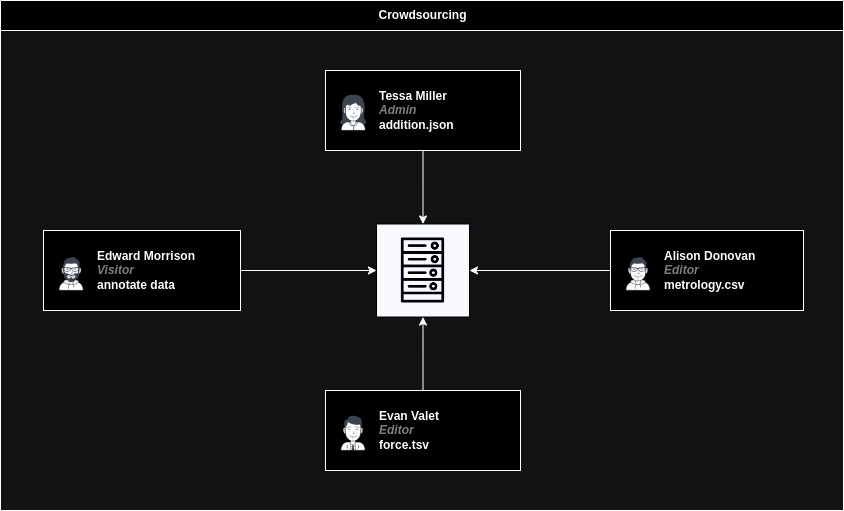
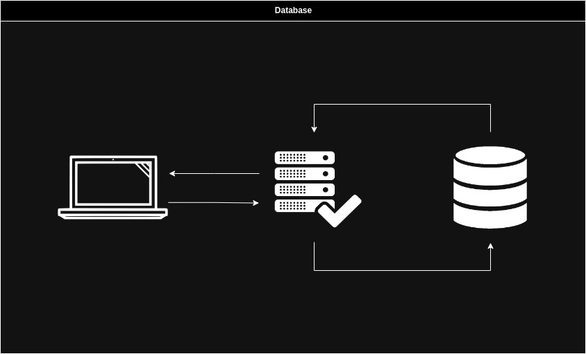
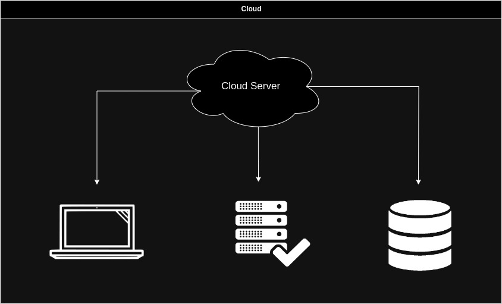
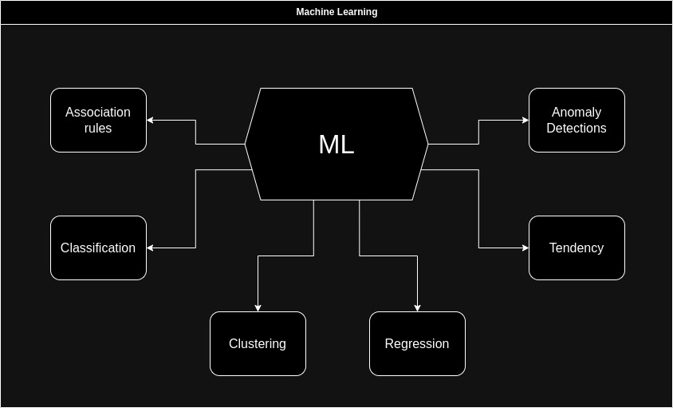
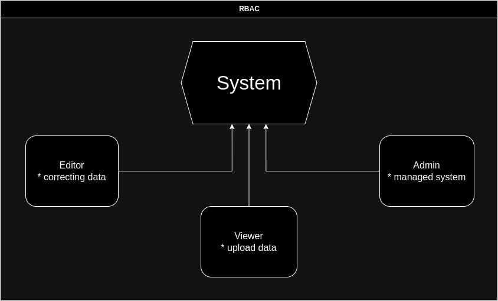
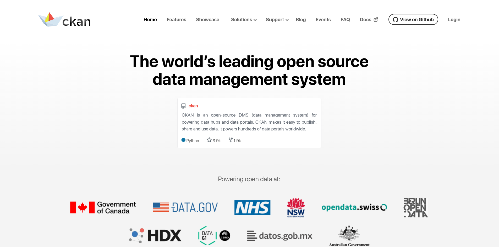
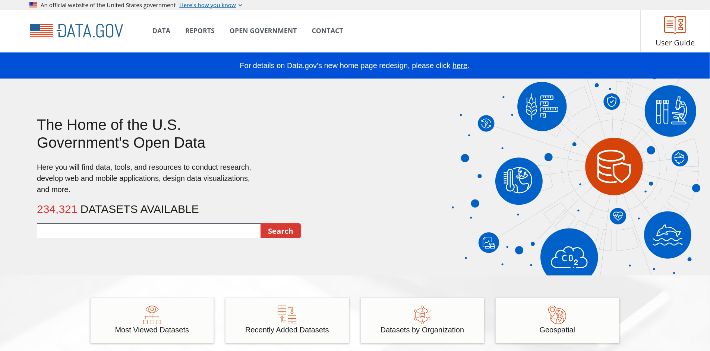
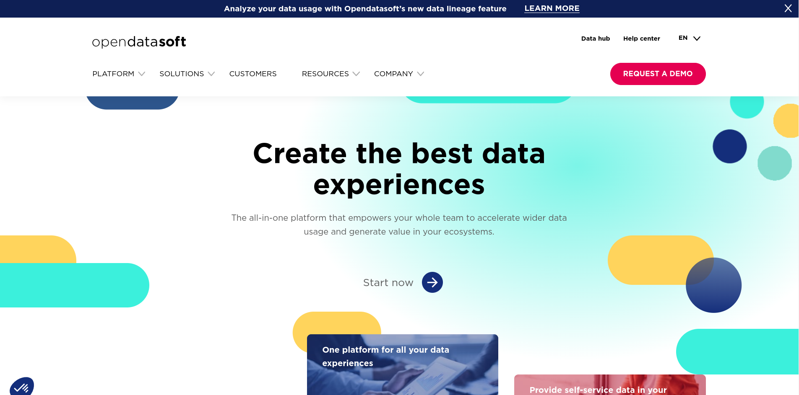
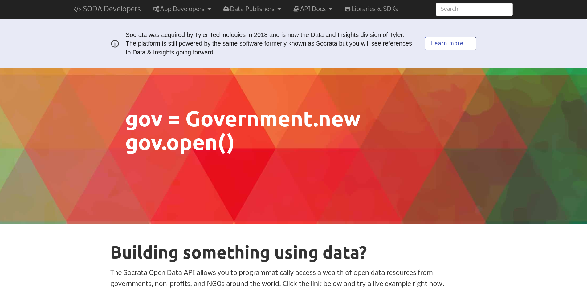

# Аналіз предметної області

## Вступ

 ***У цьому документі відображені усі основні та важливі відомості аналізу предметної області даного проекту.***

 Аналіз предметної області містить наступні розділи:
 - [Основні визначення](#основні-визначення)
 - [Підходи та способи вирішення завдання](#підходи-та-способи-вирішення-завдання)
 - [Порівняльна характеристика існуючих засобів вирішення завдання](#підходи-та-способи-вирішення-завдання)
 - [Висновки](#висновки)
 - [Посилання](#посилання)

## Основні визначення

[Відкриті дані (англ. Open data)](https://leadscanner.com.ua/articles/open-data) - концепція, яка відображає ідею про те, що певні дані повинні бути вільно доступні для машиночитаемого використання і подальшої передруку без обмежень авторського права, патентів та інших механізмів контролю. Звільнити дані від обмежень авторського права можна за допомогою вільних ліцензій, таких як ліцензій Creative Commons. Якщо який-небудь набір даних не є суспільним надбанням, або не пов'язаний ліцензією, що дає права на вільне повторне використання, то такий набір даних не вважається відкритим, навіть якщо він викладений в машиночитаемом вигляді в Інтернет.

[Система управління базами даних (або СУБД)](https://www.ibm.com/docs/en/zos-basic-skills?topic=zos-what-is-database-management-system) - це, по суті, не що інше, як комп'ютеризована система зберігання даних. Користувачам системи надаються sзасоби для виконання декількох видів операцій над такою системою для маніпулювання даними в базі даних або для управління самою структурою бази даних. Системи керування базами даних (СУБД) класифікуються відповідно до їхніх структур або типів даних.

[Краудсорсинг (англ. Сrowdsourcing)](https://novarobota.ua/ua/articles-jobseeker/kraudsorsing-chto-eto-takoe-i-kak-on-rabotaet-v-biznese-413) - це процес, який передбачає залучення широкої групи людей для виконання завдань та подання ідей для досягнення конкретних цілей організатора. Він використовується компаніями, державними установами та некомерційними організаціями, для яких краудсорсинг замінює традиційних працівників.

[Веб-скрапінг (англ. Web Scraping)](https://apix-drive.com/ua/blog/ecommerce/web-scraping) - це автоматичне отримання даних із веб-сторінок відповідно до заданих параметрів.

[База даних (англ. Database)](https://apeps.kpi.ua/shco-take-basa-danykh) - це організована структура, яка призначена для зберігання, зміни та обробки взаємозалежної інформації, переважно великих обсягів.

[Хмарні технології (англ. Cloud Technologies)](https://edin.ua/shho-take-xmarni-texnologi%D1%97-i-navishho-voni-potribni/) - це технології розподіленої обробки цифрових даних, за допомогою яких комп’ютерні ресурси надаються інтернет-користувачеві як онлайн-сервіс. Програми запускаються і видають результати роботи в вікні web-браузера на локальному ПК. При цьому всі необхідні для роботи програми та їх дані знаходяться на віддаленому інтернет-сервері і тимчасово кешуються на клієнтській стороні: на ПК та ін.

[Ролева модель доступу (англ. Role-Based Access Control скор. RBAC)](https://uk.wikipedia.org/wiki/%D0%9A%D0%B5%D1%80%D1%83%D0%B2%D0%B0%D0%BD%D0%BD%D1%8F_%D0%B4%D0%BE%D1%81%D1%82%D1%83%D0%BF%D0%BE%D0%BC_%D0%BD%D0%B0_%D0%BE%D1%81%D0%BD%D0%BE%D0%B2%D1%96_%D1%80%D0%BE%D0%BB%D0%B5%D0%B9) — розвиток політики вибіркового керування доступом, при якому права доступу суб'єктів системи на об'єкти групуються з урахуванням специфіки їх застосування, утворюючи ролі.

[Прикладний програмний інтерфейс (англ. Application Programming Interface скор. API)](https://ua.nesrakonk.ru/application-programming-interface/) - це набір програмного коду, який запитує дані, аналізує відповіді та надсилає інструкції між однією програмною платформою. API широко використовуються для надання послуг передачі даних у різних сферах та контекстах.

[Реляційна база даних (англ. Relation Data Base Management System скор. RDBMS)](https://ua5.org/database/189-reljacjjna-baza-danikh.html) - це структурована колекція даних, яка організована у вигляді таблиць. Кожна таблиця складається з рядків і стовпців, де рядки представляють конкретні записи, а стовпці визначають типи даних, які можуть бути збережені. Реляційна база даних використовує спеціальні зв’язки між таблицями, щоб увізуалізувати і зберігати залежності між даними.

[Нереляційна база даних (англ. Non Relation Data Base)](https://www.google.com/search?q=non+relational+database&oq=no+relation&aqs=chrome.1.69i57j0i10i512j0i512l2j0i10i512l2j0i512l3j0i10i512.5519j0j4&sourceid=chrome&ie=UTF-8) - база даних, яка зберігає дані без чітких зв’язків між собою та без чіткої структури. Замість структурованих таблиць, всередині бази знаходиться безліч різнорідних документів, в тому числі і зображення, відео та навіть публікації у соціальних мережах. На відміну від реляційних БД, NoSQL бази не підтримують SQL запити. 
 

## Підходи та способи вирішення завдання

Управління відкритими даними є важливим завданням, яке можна реалізувати різними способами. У цьому розділі ми розглянемо основні підходи та моделі, які можуть бути використані для розробки системи управління відкритими даними.

### Підходи до збору даних

**Краудсорсинг (англ. Crowdsourcing)** - це підхід у галузі відкритих даних, який передбачає залучення великої кількості людей, або волонтерів, які за власною згодою збирають масиви даних для проекту, оновлюють дані та підтримують якість самих даних у системі управління відкритих даних.

Основні плюси даного підходу:

1. Масштабність: Crowdsourcing дозволяє залучити велику кількість учасників, що допомагає збирати та оновлювати великі обсяги даних.

2. Розмаїтість даних: Учасники можуть мати різні спектри інтересів, що дозволяє розширювати розмах даних та їх різноманітність.

3. Ефективність витрат ресурсів: Сrowdsourcing може бути більш ефективним і економічним способом збору та обробки даних чим інші традиційні способи.

4. Гнучкість: Завдяки гнучкості, crowdsourcing може бути використаний для різних завдань, включаючи створення, валідацію та оновлення даних.

Основні мінуси даного підходу:

1. Якість і точність даних: Учасники можуть бути незаздалегідь неспеціалістами, що може призвести до низької якості та неточності зібраних даних. Потрібна велика увага до валідації та перевірки інформації.

2. Контроль і координація: Керування та координація великої кількості учасників може бути складним завданням. Для забезпечення стабільності потрібно ефективне управління та нагляд.

3. Конфіденційність даних: Залучення широкої громадськості може призвести до ризику порушення конфіденційності особистих чи чутливих даних, якщо не буде вжито відповідних заходів безпеки.

4. Часові рамки і затримки: Реалізація проекту, що використовує crowdsourcing, може займати більше часу через необхідність обробки та перевірки великої кількості даних.

Прикладами використання crowdsourcing є проекти, де громадськість допомагає розпізнавати текст на зображеннях (OCR), маркувати географічні об'єкти на картах, аналізувати дані для наукових досліджень, та багато інших. У контексті управління відкритими даними, crowdsourcing може бути корисним для поповнення та підтримки наборів даних, щоб забезпечити актуальність та точність інформації.

**Веб-скрапінг (англ. Web scraping)** - це модель автоматичного отримання даних з веб-сайтів. Він полягає в тому, щоб програмно витягти інформацію з веб-сторінок, які доступні публічно, і перетворити її у структуровані дані, які можна аналізувати та використовувати для різних цілей. Web scraping дозволяє автоматизувати процес збору даних з Інтернету і зазвичай використовується для таких завдань, як аналіз ринку, моніторинг цін, збір новин або побудова баз даних.

Основні плюси даного підходу:

1. Доступність даних: Можливість отримувати інформацію з різних веб-сайтів і джерел, навіть якщо вона не надається у вигляді відкритих даних.

2. Автоматизація: Веб-скрапінг дозволяє пришвидшити процес збору даних, що позволяє значно зекономити час і ресурси. Завдяки скриптам можливо перевіряти веб-сайти на нові дані та оновлювати нашу базу даних.

3. Широкий спектр даних: Веб-скрапінг може збирати різноманітні дані, такі як текст, зображення, відео, ціни на товари, новини, оголошення і багато іншого. Це визначає веб-скрапінг корисним для різних спектрів даних.

Основні мінуси даного підходу:

1. Юридичні обмеження: Веб-скрапінг може порушувати авторські права та правила веб-сайтів. Деякі власники веб-сайтів можуть встановлювати обмеження щодо скрапінгу через правила використання сайту. Ігнорування цих обмежень може призвести до юридичних наслідків.

2. Нестабільність структури сайту: Веб-скрапінг дуже вразливий до змін у структурі веб-сайту. Якщо власник сайту змінює розміщення або маркування даних, це може призвести до потреби постійного оновлення скриптів.

3. Вимоги до обладнання і ресурсів: Великі обсяги даних або інтенсивний веб-скрапінг може вимагати значних обчислювальних ресурсів і пропускної здатності мережі. Це може призвести до високих витрат на обладнання та хостинг.

### Моделі зберігання даних

**База даних (англ. Database)** - це модель зберігання даних у вигляді структурованих колекцій даних, яка зберігається на носіях даних та доступна через сервер системи, може використовуватися для ефективного пошуку, оновлення та аналізу. Також існують різні види баз даних, тому треба звертати фокусуватися на їх особливостях:

1. NoSQL бази даних: NoSQL бази даних, такі як MongoDB, Cassandra, Redis, Couchbase тощо, використовуються у випадку дані не мають чіткої структури та якщо не потрібна гнучкість у роботі з даними.

2. Реляційні бази даних (англ. RDBMS): Реляційні бази даних, такі як MySQL, PostgreSQL, SQLite, Microsoft SQL Server тощо, зазвичай використовуються якщо дані мають чітку структуру та існують зв'язки між ними, через яких можна виконувати складні запити.

3. Гібридні бази даних: У деяких проектах може бути вигідно використовувати гібридний підхід, коли комбінуются як реляційні, так і NoSQL бази даних в залежності від конкретних завдань та типу даних.

**Хмарні зберігальні системи (англ. Cloud Storage Systems)** - це модель зберігання даних, які надаються через інтернет на базі хмарних технологій. Замість того, щоб зберігати дані локально на власних фізичних серверах або пристроях, проект або його користувачі можуть завантажувати дані за допомогою хмарних серверів, які незалежні від серверу проекту.

Основні плюси даного підходу:

1. Масштабованість: Хмарні зберігальні системи можуть масштабуватися в залежності від потреб системи, не витрачаючи часу на розширення обсягу даних фізично.

2. Резервне копіювання та відновлення: Багато хмарних зберігальних систем автоматично створюють резервні копії даних, що дозволяє відновити дані у випадку втрати або пошкодження на фізичних носіях баз даних системи.

3. Доступність: Дані можна отримати з будь-якого місця, де є доступ до Інтернету. Користувач може отримати доступ до відкритих даних з різних пристроїв (комп'ютери, смартфони, планшети) і навіть спільно користуватися ними з іншими користувачами.

Основні мінуси даного підходу:

1. Залежність: Хмарні зберігальні системи можуть впливати на веб-проекти, які користуються їх послугами через власну політику щодо даних які зберігається. Це ставить веб-проект в стан залежного від хмарних технологій, які дозволяють зберігати дані на власних серверах.

Прикладами популярних хмарних зберігальних систем є Google Drive, Dropbox, Microsoft OneDrive, і багато інших. Вони надають користувачам можливість зберігати, керувати та обмінюватися файлами та даними через хмарний інтерфейс, що робить доступ до інформації більш зручним і гнучким.

### Аналіз та обробка даних

**Машинне навчання (англ. Machine learning)** - це модель автоматичного аналізу та обробки даних завдяки використанню існуючих математичних моделей. Машинне навчання дозволяє знаходити тренди у даних та створювати прогнози на основі отриманих даних, а також виявлення аномалій і покращення рішень які вже використовуються системою.

Машинне навчання має дані особливості:

1. Асоціативні правила - метод машинного навчання дозволяє виявляти закономірності та взаємозв'язки між даними на основі правил.

2. Класифікація - метод машинного навчання який використовується для призначення кожного об'єкту до одного з попередньо визначених класів або категорій на основі аналізу даного об'єкту.

3. Кластеризація - метод, який розбиває вибірки даних на підмножини, які називаються кластерами, так, щоб кожен кластер складавсі зі схожих об'єктів, а об'єкти різних кластерів істотно відрізнялися.

4. Регресія - використовується у випадках коли потрібно за заданим набором ознак спрогнозувати майбутню змінну. Завдання регресії передбачення місця на числовій прямій.

5. Визначення тренду - на основі даних формує загальне передбачення зміни змінних.

6. Виявлення аномалій - машинне навчання дозволяє виявляти та визначати аномалії у структурі даних та у її вибірці.

Для аналізу даних людиною, зазвичай потрібна візуалізація тих самих даних. Тому для цього існує багато методів візуалізації даних, які допомагають представити інформацію у вигляді графічних зображень, щоб спростити розуміння та аналіз даних. **Ось деякі з найпоширеніших методів візуалізації даних:**

1. Графіки та діаграми:

* Лінійні графіки: Використовуються для відображення зміни значень одного або кількох параметрів з часом.
* Стовпчикові графіки: Допомагають порівнювати значення різних категорій або об'єктів.
* Кругові діаграми: Використовуються для відображення часток у відсотках від загальної суми.

2. Графіки розсіювання (англ. Scatter Plots): Використовуються для візуалізації відношень між двома числовими параметрами. Дозволяють виявляти кореляції та викиди даних.

3. Теплові карти (англ. Heatmaps): Показують інтенсивність значень в матриці даних за допомогою кольорів. Це корисний метод для виявлення шаблонів та аномалій у великих наборах даних.

4. Дерева прийняття рішень (англ. Decision Trees): Використовуються для відображення процесу прийняття рішень у вигляді дерева з рішеннями та розділеннями, що базуються на значеннях атрибутів.

5. Картографічні візуалізації: Використовуються для представлення географічних даних на картах. До прикладів належать карти розташування точок і графіки з використанням геоданих.

6. 3D-візуалізація: Використовується для представлення тривимірних даних у тривимірному просторі для аналізу об'єктів з трьох вимірів.

7. Анімація: Використовується для відстеження змін у даних з часом та надає можливість переглядати еволюцію даних.

8. Графіки мереж (англ. Network Graphs): Використовуються для візуалізації складних мереж, таких як соціальні мережі, графи залежностей тощо.

9. Графіки дерев (англ. Tree Diagrams): Допомагають візуалізувати ієрархічну структуру даних, таку як організаційні структури.

### Забезпечення доступу та конфіденційності

**Ролева модель доступу (англ. Role-Based Access Control, RBAC)** - це система контролю доступу, яка базується на призначенні користувачам ролей та наданні прав доступу до ресурсів на основі цих ролей. В контексті системи управління відкритими даними, RBAC може бути важливим компонентом для забезпечення безпеки та керування доступом до різних функціональних можливостей та даних системи.

Основні компоненти ролевої моделі доступу включають:

1. Ролі (англ. Roles): Ролі - це набори прав доступу, які групують користувачів зі схожими функціональними обов'язками або рівнями доступу. Прикладами ролей можуть бути "адміністратор", "редактор", "гість" тощо.

2. Права доступу (англ. Permissions): Права доступу визначають, які дії користувачів дозволено виконувати щодо конкретних ресурсів (наприклад, перегляд, редагування, видалення даних). Кожна роль має набір прав доступу.

3. Користувачі (англ. Users): Користувачі системи прив'язуються до однієї чи декількох ролей. Кожен користувач має можливість виконувати дії, які дозволені його або її ролю.

4. Сесії (англ. Sessions): Сесії відстежують активність користувачів у системі та контролюють їх автентифікацію та авторизацію.

5. Управління ролями англ. (англ. Role Management): Адміністратор системи відповідає за призначення ролей користувачам, зміну наборів прав доступу та визначення, які користувачі мають доступ до конкретних ресурсів.

6. Логування та аудит (англ. Logging and Auditing): Система може вести журнали подій, щоб відстежувати, які користувачі виконують певні дії та змінюють дані, це допомагає виявляти можливі аномалії та порушення безпеки.

7. Внутрішні інтерфейси та API (англ. Internal Interfaces and APIs): Для реалізації RBAC можуть бути використані спеціальні програмні інтерфейси та API, які дозволяють розробникам легко ідентифікувати ролі користувачів та правила доступу до ресурсів.

Ролева модель доступу спрощує керування безпекою і доступом до даних, дозволяючи адміністраторам системи ефективно контролювати, які користувачі мають доступ до певних ресурсів і операцій, що вони можуть виконувати. Вона також допомагає уникнути надмірної складності в управлінні окремими правами для кожного користувача, спрощуючи процес адміністрування системи.

## Порівняльна характеристика існуючих засобів вирішення завдання

**CKAN (Comprehensive Knowledge Archive Network)** - це відкрите програмне забезпечення для створення та управління репозитаріями відкритих даних. Ця платформа розроблена з метою полегшити публікацію, пошук, доступність і спільне використання даних у формі, доступній громадськості, дослідникам та іншим зацікавленим сторонам. Вона стала популярною завдяки співпраці з урядовими органами, муніципалітетами, неприбутковими організаціями та підприємствами для створення веб-порталів відкритих даних. CKAN дозволяє організаціям створювати реєстри даних, які включають деталі та метадані про набори даних, такі як опис, автори, ліцензії, ключові слова тощо. CKAN може бути розширений за допомогою додаткових модулів та розширень, які дозволяють додавати додаткову функціональність та адаптувати платформу під конкретні потреби, та надає API для доступу до даних, що дозволяє інтегрувати дані CKAN у свої додатки та сервіси. А саме головне це те, що CKAN - це відкрите програмне забезпечення з активною спільнотою користувачів та розробників, що надає підтримку та допомогу через форуми, документацію та інші ресурси.

**DATA.GOV** - це веб-портал та ініціатива уряду Сполучених Штатів Америки, спрямована на публікацію та надання доступу до великої кількості відкритих даних, які опубліковані федеральними установами та агентствами США. Ця ініціатива була запущена в 2009 році з метою прозорості, відкритості, та підтримки іновацій урядом. Data.gov містить тисячі наборів даних, що охоплюють різні аспекти життя, включаючи економіку, здоров'я, освіту, середовище, транспорт, безпеку та багато інших. Портал підтримує активну спільноту користувачів, дослідників та розробників, яка сприяє використанню даних та спільному вирішенню проблем. Data.gov став важливим інструментом для громадськості та урядових структур, який сприяє прозорості та інноваціям в США. Цей портал надає доступ до значної кількості інформації, що допомагає громадянам, дослідникам та бізнесу використовувати дані для прийняття рішень, розробки додатків та розв'язання різноманітних завдань.

**OpenDataSoft** - це хмарна платформа для управління відкритими даними (Open Data) і створення веб-порталів відкритих даних. Її програмне забезпечення дозволяє організовувати, ділитися та візуалізувати будь-які типи даних. Програмне забезпечення може використовуватися як приватними компаніями, так і державними установами. Платформа пропонує великий спектр рішень під майже будь-яке завдання, від сфери банкінгу до логістики. А також пропонує користувачам зробити власний сервіс обробки даних завдяки фірменній платформі від OpenDataSoft. Основною перевагою платформи вважається саме використання хмарних технологій та впровадження їх у обробку та зберігання даних.

**Socrata** - це платформа для управління відкритими даними, яка допомагає урядовим органам та організаціям публікувати, аналізувати, візуалізувати та спільно використовувати дані з метою забезпечення прозорості та інновацій. Socrata спрямована на полегшення доступу до даних і використання їх для розв'язання різних соціальних та економічних завдань. Має продвинутий інтуїтивно зрозумілий інтерфейс користувача, що дозволяє навіть неспеціалістам легко завантажувати, публікувати та аналізувати дані без глибоких технічних знань. На відміну від інших, платформа дозволяє інтегрувати дані Socrata з іншими системами та джерелами даних.

| Вимоги |           Критерії            |Nata  | CKAN | DATA.GOV | OpenDataSoft |Socrata |
|:------:|:-----------------------------:|:----:|:--------:|:------------:|:-------:|:-------:|
| Functionality |                                |🟢|🟢|🟡|🟢|🟢|
|        |      Каталогізація даних              |🟢|🟢|🟢|🟢|🟢|
|        |  Завантаження та імпорт даних         |🟢|🟢|🔴|🟢|🟢|
|        |         Наявність API                 |🟢|🟢|🟡|🟢|🟢|
|        |     Пошук та фільтрація               |🟢|🟡|🟡|🟢|🟢|
|        |         Візуалізація даних            |🟢|🟡|🟡|🟢|🟢|
|        |       API доступу до даних            |🟢|🟢|🟡|🟢|🟢|
|        |Підтримка різних форматів даних        |🟢|🟡|🟡|🟢|🟢|
|        |       Керування версіями              |🟡|🟡|🟡|🟡|🟡|
|        | Спільнотна функціональність           |🟡|🟢|🟡|🟢|🟢|
| Usability |                                    |🟢|🟡|🟡|🟢|🟢|
|        |       Інтуїтивний інтерфейс           |🟢|🟢|🟡|🟢|🟢|
|        |            Навігація                  |🟢|🟢|🟡|🟢|🟢|
|        |  Зручність завантаження даних         |🟢|🟡|🟡|🟢|🟢|
|        |         Персоналізація                |🟢|🟡|🟡|🟢|🟢|
|        |   Підтримка різних пристроїв          |🟡|🟡|🟡|🟢|🟢|
|        |          Підтримка мов                |🟡|🟡|🟡|🟡|🟡|
| Reliability |                                  |🟢|🟢|🟢|🟢|🟢|
|        |     Відновлення після збоїв           |🟢|🟢|🟢|🟢|🟢|
|        |Резервне копіювання і відновлення даних|🟢|🟢|🟢|🟢|🟢|
|        |           Приватні проєкти            |🟢|🟢|🔴|🟢|🟢|
|        |        Захист від вторгнень           |🟡|🟢|🟢|🟢|🟢|
|        |    Стійкість до навантаження          |🟡|🟢|🟢|🟢|🟢|
|        |      Аварійне відключення             |🟢|🟢|🟢|🟢|🟢|
| Performance |                                  |🟢|🟢|🟢|🟢|🟢|
|        |       Ефективність обробки даних      |🟢|🟢|🟢|🟢|🟢|
|        |           Кешування даних             |🟡|🟡|🟡|🟢|🟢|
|        |      Швидкість візуалізації даних     |🟢|🟡|🟡|🟢|🟢|
|        |        Мінімізація затримок           |🟢|🟢|🟢|🟢|🟢|
|        |       Пропускна спроможність API      |🟡|🟢|🟢|🟢|🟢|
|        |           Масштабованість             |🟡|🟢|🟢|🟢|🟢|
| Supportability |                               |🟢|🟢|🟡|🟢|🟢|
|        |           Документація                |🟢|🟢|🟡|🟢|🟢|
|        |         Служба підтримки              |🟢|🟢|🟡|🟢|🟢|
|        |        Оновлення та патчі             |🟢|🟢|🟡|🟢|🟢|

## Висновки

По-перше, слід докладно проаналізувати функціональність і вимоги, які має задовольнити система управління даними. На основі порівняльної таблиці, представленої вище, можна встановити, що існуючі системи, такі як CKAN, DATA.GOV, OpenDataSoft або Socrata, вже надають більшість необхідних функцій. Ці системи можуть бути модифіковані за потреби, що може заощадити час і ресурси.

Але важливо врахувати, що інструменти та можливості, які надають існуючі платформи управління відкритими даними, можуть бути досить гнучкими. Це може призвести до проблем при обробці великих обсягів даних, які вимагають ефективної візуалізації та кешування. Також, виникають труднощі у створенні власних інструментів для роботи з власними даними.

З урахуванням усього вищезазначеного, можна зробити висновок, що спеціалізована система, яка надає відповідні і кінцеві інструменти для користувача, може знайти своє місце в сфері управління відкритими даними. Така система може бути спрямована на вирішення конкретних завдань та надавати засоби для роботи з власними даними, що робить її конкурентоспроможною в цьому сегменті ринку.

## Посилання

1. [Відкриті дані](https://leadscanner.com.ua/articles/open-data)
2. [Система управління базами даних](https://www.ibm.com/docs/en/zos-basic-skills?topic=zos-what-is-database-management-system)
3. [Краудсорсинг](https://novarobota.ua/ua/articles-jobseeker/kraudsorsing-chto-eto-takoe-i-kak-on-rabotaet-v-biznese-413)
4. [Веб-скрапінг](https://apix-drive.com/ua/blog/ecommerce/web-scraping)
5. [База даних](https://apeps.kpi.ua/shco-take-basa-danykh)
6. [Хмарні технології](https://edin.ua/shho-take-xmarni-texnologi%D1%97-i-navishho-voni-potribni/)
7. [Ролева модель доступу](https://uk.wikipedia.org/wiki/%D0%9A%D0%B5%D1%80%D1%83%D0%B2%D0%B0%D0%BD%D0%BD%D1%8F_%D0%B4%D0%BE%D1%81%D1%82%D1%83%D0%BF%D0%BE%D0%BC_%D0%BD%D0%B0_%D0%BE%D1%81%D0%BD%D0%BE%D0%B2%D1%96_%D1%80%D0%BE%D0%BB%D0%B5%D0%B9)
8. [Прикладний програмний інтерфейс](https://ua.nesrakonk.ru/application-programming-interface/)
9. [Реляційна база даних](https://ua5.org/database/189-reljacjjna-baza-danikh.html)
10. [Нереляційна база даних](https://www.google.com/search?q=non+relational+database&oq=no+relation&aqs=chrome.1.69i57j0i10i512j0i512l2j0i10i512l2j0i512l3j0i10i512.5519j0j4&sourceid=chrome&ie=UTF-8)
11. [CKAN](https://ckan.org/)
12. [DATA.GOV](https://data.gov/)
13. [OpenDataSoft](https://www.opendatasoft.com)
14. [Socrata](https://dev.socrata.com/)