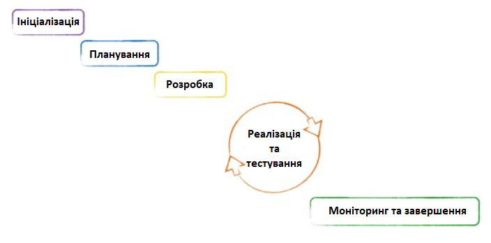
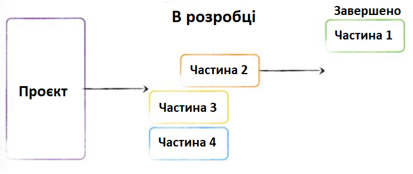
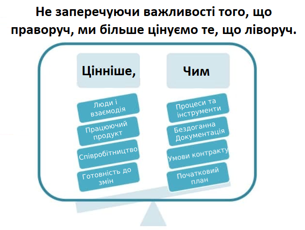
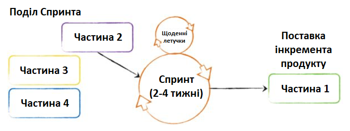
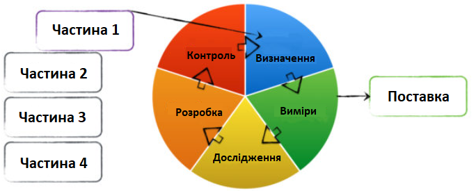
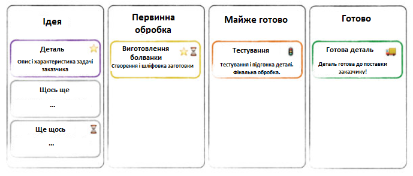

# Аналіз предметної області

## Вступ

У даному документі проводиться аналіз систем управління проєктами. Виділяються основні визначення, такі як: управління проектами, система керування версіями, багатоплатформенність. Також будуть моделі вирішення завдання та  порівняльна характеристика існуючих рішень завдання. Звісно будуть сформовані висновки.

## Основні визначення

***Управління проєктами*** - це процеси планування, організації та управління ресурсами для успішного досягнення цілей та досягнення цілей проекту.

***СУП(Система управління проєктами)*** - це комплексне програмне забезпечення, що включає планування завдань, планування, контроль цін та управління бюджетом, розподіл ресурсів, співпрацю, комунікацію, швидке управління, управління документами та системами та інші програми, які спільно використовуються для управління великими проектами.

***Життєвий цикл проекту*** – це період часу від задуму проекту до його закінчення, який може характеризуватися моментом здійснення перших витрат за проектом (поява проекту) й отриманням останньої вигоди (ліквідація проекту).

***Життєвий цикл ПЗ*** - сукупність окремих етапів робіт, що проводяться у заданому порядку протягом періоду часу, який починається з вирішення питання про розроблення програмного забезпечення і закінчується припиненням використання програмного забезпечення

***API(Application Programming Interface)*** — це набір готових класів, процедур, функцій, структур і констант, що надаються додатком (бібліотекою, сервісом) для використання в зовнішніх програмних продуктах.

***Багатоплатформенність*** - властивість програмного забезпечення працювати більш ніж на одній програмній (в тому числі — операційній системі) або апаратній платформі; технології, що дозволяють досягти такої властивості.

***Панель показників (Dashboard)*** - це розумні звіти в реальному часі, за допомогою яких керівники і менеджери розуміють, що прямо зараз відбувається з певними показниками і групами показників.

***Система керування версіями***— це система, що записує зміни у файл або набір файлів протягом деякого часу, так що ви зможете повернутися до певної версії пізнише.

***Сховище документів (Repository)*** - місце, де система управління версіями зберігає всі документи разом з історією їх зміни та іншої службової інформацією.

***Гілка (Branch)*** - це копія частини (як правило, одного каталогу) сховища, в яку можна вносити свої зміни, які не впливають на інші гілки. Документи в різних гілках мають однакову історію до точки розгалуження і різні - після неї.

<<<<<<< HEAD
***Agile*** - сімейство гнучких ітеративно-інкрементальних методів управління проектами і продуктами.

***Scrum*** - цей фреймфорк створений у 1986 році, вважається найбільш структурованим із сімейства Agile. Він поєднує у собі елементи класичного процесу та ідеї гнучкого підходу до управління проектами. У результаті вийшло дуже збалансоване поєднання гнучкості та структурованості.

***Kanban*** - Цей фреймворк створений інженером компанії Toyota, Тайічі Оно (Taiichi Ono) у 1953 році, Kanban дуже схожий на схему промислового виробництва. На вході до цього процесу потрапляє шматочок металу, але в виході виходить готова деталь. 

***Github projects*** - це один з підпроектів github, який допомагає організовувати командне виконання проекту.Сам сервіс оформлений в вигляді to-do dashboard.

***Trello*** - безкоштовний сервіс для колективного виконання проекту.Сам проект виконаний у вигляді дошки яка містить картки, якими описується завдання.Картки переносяться з одного розділу в інший тим самим ілюструють прогрес виконання проекту.

***BaseCamp*** - проста і ефективна система для керування проектом, містить в своєму арсеналі задачі, календар, профайли,документи і тд. на відміну від попередніх сервісів даний оформлений в стилі to-do list.

***Nifty*** - це сервіс для колективного виконання проектів,сервіс дає змогу користувачу відображати прогрес виконання проекту як у вигляді дошки з завданнями так і у вигляді списку завдань.

***Backlog*** - онлайн інструмент для розробників який дозволяє організувати діяльність команди для реалізації проекту.Софт являє собою потужний інтерфейс з великим вибором функцій які полегшують процес створення проекту.

***Asana*** - це універсальний таск-менеджер який створений для керування задачами і проектами.

***Jira*** - це набір agile-рішень для керування колективною роботою, який забезпечує спільну роботу між усіма учасниками починаючи з ідеї самого проекту і аж до фінального результату.
 
=======
***Дедлайн (Deadline)*** - кінцева дата, коли робота повинна бути готова.

***Віха (Milestone)*** - ключовий етап, перехід на нову стадію розвитку проєкту. Зазвичай, цим важливим етапом є завершення якогось ключового завдання, підписання важливих документів або ж будь-які інші важливі дії, що передбачаються планом проєкту. Перехід цієї контрольної точки призводить до змін у всьому проєкті.
>>>>>>> 4745f84ec861001394309bc21bf2491f0b89d0a7

## Підходи та способи вирішення завдання

>"З усіх труднощів, з якими зіткнулися НАСА, відправляючи людину на Місяць, управління було напевно найскладнішим завданням"
 >                               — Роджер Лауніс, історик НАСА

  Варто зазначити, що усі проекти різні. Немає ідеальної системи управління проектами, придатної кожного з проектів. Також не існує системи, яка б підходила кожному керівнику та була зручною для всіх членів команди. Проте за час існування проектного управління було створено чимало ефективних підходів, методик та стандартів, які будуть описані нижче.
Розроблені підходи дуже відрізняються один від одного. Вони різняться за сферами застосування, деталізованості, самодостатності та формалізації. 

-[Класичне проектне упправління(Водоспад)](#classic)

-[Agile](#agile)

-[Scrum](#scrum)

-[Six Sigma](#sigma)

-[Kanban](#kanban)

-[Чому ми обрали саме Kanban?](#choiсe)

### Класичне проектне упправління(Водоспад)

Ми об'єднали ці два методи, адже вони дуже подібні. Найбільш очевидний спосіб зробити свій проект більш керованим – це розбити його виконання на послідовні етапи. Саме на такій лінійній структурі базується традиційне проектне управління. У цьому сенсі воно нагадує комп'ютерну гру – не можна перейти на наступний рівень, не завершивши попередній.
 
 
 
Цей підхід орієнтований на проекти, у яких є суворі обмеження щодо послідовності виконання завдань. Наприклад, будівництво будинку – не можна будувати стіни без фундаменту.

Різним проектам потрібні різні фази реалізації – деяким достатньо трьох фаз, іншим набагато більше. Чому ми об'єднали ці два підходи, бо в них обох кожен етап є певним підпроектом, під час якого завдання реалізуються за фіксованими ітераціями. Але суть залишається одна - проект розбитий на етапи, які виконуються в певній послідовності.

Завдяки тому, що класичний проектний менеджмент суворо прив'язаний до виконання завдань, як правило, заздалегідь визначеному на етапі планування, для реалізації проектів у рамках цього підходу відмінно підходять інструменти календарно-мережевого планування. Існує безліч інструментів для її побудови – від простих таблиць на кшталт Excel та Smartsheet до професійних програмних пакетів типу Microsoft Project і Primavera.

### Agile

Agile – сімейство гнучких ітеративно-інкрементальних методів управління проектами і продуктами. Відповідно до цього підходу, проект розбивається не так на послідовні фази, але в маленькі підпроекти, які потім «збираються» в готовий продукт. 
 

Незважаючи на те, що Agile увійшов у моду відносно недавно, ідея ітеративної розробки не нова. Свою нинішню назву сімейство гнучких методологій отримало у 2001 році з публікації Маніфесту Agile (Agile Manifesto), який закріпив основні цінності та принципи гнучкої розробки програмного забезпечення, в основі яких – командна робота та адаптація, навіть «любов» до змін.
 
 

Сам собою Agile – не метод управління проектами. Це скоріше набір ідей та принципів того, як потрібно реалізовувати проекти. Вже на основі цих принципів та кращих практик були розроблені окремі гнучкі методи: Scrum, Kanban, Crystal та багато інших. Ці методи можуть досить сильно відрізнятися один від одного, але вони слідують тим самим принципам.

Найголовніша перевага Agile – його гнучкість та адаптивність. Він може підлаштуватися під будь-які умови та процеси організації. Саме це обумовлює його нинішню популярність і те, скільки систем для різних областей було створено на його основі.

Cлаба сторона полягає в тому, що кожній команді доведеться самостійно складати свою систему управління, керуючись принципами Agile.

### Scrum
Цей метод управління створений у 1986 році, вважається найбільш структурованим із сімейства Agile. Він поєднує у собі елементи класичного процесу та ідеї гнучкого підходу до управління проектами. У результаті вийшло дуже збалансоване поєднання гнучкості та структурованості.

Дотримуючись звітів Agile, Scrum розбиває проект на частини, які можуть бути використані Замовником для отримання цінності. Потім ці частини пріоретизуються Власником продукту представником Замовника в команді. Найважливіші «шматочки» першими відбираються до виконання у Спринті – так називаються ітерації в Scrum, що тривають від 2 до 4 тижнів. Наприкінці Спринту Замовнику є робочий інкремент продукту – ті найважливіші «шматочки», які вже можна використовувати. Наприклад, сайт із частиною функціоналу або програма, яка вже працює, хай і частково. Після цього команда проекту розпочинає наступний Спринт. Тривалість у Спринта фіксована, але команда вибирає її самостійно на початку проекту, виходячи із проекту та власної продуктивності.
 
 

Scrum був розроблений для проектів, у яких потрібні «швидкі перемоги» у поєднанні з толерантністю до змін. Крім того, цей фреймворк підходить для ситуацій, коли не всі члени команди мають достатній досвід у тій сфері, в якій реалізується проект – постійні комунікації між членами команд дозволяють недолік досвіду або кваліфікації одних співробітників за рахунок інформації та допомоги від колег.

Scrum дуже вимогливий до команди проекту. Вона повинна бути невеликою (5-9 осіб) і кросфункціональною – тобто члени команди повинні мати більш ніж одну компетенцію, необхідну для реалізації проекту. Наприклад розробник ПЗ повинен мати знання в тестуванні та бізнес-аналітиці. Робиться це для того, щоб частина команди не «вимагала» на різних етапах проекту, а також для того, щоб співробітники могли допомагати та підміняти один одного.

### Six Sigma

Компанія Motorola інженер цієї компанії Bill Smith створив концепцію 6 сигм у 1986 році. Кінцева мета проекту – задоволення замовника якістю продукту, якого можна досягти за допомогою безперервного процесу покращення всіх аспектів проекту, що базується на ретельному аналізі показників. У концепції 6 сигма приділяється окрема увага усунення проблем, що виникають.
 

 
Концепція 6 сигм надає чітку схему для реалізації проектів та постійного поліпшення процесів. Визначаючи цілі, потім ретельно аналізуючи їх та переглядаючи ви отримуєте кількісні дані для глибшого розуміння проекту та прийняття більш якісних рішень. І хоча збір, аналіз даних та витяг уроків можуть зайняти певний час, це дозволить покращити та оптимізувати процеси реалізації проекту та заощадити таким чином ресурси в майбутньому.

6 сигм підходить для важких проектів, у яких багато нових та складних операцій. Цей підхід дозволяє реалізовувати елементи проекту, вчитися на помилках та підвищувати якість у майбутньому.

### Kanban

>_Саме Kanban([Jira](https://jira.com/)) ми вибрали, як основний метод управління проектами і далі розкажемо чому._

Цей фреймворк створений інженером компанії Toyota, Тайічі Оно (Taiichi Ono) у 1953 році, Kanban дуже схожий на схему промислового виробництва. На вході до цього процесу потрапляє шматочок металу, але в виході виходить готова деталь. Також і Kanban, інкремент продукту передається вперед з етапу на етап, а в кінці виходить готовий до поставки елемент.

Крім того, творець Kanban надихався супермаркетами, а саме їх принципом – «тримай на полицях лише те, що потрібне клієнту». А тому Kanban дозволяється залишити незакінчену задачу на одному з етапів, якщо її пріоритет змінився і є інші термінові завдання. Невідредагована стаття для блогу, підвішена без дати публікації або частина коду функції, яку можливо не включатимуть до продукту – це нормально для роботи з Kanban.

Для роботи з Kanban необхідно визначити етапи потоку операцій (workflow). У Kanban вони зображуються як стовпці, а завдання позначають спеціальні картки. Картка переміщається по етапах, подібно до деталі на заводі, що переходить від верстата до верстата, і на кожному етапі відсоток завершення стає вищим. На виході ми отримуємо готовий до постачання замовнику елемент продукту. Дошка зі стовпцями та картками може бути як справжньою, так і електронною – навіть тут Kanban не накладає жодних обмежень на користувачів.
Ваша власна система Kanban може бути настільки гнучкою, наскільки Ви самі того забажаєте - адже багато в чому Kanban є візуалізацією ідеї Agile.

*Сильні сторони Kanban*

Як і Scrum, Kanban добре підходить для досить згуртованих команди з гарною комунікацією. Але на відміну від Scrum, у Kanban немає встановлених точних дедлайн, що добре підходить для замотивованих і досвідчених команд.

При правильному налаштуванні та управлінні, Kanban може принести велику користь команді проекту. Точний розрахунок навантаження на команду, правильне розміщення обмежень і концентрація на постійному поліпшенні - все це дозволяє Kanban серйозно економити ресурси і вкладати в дедлайн і бюджет. І все це у поєднанні з гнучкістю.

*Слабкі сторони Kanban*

Часто можна чути, що Kanban, на відміну від Scrum, можна працювати з практично будь-якою командою. Але це зовсім так. Kanban найкраще підходить для команд, навички членів яких перетинаються. Таким чином вони можуть допомагати один одному долати труднощі під час вирішення завдань. Без цього Kanban буде не таким ефективним, як міг би бути. Також, як уже було сказано, Kanban краще підходить у випадках, коли немає жорстких дедлайнів. Для жорстких дедлайн краще підходить класичний підхід або Scrum.

#### Чому ми обрали саме Kanban?

Kanban менш строгий, ніж його аналоги, він не обмежує час спринтів, немає ролей, за винятком власника продукту. Kanban навіть дозволяє члену команди вести кілька завдань одночасно, що не дозволяє Scrum. Також ніяк не регламентовані зустрічі щодо статусу проекту – можна робити це як Вам зручно, а можна не робити взагалі. Комунікація в команді у нас на високому рівні. Ми створити бесіду для обговорення проєкту в телеграмі, тому і труднощі ми вирішуємо одразу і згуртовано, адже у нас спільні інтереси та бажання, а саме отримати навички і знання, ще й балів на додачу. Гадаю мотивації нам вистачає, тому і жорсткі дедлайни не потрібні, бо всі працюють поступово та швидко одночасно.
 
## Порівняльна характеристика існуючих засобів вирішення завдання

>[__Github projects__](https://github.com/features/issues)

__Github projects__ - Це один з підпроектів github, який допомагає організовувати командне виконання проекту.Сам сервіс оформлений в вигляді "to-do dashboard".На дошці додаються завдання які необхідно виконати,ви можете розбити проект на будь яку кількість задач,також можна прослідкувати прогрес виконання певного завдання,та побачити відповідального за певне завдання.Сам сервіс є інтуїтивно зрозумілий та зручний у використанні.

>[__Trello__](https://trello.com/)

__Trello__ - безкоштовний сервіс для колективного виконання проекту.Сам проект виконаний у вигляді дошки яка містить картки, якими описується завдання.Картки переносяться з одного розділу в інший тим самим ілюструють прогрес виконання проекту.До кожної картки під час виконання присвоюється відповідальний за певне завдання.Користувачі можуть об’єднуватись в команди для виконання якогось завдання, сам сервіс працює в режимі "drag-and-drop",тобто картку після виконання можна перемістити до наступної стадії виконання.

Сам сервіс має безліч стандартних функцій властивих для сервісів цього роду, таких як: 

* додавання на дошку коментарів 
* Додавання файлів 
* Створення контрольних списків  
* Додавання смайлів

Цікавою особливістю trello є можливість додавання плагінів для розширення базового функціоналу.Сервіс є зручним у використанні і має приємний для використання інтерфейс.

>[__BaseCamp__](https://basecamp.com/)

__BaseCamp__ -Проста і ефективна система для керування проектом, містить в своєму арсеналі задачі, календар, профайли,документи і тд. на відміну від попередніх сервісів даний оформлений в стилі "to-do list",тобто існує список в якому записуються задачі які необхідно виконати, при переході на задачу відкривається більш детальний опис завдання де користувач може відмітити що він виконав це завдання.Сервіс надає змогу користувачам:

- Відслідковувати прогрес виконання завдання
- Зберігати та спільно використовувати документи
- Спілкуватись зі своєю проектною групою
- Полегшити спільне виконання проекту

До плюсів можна віднести зручний та простий у використанні інтерфейс,наявність спільного редагування документації,функціонал для спіілкування з командою.До мінусів досить невеликий запас інструментів, однак достатній для комфортного користування сервісом.

>[__Nifty__](https://niftypm.com/)

__Nifty__ - Це сервіс для колективного виконання проектів,сервіс дає змогу користувачу відображати прогрес виконання проекту як у вигляді дошки з завданнями так і у вигляді списку завдань.

Містить у собі такі функції як:
* Систему нагадувань 
* Історію редагування завдань
* Можливість завдавання дедлайнів,
* Інтеграцію з Github

До перевах сервісу можна віднести підвищення ефективності командної роботи за допомогою таких функцій як: онлайн редагування документу в реальному часі декількома людьми, спільний чат для обговорення задач та проектів.

Також проект надає досить широкий вибір видів розподілу задач, таких як Дошка завдань, "to-do list",календарний план та таблиця задач.
Загалом досить зручний та візуально приємний у використанні сервіс

>[__Asana__](https://asana.com/)

__Asana__ - це універсальний диспетчер завдань, який створений для керування задачами і проектами.

Сервіс містить в собі все необхідне для комфортної роботи: 
- задачі 
- підзадачі, 
- систему нагадувань, 
- календар 
- приємний та інтуїтивно зрозумілий дизайн.

Що ж до функціоналу цього сервісу можна виділити: можливість модифікації задач, сучасний дизайн, простий та зрозумілий інтерфейс, візуалізацію задач у вигляді календаря, наявність android додатку.

Будь яку задачу сервіс дозволяє планувати максимально детально, за допомогою наступних елементів: підзадачі, об'єднання задач, дедлайни, вкладені файли, система лайків, теги.Загалом сервіс є зручним та досить легким у використанні.

>[__Jira__](https://www.atlassian.com/software/jira)

__Jira__ - це набір agile-рішень для керування колективною роботою, який забезпечує спільну роботу між усіма учасниками починаючи з ідеї самого проекту і аж до фінального результату.За допомогою jira команда може планувати ,призначати та відслідковувати роботу, а також керувати нею. Сервіс дає можливість оформлювати задачі у вигляді Kanban дошки, що допоможе команді оптимізувати робочий процес і розділити проект на задачі з відставанням(backlog),прив'язати програмний код до задачі, вести документацію, та проводити сумісну роботу кількох людей над однією задачею.Сам сервіс має простий интерфейс під час роботи з яким не буде виникати труднощів. 

## Порівняльна таблиця

Нижче йде порівняльна таблиця за критеріями. Ці критерії умовно поділені на категорії, згідно їх призначення/функції. Цих критеріїв існує більше, але для порівняння вони були спрощенні до найважливіших та тих, які відрізняються. Деякі категорії (наприклад, як "Швидкість") відсутні, адже припустимо, що кожен з перелічених проектів має таку рису.

|Категорії|Особливості|Github Projects|Trello|BaseCamp|Nifty|Asana|Jira|Наш проєкт|
|---|---|:---:|:---:|:---:|:---:|:---:|:---:|:---:|
|**Функціональність**|Автоматизація|:heavy_check_mark:|:heavy_check_mark:|:heavy_check_mark:|:heavy_check_mark:|:heavy_check_mark:|:heavy_check_mark:|:x:|
|			  	  |Керування командою|:heavy_check_mark:|:heavy_check_mark:|:heavy_check_mark:|:heavy_check_mark:|:heavy_check_mark:|:heavy_check_mark:|:heavy_check_mark:|
|			  	  |Сповіщення|:heavy_check_mark:|:heavy_check_mark:|:heavy_check_mark:|:heavy_check_mark:|:heavy_check_mark:|:heavy_check_mark:|:x:|
|			  	  |API|:heavy_check_mark:|:heavy_check_mark:|:heavy_check_mark:|:heavy_check_mark:|:heavy_check_mark:|:heavy_check_mark:|:x:|
|			  	  |Чат|:heavy_check_mark:|:heavy_check_mark:|:heavy_check_mark:|:heavy_check_mark:|:heavy_check_mark:|:x:|:x|
|			  	  |Артифакти|:heavy_check_mark:|:heavy_check_mark:|:x:|:x:|:x:|:heavy_check_mark:|:heavy_check_mark:|
|			  	  |Робочі процеси|:heavy_check_mark:|:heavy_check_mark:|:x:|:heavy_check_mark:|:heavy_check_mark:|:heavy_check_mark:|:x:|
|			  	  |Залежності завдань|:x:|:x:|:x:|:x:|:heavy_check_mark:|:x:|:heavy_check_mark:|
|			  	  |Статуси завдань|:heavy_check_mark:|:heavy_check_mark:|:x:|:heavy_check_mark:|:heavy_check_mark:|:heavy_check_mark:|:heavy_check_mark:|
|				  |Віхи|:heavy_check_mark:|:heavy_check_mark:|:heavy_check_mark:|:heavy_check_mark:|:heavy_check_mark:|:heavy_check_mark:|:heavy_check_mark:|
|**Практичність**|Клієнтські програми|:heavy_check_mark:|:heavy_check_mark:|:heavy_check_mark:|:heavy_check_mark:|:heavy_check_mark:|**Лише мобільний додаток**|:x:|
|			 	 |Автономний режим|:heavy_check_mark:|:x:|:x:|:heavy_check_mark:|:heavy_check_mark:|:heavy_check_mark:|:x:|
|			 	 |Ціноутворення|**Безкоштовно**-$21/місяць|**Безкоштовно**-$17.5/місяць|Обмежена:**Безкоштовно**, Повна: $99/місяць|**Безкоштовно**-400$/рік|**Безкоштовно**-25$/місяць|**Безкоштовно**-14.5$/місяць|**Безкоштовно**|
|			 	 |Кросплатформеність|:heavy_check_mark:|:heavy_check_mark:|:heavy_check_mark:|:heavy_check_mark:|:x::heavy_check_mark:(No Linux)|**Браузер і мобільний**|**Браузер**|
|**Надійність**|Конфіденційність|:heavy_check_mark:|:heavy_check_mark:|:heavy_check_mark:|:heavy_check_mark:|:heavy_check_mark:|:heavy_check_mark:|:heavy_check_mark:|
|				|Резервне копіювання|:heavy_check_mark:|:heavy_check_mark:|:heavy_check_mark:|:heavy_check_mark:|:heavy_check_mark:|:heavy_check_mark:|:heavy_check_mark:|
|				|Висока захищеність|:heavy_check_mark:|:heavy_check_mark:|:heavy_check_mark:|:heavy_check_mark:|:heavy_check_mark:|:heavy_check_mark:|:x:|
|**Продуктивність**|Інтеграція VCS|:heavy_check_mark:|:heavy_check_mark:|:x::heavy_check_mark:|:heavy_check_mark:|:heavy_check_mark:|:x::heavy_check_mark:|:x:|
|				 |Документація|:heavy_check_mark:|:heavy_check_mark:|:heavy_check_mark:|:heavy_check_mark:|:heavy_check_mark:|:heavy_check_mark:|:heavy_check_mark:|
|				 |Багатомовний|:x:|:heavy_check_mark:|:x:|:heavy_check_mark:|:heavy_check_mark:|:heavy_check_mark:|**RU, UA, EN**|
|**Працездатність**|Часті оновлення|:heavy_check_mark:|:heavy_check_mark:|:heavy_check_mark:|:heavy_check_mark:|:heavy_check_mark:|:heavy_check_mark:|:x:|
|				   |Підтримка користувачів|:heavy_check_mark:|:heavy_check_mark:|:heavy_check_mark:|:heavy_check_mark:|:heavy_check_mark:|:heavy_check_mark:|:x:|
|			  	   |Обслуговування клієнтів|:heavy_check_mark:|:heavy_check_mark:|:heavy_check_mark:|:heavy_check_mark:|:heavy_check_mark:|:heavy_check_mark:|:x:|
|			  	   |Зворотній зв'язок|:heavy_check_mark:|:heavy_check_mark:|:heavy_check_mark:|:heavy_check_mark:|:heavy_check_mark:|:heavy_check_mark:|:heavy_check_mark:|

## Висновки

Виконавши аналіз ефективних підходів, методик та стандартів, можна зазначити, що вони різняться за сферами застосування, деталізованості, самодостатності та формалізації. Тобто для кожного проекту відповідний підход. Кожен аналізує та вибирає свої засоби вирішення завдань. 
Виконавши аналіз ефективних підходів, методик та стандартів, можна зазначити, що вони різняться за сферами застосування, деталізованості, самодостатності та формалізації. Тобто для кожного проекту відповідний підход. Кожен аналізує та вибирає свої засоби вирішення завдань. Можна помітити, що багато сервісів не підтримують артефакти та залежності задач. Ми вирішили сфокусувати наш проект на реалізації наступних можливостей: керування командою (ролі), артефакти, статуси задач, залежності задач одна від одної, дедлайни.

## Посилання

 - [__Підходи до управління проектами__](https://infostart.ru/1c/articles/985232/)

 - [__Методи управління проектами__](https://www.pmservices.ru/project-management-news/top-7-metodov-upravleniya-proektami-agile-scrum-kanban-prince2-i-drugie/)

 - [__Github projects__](https://github.com/features/issues)

 - [__Trello__](https://trello.com/)

 - [__BaseCamp__](https://basecamp.com/)

 - [__Nifty__](https://niftypm.com/)

 - [__Asana__](https://asana.com/)

 - [__Jira__](https://www.atlassian.com/software/jira)
