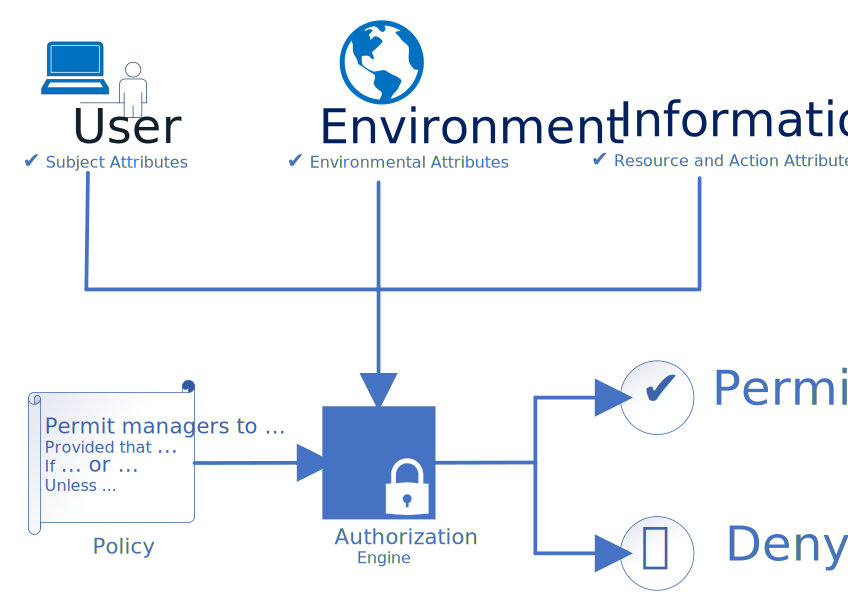

# Аналіз предметної області

## Вступ

_[Вступ повинен містити короткий огляд всього документу.]_

**_vhgdvdc dhcbjhbcds cdsbcdshgc b cbhd cgds cg d_**

gdgdgf:

- jdsjsd
- ncjdsnc
- mncjdcnsdknc

 sbhcjhsdcdshc 

## Основні визначення

_[Розділ містить визначення термінів та скорочень, які використовуються при аналізі предметної області.]_

## Підходи та способи вирішення завдання

_[Розділ містить опис підходів, моделей та способів вирішення завдання.]_

### Життєвий цикл даних

Це низка етапів, через які проходять дані від їх створення до остаточного вилучення або видалення. Це спосіб зрозуміти та керувати потоком даних протягом усього їхнього існування, забезпечуючи належне управління, підтримку та використання на кожному етапі.

**1. Створення (збір) даних**: Це початковий етап, на якому дані генеруються або збираються з різних джерел.

**2. Зберігання та обслуговування даних**: Після того, як дані зібрані, їх потрібно зберігати в безпечному та організованому місці для легкого доступу та обслуговування. Це можуть бути бази даних, хмарні сховища тощо.

**3. Використання даних**: Цей етап передбачає обробку та аналіз даних для вилучення корисної інформації. Він може включати очищення, трансформацію, статистичний аналіз, машинне навчання тощо.

**4. Архівування даних**: Після того, як дані були використані, вони можуть бути заархівовані для подальшого використання або для дотримання законодавчих чи нормативних вимог.

**5. Видалення або повторне використання даних**: дані можуть бути видалені, коли вони більше не потрібні, або повторно використані для інших цілей.

У нашій системі управління відкритими даними ми збиратимемо широкий спектр типів даних, які існують у сучасному цифровому просторі. Сюди входять структуровані дані, такі як числа та категорії, напівструктуровані дані, такі як XML та JSON, та неструктуровані дані, такі як текст, зображення та відео. Завдяки підтримці цих різноманітних типів даних наша система буде дуже універсальною і здатною працювати з широким спектром застосувань. Така гнучкість робить нашу систему управління відкритими даними надійним рішенням для управління та аналізу даних в сучасному світі.

### Методи збору даних

#### Web scraping

Також відомий як вилучення даних, - це метод, який використовується для вилучення контенту та даних з вебсайтів. Web scraping дозволяє користувачам збирати великі обсяги даних ефективно й автоматично, заощаджуючи час і зусилля порівняно з ручним вилученням даних.

Процес веб-скрепінгу складається з двох основних частин: краулера та скрепера. Краулер, також відомий як павук або бот, - це алгоритм штучного інтелекту, який переглядає вебсторінка в пошуках необхідних даних, переходячи за посиланнями в Інтернеті. З іншого боку, скрепер - це спеціальний інструмент, створений для вилучення даних з вебсайту.

#### API

Інтерфейс прикладного програмування можна визначити як набір правил і протоколів, що дозволяє додатку спілкуватися та обмінюватися даними із зовнішніми сервісами. Він забезпечує структурований спосіб доступу до даних і їх отримання, що дозволяє системі використовувати наявні функціональні можливості та дані з різних джерел. Це розширює сферу застосування системи, підвищує ефективність і дозволяє масштабувати її в міру зростання.

**Переваги використання сторонніх API:**

- Доступ до зовнішніх даних: API можуть надати доступ до даних із зовнішніх сервісів, інформаційних систем. Це може значно розширити сферу застосування та корисність нашої системи.

- Ефективність: API дозволяють використовувати наявні функціональні можливості та дані, заощаджуючи час і зусилля на їх створення з нуля. Це може зробити процес розробки більш ефективним.

- Масштабованість: У міру зростання проєкту може знадобитися інтеграція з більшою кількістю сервісів або обробка більшого обсягу даних. API дозволяють легко масштабувати проєкт без значних змін у кодовій базі.

- Безпека: Використовуючи API, не потрібно розкривати всю інформаційну систему, а лише ті частини, які необхідно. Це означає, що можна тримати конфіденційну інформацію прихованою, без втрати можливості надавати послуги.

#### Database extraction

Витяг з бази даних - це процес отримання даних з бази даних для подальшого використання. Він передбачає використання мови запитів, такої як SQL (мова структурованих запитів), для безпосередньої взаємодії з базою даних і вилучення необхідних даних. Ці витягнуті дані можуть бути використані для різних цілей, таких як аналіз, звітність або введення в інші системи. Процес вилучення можна налаштувати для отримання конкретних даних, які відповідають певним критеріям, що робить його гнучким і потужним інструментом для управління даними.

**Переваги:**

- Доступ до структурованих даних: Якщо система передбачає роботу зі структурованими даними, SQL дозволяє безпосередньо взаємодіяти з реляційними базами даних. Це означає, що ми можемо витягувати конкретні дані відповідно до наших потреб.

- Ефективний пошук даних: SQL призначена для керування даними, що зберігаються в реляційних системах керування базами даних. Вона дуже ефективна для швидкого вилучення великих обсягів даних. Це може бути особливо корисно, якщо система передбачає роботу з великими наборами даних.

- Гнучкість і потужність: SQL забезпечує велику гнучкість вилучення даних. Можна використовувати різні оператори (наприклад, SELECT, FROM, WHERE), щоб точно вказати, які дані потрібно отримати. Це робить SQL потужним інструментом для будь-якої системи де потрібно взаємодіяти з даними.

- Маніпулювання даними: Окрім вилучення даних, SQL також дозволяє оновлювати, видаляти або вставляти нові дані в базу даних. Це може бути корисно для підтримки та оновлення даних системи.

- Інтеграція з іншими технологіями: SQL можна використовувати в поєднанні з різними мовами програмування (наприклад, Python, Java тощо) та інструментами (наприклад, Excel, Tableau тощо), що робить її універсальним рішенням для багатьох систем.

### Зберігання даних

_База даних_ - це структурований набір даних. Це сукупність інформації, яка організована таким чином, щоб до неї можна було легко отримати доступ, керувати нею та оновлювати. Бази даних можна класифікувати за типами вмісту: бібліографічні, повнотекстові, числові та графічні.

**NoSQL databases**: NoSQL бази даних, такі як MongoDB, Cassandra, Redis, Couchbase тощо, використовуються, коли дані не мають чіткої структури й коли вам потрібна гнучкість у роботі з даними. Вони більш масштабовані, ніж традиційні реляційні бази даних, і можуть зберігати дані у різних форматах. Але їм може бракувати узгодженості, вони мають обмежену підтримку та аналітичні можливості, а також стикаються з бар'єрами на шляху до впровадження через свою відносну новизну.

**Relational databases (RDBMS)**: Реляційні бази даних, такі як MySQL, PostgreSQL, SQLite, Microsoft SQL Server тощо, зазвичай використовуються, коли дані мають чітку структуру і між ними існують зв'язки, які можна використовувати для виконання складних запитів. Вони забезпечують послідовний дизайн бази даних, але мають обмеження, коли мова йде про великі обсяги транзакцій або великі обсяги зберігання даних.

**Гібридна база даних** - це тип бази даних, який поєднує в собі особливості баз даних SQL та NoSQL. Вона може зберігати дані як у форматі SQL, так і в форматі NoSQL, дозволяючи вам користуватися перевагами обох типів баз даних. Приклад: Altibase.

**Cloud Storage Systems**: Хмарні системи зберігання даних забезпечують масштабованість, резервне копіювання та відновлення, а також доступність. Приклади таких систем: Oracle Cloud Storage, Microsoft Azure Storage, IBM Cloud Object Storage. Вони можуть масштабуватися залежно від потреб системи, автоматично створювати резервні копії даних, що дозволяє відновити їх у разі втрати або пошкодження фізичного носія бази даних системи, а також надавати доступ до даних з будь-якого місця, де є доступ до Інтернету. Однак вони ставлять вебпроєкт у залежність від хмарних технологій, які дозволяють зберігати дані на власних серверах.

#### Гібридна база даних

У нашому проєкті ми вирішили використовувати гібридну базу даних. Це рішення ґрунтується на унікальних перевагах, які пропонують гібридні бази даних. Гібридна база даних поєднує в собі функції як SQL, так і NoSQL баз даних, дозволяючи зберігати дані як в структурованому, так і в неструктурованому форматі. Це забезпечує гнучкість баз даних NoSQL, яка ідеально підходить для обробки неструктурованих даних, і можливості структурованих запитів баз даних SQL, які корисні для обробки складних запитів.

**Переваги**

- Гнучкість: гібридні бази даних можуть обробляти як структуровані, так і неструктуровані дані.
- Масштабованість: Вони можуть масштабуватися відповідно до потреб системи.
- Висока продуктивність: Вони пропонують високопродуктивну обробку даних в основній пам'яті разом з великою ємністю сховища.

**Недоліки**

- Синхронізація даних: Потенційні проблеми з втратою синхронізації даних.
- Складне управління: Потреба в складних скриптах для виконання базових завдань.

### Аналіз даних

**TensorFlow** - це безплатна бібліотека програмного забезпечення з відкритим вихідним кодом для машинного навчання та штучного інтелекту. Вона надає ряд функціональних можливостей, які дозволяють створювати й тренувати моделі машинного навчання, а потім використовувати ці моделі для виконання таких завдань, як прогнозування результатів або виявлення закономірностей у ваших даних.

У контексті нашої системи управління відкритими даними TensorFlow можна використовувати для аналізу даних. Він може обробляти великі набори даних, що робить його придатним для систем з великими даними (big data).

Крім того, TensorFlow надає кілька інструментів і бібліотек, які можуть допомогти в аналізі даних. Наприклад, TensorFlow Data Validation (TFDV) допоможе вам зрозуміти й перевірити ваші дані. TensorFlow Transform (TFT) корисний для попередньої обробки вхідних даних. TensorFlow Model Analysis (TFMA) дозволяє розподілено оцінювати моделі на великих обсягах даних.

Використовуючи ці інструменти, можливо перетворити необроблені дані на значущу інформацію, яка може сприяти прийняттю рішень у нашій системі управління відкритими даними.

### Візуалізація даних

**D3.js** — це бібліотека JavaScript для створення динамічної та інтерактивної візуалізації даних у веббраузерах. Він використовує широко реалізовані стандарти масштабованої векторної графіки, HTML5 та Каскадних Таблиць Стилів.

_Причини використання D3.js:_

- Універсальність: D3.js не обмежується певним типом діаграми або графіка. Він може створювати що завгодно, від простої гістограми до складних інтерактивних діаграм.

- Інтеграція з вебтехнологіями: D3.js використовує стандартні вебтехнології - HTML, CSS, SVG та JavaScript. Це дозволяє легко інтегрувати D3.js у будь-який вебдодаток.

- Динамічність та інтерактивність: D3.js може створювати динамічні візуалізації, які можуть оновлюватися і змінюватися в режимі реального часу. Він також підтримує взаємодію з користувачем, наприклад, натискання, наведення, масштабування тощо.

- Доступ до елементів нижчого рівня: На відміну від багатьох інших бібліотек, які надають готові діаграми, D3.js дає контроль над основними елементами візуалізації. Це дозволяє точно налаштувати діаграми.

### Доступ до даних

**Контроль доступу на основі атрибутів (Attribute-Based Access Control, ABAC)** - це модель авторизації, яка використовує атрибути, а не ролі для визначення доступу. Мета ABAC - захистити такі об'єкти, як дані, мережеві пристрої та ІТ-ресурси від несанкціонованих користувачів та дій. ABAC еволюціонувала від простих списків контролю доступу та контролю доступу на основі ролей (RBAC) і була схвалена US CIO.

_Основні компоненти моделі ABAC включають:_

1. Суб'єкт: Користувач, який запитує доступ до ресурсу для виконання певної дії. Атрибути суб'єкта в профілі користувача включають ідентифікатор, посадові ролі, членство в групах, членство в департаментах та організаціях, рівень управління, допуск до доступу та інші ідентифікаційні критерії.

2. Ресурс: Актив або об'єкт (наприклад, файл, додаток, сервер або навіть API), до якого суб'єкт хоче отримати доступ. Атрибути ресурсу - це всі ідентифікаційні характеристики.

3. Дія: Те, що користувач намагається зробити з ресурсом. Поширені атрибути дій включають "читання", "запис", "редагування", "копіювання" і "видалення ".

4. Середовище: Ширший контекст кожного запиту на доступ. Усі атрибути середовища вказують на такі контекстуальні фактори, як час і місце спроби доступу, пристрій суб'єкта, протокол зв'язку та надійність шифрування.

Контроль доступу на основі атрибутів (ABAC) використовує атрибути користувачів, ресурсів і середовища для створення правил контролю доступу. Ці політики виражаються у вигляді булевих функцій. На відміну від контролю доступу на основі ролей (RBAC), ABAC може оцінювати багато різних атрибутів, що дозволяє створювати складні набори правил.

ABAC спрощує управління безпекою, визначаючи узгоджені атрибути в правилах, усуваючи потребу в явних авторизаціях. Атрибути можуть бути атомарними (одне значення, наприклад, дозвіл) або множинними (кілька значень, наприклад, ролі та проєкти).

ABAC є моделлю "наступного покоління", оскільки забезпечує динамічний, контекстно-залежний контроль доступу. Вона дозволяє включати атрибути з різних систем, що забезпечує ефективне дотримання нормативних вимог.

## Порівняльна характеристика існуючих засобів вирішення завдання

_[Розділ містить опис існуючих програм, інформаційних систем, сервісів, тощо, призначених для вирішення
завдання. Дається порівняльна характеристика властивостей FURPS:_

- _Functionality (функциональні вимоги)_
- _Usability (вимоги до зручності роботи)_
- _Reliability (вимоги до надійності)_
- _Performance (вимоги до продуктивності)_
- _Supportability (вимоги до підтримки)_

  _(у вигляді таблиці).]_

### [Gapminder](https://www.gapminder.org/)

незалежна некомерційна організація, яка надає доступ до даних та інформації про світовий розвиток через візуалізацію даних та інтерактивні інструменти. Заснована в Швеції, організація бореться з нестачею інформації та стереотипами в галузі світового розвитку, а також надає освітні ресурси та інструменти для аналізу світових тенденцій.

### [The World Bank DataBank](https://databank.worldbank.org/)

це онлайн-платформа, надана Всесвітнім банком, яка надає доступ до різноманітних даних зі світового розвитку. Вона є корисним ресурсом для дослідників, політиків та всіх, хто зацікавлений у економічних та соціальних даних з різних країн світу. На платформі доступні різні набори даних, включаючи економічні показники, демографічну інформацію, статистику здоров'я та освіти, дані про інфраструктуру та багато іншого.

### [EuroStat](https://ec.europa.eu/eurostat/web/main/data/database)

це статистичне агентство Європейського Союзу, відповідальне за збір, аналіз та оприлюднення статистичних даних з різних сфер життя в країнах ЄС. Головна мета Eurostat - це надавати надійні та порівнянні дані, які використовуються для моніторингу та аналізу соціально-економічних процесів в Європейському Союзі. Ці дані корисні для прийняття рішень на рівні ЄС та для порівняння статистики між різними країнами Європи. Eurostat сприяє створенню єдиного інформаційного простору для аналізу та планування розвитку в ЄС.

### [Google Public Data Explorer](https://www.google.com/publicdata/directory)

це інтерактивний веб-інструмент, розроблений Google, який надає доступ до великої кількості глобальних статистичних даних. Цей інструмент дозволяє користувачам візуалізувати та аналізувати дані з різних джерел, зокрема офіційних статистичних органів, інститутів та організацій. Google Public Data Explorer допомагає користувачам зробити інформацію більш доступною та зрозумілою, шляхом візуальних графіків та діаграм, які допомагають аналізувати тенденції та порівнювати дані між різними країнами та регіонами.

### [Dataverse](https://dataverse.org/)

це відкрите програмне забезпечення та інфраструктура для управління та публікації наукових даних. Він розроблений з метою зберігання, організації та поширення даних, що дозволяє дослідникам зберігати свої наукові набори даних, надаючи доступ до них для інших учених та громадськості. Dataverse сприяє відкритому доступу до даних, сприяє їхній архівації та забезпеченню довгострокової доступності для подальших досліджень.

Критерії:
- 🟢 - функція реалізована 
- 🟡 - функція реалізована, проте має недоліки
- ❌ - функція не реалізована

| Категорія | Критерій | Open Data Management System | Dataverse | Gapminder | The World Bank DataBank | Eurostat | Google Public Data Explorer  |
| :----------------------------------------: | :---------------------------------------------------: | :-------------------------: | :--------------------------------------------------------------: | :-------------------------------------------------------------------------------: | :-----------------------------------------------------------------------------------------: | :----------------------------------------------------------------------------------------------------------------------------------------------: | :--------------------------------------------------------------------------------------------------------: |
|**Functionality**                           |           Створення, редагування датасетів            | 🟢 | 🟢 | 🟡 | ❌ | ❌ | 🟢 |
|                                            |          Інструменти для візуалізації данних          | 🟢 | ❌ | 🟢 | 🟢 | 🟢 | 🟢 |
|                                            |                        Дозволи                        | 🟢 | ❌ | 🟢 | ❌ | ❌ | ❌ |
|                                            |                         Пошук                         | 🟢 | 🟢 | 🟡 | 🟢 | 🟢 | 🟡 |
|                                            |                 Поділ даних за темами                 | 🟢 | 🟢 | 🟢 | 🟢 | 🟢 | 🟢 |
|**Usability**                               |              Підтримка англійської мови               | 🟢 | 🟢 | 🟢 | 🟢 | 🟢 | 🟢 |
|                                            |                 Наявність Документації                | 🟢 | 🟢 | 🟢 | ❌ | 🟢 | 🟢 |
|                                            |                         UI/UX                         | 🟢 | 🟡 | 🟢 | 🟡 | 🟡 | 🟡 |
|**Reliability**                             |            Ліцензія та вказівка авторства             | 🟢 | 🟢 | 🟢 | 🟢 | 🟢 | 🟢 |
|**Performance**                             |            оцінка через PageSpeed Insights            | 🟢 | 🟡 78 | 🟡 85 | 🟢89 | ❌ 49 | 🟢 98 |
|**Supportability**                          |             Можливість зворотнього звязку             | 🟢 | 🟢 | 🟢 | 🟡 | 🟢 | 🟢 |
|                                            |                  Актуальність даних                   | 🟢 | 🟡 | 🟡 | 🟡 | 🟢 | 🟡 |

## Висновки

_[Робляться висновки щодо доцільності розробки нової або модифікації існуючої інформаційної системи, необхідності та способів інтеграції з системами(сервісами) третіх сторін, тощо.]_

## Посилання

_[Розділ містить повний список всіх документів, про які згадується.]_
