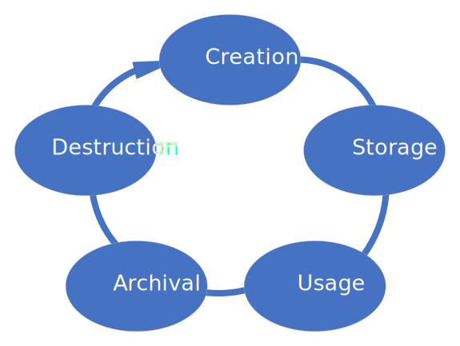
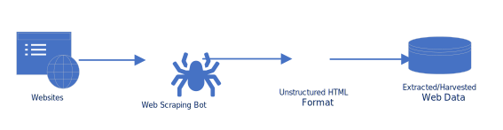
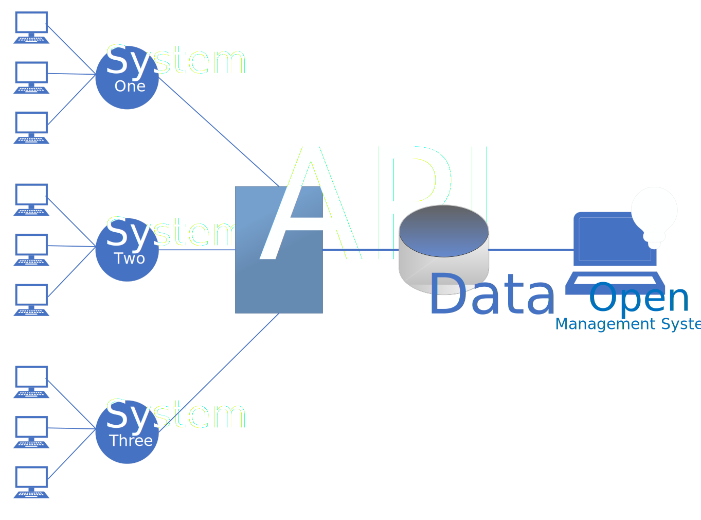

# Аналіз предметної області

## Вступ

_[Вступ повинен містити короткий огляд всього документу.]_

**_vhgdvdc dhcbjhbcds cdsbcdshgc b cbhd cgds cg d_**

gdgdgf:

- jdsjsd
- ncjdsnc
- mncjdcnsdknc

 sbhcjhsdcdshc 

## Основні визначення

_[Розділ містить визначення термінів та скорочень, які використовуються при аналізі предметної області.]_

## Підходи та способи вирішення завдання

_[Розділ містить опис підходів, моделей та способів вирішення завдання.]_

### Життєвий цикл даних

Це низка етапів, через які проходять дані від їх створення до остаточного вилучення або видалення. Це спосіб зрозуміти та керувати потоком даних протягом усього їхнього існування, забезпечуючи належне управління, підтримку та використання на кожному етапі.

**1. Створення (збір) даних**: Це початковий етап, на якому дані генеруються або збираються з різних джерел.

**2. Зберігання та обслуговування даних**: Після того, як дані зібрані, їх потрібно зберігати в безпечному та організованому місці для легкого доступу та обслуговування. Це можуть бути бази даних, хмарні сховища тощо.

**3. Використання даних**: Цей етап передбачає обробку та аналіз даних для вилучення корисної інформації. Він може включати очищення, трансформацію, статистичний аналіз, машинне навчання тощо.

**4. Архівування даних**: Після того, як дані були використані, вони можуть бути заархівовані для подальшого використання або для дотримання законодавчих чи нормативних вимог.

**5. Видалення або повторне використання даних**: дані можуть бути видалені, коли вони більше не потрібні, або повторно використані для інших цілей.

У нашій системі управління відкритими даними ми збиратимемо широкий спектр типів даних, які існують у сучасному цифровому просторі. Сюди входять структуровані дані, такі як числа та категорії, напівструктуровані дані, такі як XML та JSON, та неструктуровані дані, такі як текст, зображення та відео. Завдяки підтримці цих різноманітних типів даних наша система буде дуже універсальною і здатною працювати з широким спектром застосувань. Така гнучкість робить нашу систему управління відкритими даними надійним рішенням для управління та аналізу даних в сучасному світі.

### Методи збору даних

#### Web scraping

Також відомий як вилучення даних, - це метод, який використовується для вилучення контенту та даних з вебсайтів. Web scraping дозволяє користувачам збирати великі обсяги даних ефективно й автоматично, заощаджуючи час і зусилля порівняно з ручним вилученням даних.

Процес веб-скрепінгу складається з двох основних частин: краулера та скрепера. Краулер, також відомий як павук або бот, - це алгоритм штучного інтелекту, який переглядає вебсторінка в пошуках необхідних даних, переходячи за посиланнями в Інтернеті. З іншого боку, скрепер - це спеціальний інструмент, створений для вилучення даних з вебсайту.

#### API

Інтерфейс прикладного програмування можна визначити як набір правил і протоколів, що дозволяє додатку спілкуватися та обмінюватися даними із зовнішніми сервісами. Він забезпечує структурований спосіб доступу до даних і їх отримання, що дозволяє системі використовувати наявні функціональні можливості та дані з різних джерел. Це розширює сферу застосування системи, підвищує ефективність і дозволяє масштабувати її в міру зростання.

**Переваги використання сторонніх API:**

- Доступ до зовнішніх даних: API можуть надати доступ до даних із зовнішніх сервісів, інформаційних систем. Це може значно розширити сферу застосування та корисність нашої системи.

- Ефективність: API дозволяють використовувати наявні функціональні можливості та дані, заощаджуючи час і зусилля на їх створення з нуля. Це може зробити процес розробки більш ефективним.

- Масштабованість: У міру зростання проєкту може знадобитися інтеграція з більшою кількістю сервісів або обробка більшого обсягу даних. API дозволяють легко масштабувати проєкт без значних змін у кодовій базі.

- Безпека: Використовуючи API, не потрібно розкривати всю інформаційну систему, а лише ті частини, які необхідно. Це означає, що можна тримати конфіденційну інформацію прихованою, без втрати можливості надавати послуги.

### Database extraction

Витяг з бази даних - це процес отримання даних з бази даних для подальшого використання. Він передбачає використання мови запитів, такої як SQL (мова структурованих запитів), для безпосередньої взаємодії з базою даних і вилучення необхідних даних. Ці витягнуті дані можуть бути використані для різних цілей, таких як аналіз, звітність або введення в інші системи. Процес вилучення можна налаштувати для отримання конкретних даних, які відповідають певним критеріям, що робить його гнучким і потужним інструментом для управління даними.

**Переваги:**

- Доступ до структурованих даних: Якщо система передбачає роботу зі структурованими даними, SQL дозволяє безпосередньо взаємодіяти з реляційними базами даних. Це означає, що ми можемо витягувати конкретні дані відповідно до наших потреб.

- Ефективний пошук даних: SQL призначена для керування даними, що зберігаються в реляційних системах керування базами даних. Вона дуже ефективна для швидкого вилучення великих обсягів даних. Це може бути особливо корисно, якщо система передбачає роботу з великими наборами даних.

- Гнучкість і потужність: SQL забезпечує велику гнучкість вилучення даних. Можна використовувати різні оператори (наприклад, SELECT, FROM, WHERE), щоб точно вказати, які дані потрібно отримати. Це робить SQL потужним інструментом для будь-якої системи де потрібно взаємодіяти з даними.

- Маніпулювання даними: Окрім вилучення даних, SQL також дозволяє оновлювати, видаляти або вставляти нові дані в базу даних. Це може бути корисно для підтримки та оновлення даних системи.

- Інтеграція з іншими технологіями: SQL можна використовувати в поєднанні з різними мовами програмування (наприклад, Python, Java тощо) та інструментами (наприклад, Excel, Tableau тощо), що робить її універсальним рішенням для багатьох систем.

## Порівняльна характеристика існуючих засобів вирішення завдання

_[Розділ містить опис існуючих програм, інформаційних систем, сервісів, тощо, призначених для вирішення
завдання. Дається порівняльна характеристика властивостей FURPS:_

- _Functionality (функциональні вимоги)_
- _Usability (вимоги до зручності роботи)_
- _Reliability (вимоги до надійності)_
- _Performance (вимоги до продуктивності)_
- _Supportability (вимоги до підтримки)_

  _(у вигляді таблиці).]_

## Висновки

_[Робляться висновки щодо доцільності розробки нової або модифікації існуючої інформаційної системи, необхідності та способів інтеграції з системами(сервісами) третіх сторін, тощо.]_

## Посилання

_[Розділ містить повний список всіх документів, про які згадується.]_
