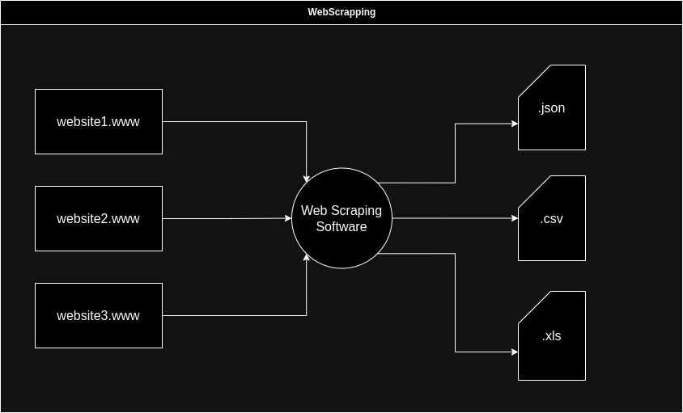

# Аналіз предметної області

## Вступ

 ***У цьому документі відображені усі основні та важливі відомості аналізу предметної області даного проекту.***

 Аналіз предметної області містить наступні розділи:
 - [Основні визначення](#основні-визначення)
 - [Підходи та способи вирішення завдання](#підходи-та-способи-вирішення-завдання)
 - [Порівняльна характеристика існуючих засобів вирішення завдання](#підходи-та-способи-вирішення-завдання)
 - [Висновки](#висновки)
 - [Посилання](#посилання)

## Основні визначення

[Відкриті дані (англ. Open data)](https://leadscanner.com.ua/articles/open-data) - концепція, яка відображає ідею про те, що певні дані повинні бути вільно доступні для машиночитаемого використання і подальшої передруку без обмежень авторського права, патентів та інших механізмів контролю. Звільнити дані від обмежень авторського права можна за допомогою вільних ліцензій, таких як ліцензій Creative Commons. Якщо який-небудь набір даних не є суспільним надбанням, або не пов'язаний ліцензією, що дає права на вільне повторне використання, то такий набір даних не вважається відкритим, навіть якщо він викладений в машиночитаемом вигляді в Інтернет.

[Система управління базами даних (або СУБД)](https://www.ibm.com/docs/en/zos-basic-skills?topic=zos-what-is-database-management-system) - це, по суті, не що інше, як комп'ютеризована система зберігання даних. Користувачам системи надаються sзасоби для виконання декількох видів операцій над такою системою для маніпулювання даними в базі даних або для управління самою структурою бази даних. Системи керування базами даних (СУБД) класифікуються відповідно до їхніх структур або типів даних.

## Підходи та способи вирішення завдання

Управління відкритими даними є важливим завданням, яке можна реалізувати різними способами. У цьому розділі ми розглянемо основні підходи та моделі, які можуть бути використані для розробки системи управління відкритими даними.

### Підходи до збору даних

**Краудсорсинг (англ. Crowdsourcing)** - це підхід у галузі відкритих даних, який передбачає залучення великої кількості людей, або волонтерів, які за власною згодою збирають масиви даних для проекту, оновлюють дані та підтримують якість самих даних у системі управління відкритих даних.

Основні плюси даного підходу:

1. Масштабність: Crowdsourcing дозволяє залучити велику кількість учасників, що допомагає збирати та оновлювати великі обсяги даних.

2. Розмаїтість даних: Учасники можуть мати різні спектри інтересів, що дозволяє розширювати розмах даних та їх різноманітність.

3. Ефективність витрат ресурсів: Сrowdsourcing може бути більш ефективним і економічним способом збору та обробки даних чим інші традиційні способи.

4. Гнучкість: Завдяки гнучкості, crowdsourcing може бути використаний для різних завдань, включаючи створення, валідацію та оновлення даних.

Основні мінуси даного підходу:

1. Якість і точність даних: Учасники можуть бути незаздалегідь неспеціалістами, що може призвести до низької якості та неточності зібраних даних. Потрібна велика увага до валідації та перевірки інформації.

2. Контроль і координація: Керування та координація великої кількості учасників може бути складним завданням. Для забезпечення стабільності потрібно ефективне управління та нагляд.

3. Конфіденційність даних: Залучення широкої громадськості може призвести до ризику порушення конфіденційності особистих чи чутливих даних, якщо не буде вжито відповідних заходів безпеки.

4. Часові рамки і затримки: Реалізація проекту, що використовує crowdsourcing, може займати більше часу через необхідність обробки та перевірки великої кількості даних.

Прикладами використання crowdsourcing є проекти, де громадськість допомагає розпізнавати текст на зображеннях (OCR), маркувати географічні об'єкти на картах, аналізувати дані для наукових досліджень, та багато інших. У контексті управління відкритими даними, crowdsourcing може бути корисним для поповнення та підтримки наборів даних, щоб забезпечити актуальність та точність інформації.

**Веб-скрапінг (англ. Web scraping)** - це модель автоматичного отримання даних з веб-сайтів. Він полягає в тому, щоб програмно витягти інформацію з веб-сторінок, які доступні публічно, і перетворити її у структуровані дані, які можна аналізувати та використовувати для різних цілей. Web scraping дозволяє автоматизувати процес збору даних з Інтернету і зазвичай використовується для таких завдань, як аналіз ринку, моніторинг цін, збір новин або побудова баз даних.

Основні плюси даного підходу:

1. Доступність даних: Можливість отримувати інформацію з різних веб-сайтів і джерел, навіть якщо вона не надається у вигляді відкритих даних.

2. Автоматизація: Веб-скрапінг дозволяє пришвидшити процес збору даних, що позволяє значно зекономити час і ресурси. Завдяки скриптам можливо перевіряти веб-сайти на нові дані та оновлювати нашу базу даних.

3. Широкий спектр даних: Веб-скрапінг може збирати різноманітні дані, такі як текст, зображення, відео, ціни на товари, новини, оголошення і багато іншого. Це визначає веб-скрапінг корисним для різних спектрів даних.

Основні мінуси даного підходу:

1. Юридичні обмеження: Веб-скрапінг може порушувати авторські права та правила веб-сайтів. Деякі власники веб-сайтів можуть встановлювати обмеження щодо скрапінгу через правила використання сайту. Ігнорування цих обмежень може призвести до юридичних наслідків.

2. Нестабільність структури сайту: Веб-скрапінг дуже вразливий до змін у структурі веб-сайту. Якщо власник сайту змінює розміщення або маркування даних, це може призвести до потреби постійного оновлення скриптів.

3. Вимоги до обладнання і ресурсів: Великі обсяги даних або інтенсивний веб-скрапінг може вимагати значних обчислювальних ресурсів і пропускної здатності мережі. Це може призвести до високих витрат на обладнання та хостинг.

### Моделі зберігання даних

**База даних (англ. Database)** - це модель зберігання даних у вигляді структурованих колекцій даних, яка зберігається на носіях даних та доступна через сервер системи, може використовуватися для ефективного пошуку, оновлення та аналізу. Також існують різні види баз даних, тому треба звертати фокусуватися на їх особливостях:

1. NoSQL бази даних: NoSQL бази даних, такі як MongoDB, Cassandra, Redis, Couchbase тощо, використовуються у випадку дані не мають чіткої структури та якщо не потрібна гнучкість у роботі з даними.

2. Реляційні бази даних (англ. RDBMS): Реляційні бази даних, такі як MySQL, PostgreSQL, SQLite, Microsoft SQL Server тощо, зазвичай використовуються якщо дані мають чітку структуру та існують зв'язки між ними, через яких можна виконувати складні запити.

3. Гібридні бази даних: У деяких проектах може бути вигідно використовувати гібридний підхід, коли комбінуются як реляційні, так і NoSQL бази даних в залежності від конкретних завдань та типу даних.

**Хмарні зберігальні системи (англ. Cloud Storage Systems)** - це модель зберігання даних, які надаються через інтернет на базі хмарних технологій. Замість того, щоб зберігати дані локально на власних фізичних серверах або пристроях, проект або його користувачі можуть завантажувати дані за допомогою хмарних серверів, які незалежні від серверу проекту.

Основні плюси даного підходу:

1. Масштабованість: Хмарні зберігальні системи можуть масштабуватися в залежності від потреб системи, не витрачаючи часу на розширення обсягу даних фізично.

2. Резервне копіювання та відновлення: Багато хмарних зберігальних систем автоматично створюють резервні копії даних, що дозволяє відновити дані у випадку втрати або пошкодження на фізичних носіях баз даних системи.

3. Доступність: Дані можна отримати з будь-якого місця, де є доступ до Інтернету. Користувач може отримати доступ до відкритих даних з різних пристроїв (комп'ютери, смартфони, планшети) і навіть спільно користуватися ними з іншими користувачами.

Основні мінуси даного підходу:

1. Залежність: Хмарні зберігальні системи можуть впливати на веб-проекти, які користуються їх послугами через власну політику щодо даних які зберігається. Це ставить веб-проект в стан залежного від хмарних технологій, які дозволяють зберігати дані на власних серверах.

Прикладами популярних хмарних зберігальних систем є Google Drive, Dropbox, Microsoft OneDrive, і багато інших. Вони надають користувачам можливість зберігати, керувати та обмінюватися файлами та даними через хмарний інтерфейс, що робить доступ до інформації більш зручним і гнучким.

### Аналіз та обробка даних

**Машинне навчання (англ. Machine learning)** - це модель автоматичного аналізу та обробки даних завдяки використанню існуючих математичних моделей. Машинне навчання дозволяє знаходити тренди у даних та створювати прогнози на основі отриманих даних, а також виявлення аномалій і покращення рішень які вже використовуються системою.

Машинне навчання має дані особливості:

1. Асоціативні правила - метод машинного навчання дозволяє виявляти закономірності та взаємозв'язки між даними на основі правил.

2. Класифікація - метод машинного навчання який використовується для призначення кожного об'єкту до одного з попередньо визначених класів або категорій на основі аналізу даного об'єкту.

3. Кластеризація - метод, який розбиває вибірки даних на підмножини, які називаються кластерами, так, щоб кожен кластер складавсі зі схожих об'єктів, а об'єкти різних кластерів істотно відрізнялися.

4. Регресія - використовується у випадках коли потрібно за заданим набором ознак спрогнозувати майбутню змінну. Завдання регресії передбачення місця на числовій прямій.

5. Визначення тренду - на основі даних формує загальне передбачення зміни змінних.

6. Виявлення аномалій - машинне навчання дозволяє виявляти та визначати аномалії у структурі даних та у її вибірці.

Для аналізу даних людиною, зазвичай потрібна візуалізація тих самих даних. Тому для цього існує багато методів візуалізації даних, які допомагають представити інформацію у вигляді графічних зображень, щоб спростити розуміння та аналіз даних. **Ось деякі з найпоширеніших методів візуалізації даних:**

1. Графіки та діаграми:

* Лінійні графіки: Використовуються для відображення зміни значень одного або кількох параметрів з часом.
* Стовпчикові графіки: Допомагають порівнювати значення різних категорій або об'єктів.
* Кругові діаграми: Використовуються для відображення часток у відсотках від загальної суми.

2. Графіки розсіювання (англ. Scatter Plots): Використовуються для візуалізації відношень між двома числовими параметрами. Дозволяють виявляти кореляції та викиди даних.

3. Теплові карти (англ. Heatmaps): Показують інтенсивність значень в матриці даних за допомогою кольорів. Це корисний метод для виявлення шаблонів та аномалій у великих наборах даних.

4. Дерева прийняття рішень (англ. Decision Trees): Використовуються для відображення процесу прийняття рішень у вигляді дерева з рішеннями та розділеннями, що базуються на значеннях атрибутів.

5. Картографічні візуалізації: Використовуються для представлення географічних даних на картах. До прикладів належать карти розташування точок і графіки з використанням геоданих.

6. 3D-візуалізація: Використовується для представлення тривимірних даних у тривимірному просторі для аналізу об'єктів з трьох вимірів.

7. Анімація: Використовується для відстеження змін у даних з часом та надає можливість переглядати еволюцію даних.

8. Графіки мереж (англ. Network Graphs): Використовуються для візуалізації складних мереж, таких як соціальні мережі, графи залежностей тощо.

9. Графіки дерев (англ. Tree Diagrams): Допомагають візуалізувати ієрархічну структуру даних, таку як організаційні структури.

### Забезпечення доступу та конфіденційності

**Ролева модель доступу (англ. Role-Based Access Control, RBAC)** - це система контролю доступу, яка базується на призначенні користувачам ролей та наданні прав доступу до ресурсів на основі цих ролей. В контексті системи управління відкритими даними, RBAC може бути важливим компонентом для забезпечення безпеки та керування доступом до різних функціональних можливостей та даних системи.

Основні компоненти ролевої моделі доступу включають:

1. Ролі (англ. Roles): Ролі - це набори прав доступу, які групують користувачів зі схожими функціональними обов'язками або рівнями доступу. Прикладами ролей можуть бути "адміністратор", "редактор", "гість" тощо.

2. Права доступу (англ. Permissions): Права доступу визначають, які дії користувачів дозволено виконувати щодо конкретних ресурсів (наприклад, перегляд, редагування, видалення даних). Кожна роль має набір прав доступу.

3. Користувачі (англ. Users): Користувачі системи прив'язуються до однієї чи декількох ролей. Кожен користувач має можливість виконувати дії, які дозволені його або її ролю.

4. Сесії (англ. Sessions): Сесії відстежують активність користувачів у системі та контролюють їх автентифікацію та авторизацію.

5. Управління ролями англ. (англ. Role Management): Адміністратор системи відповідає за призначення ролей користувачам, зміну наборів прав доступу та визначення, які користувачі мають доступ до конкретних ресурсів.

6. Логування та аудит (англ. Logging and Auditing): Система може вести журнали подій, щоб відстежувати, які користувачі виконують певні дії та змінюють дані, це допомагає виявляти можливі аномалії та порушення безпеки.

7. Внутрішні інтерфейси та API (англ. Internal Interfaces and APIs): Для реалізації RBAC можуть бути використані спеціальні програмні інтерфейси та API, які дозволяють розробникам легко ідентифікувати ролі користувачів та правила доступу до ресурсів.

Ролева модель доступу спрощує керування безпекою і доступом до даних, дозволяючи адміністраторам системи ефективно контролювати, які користувачі мають доступ до певних ресурсів і операцій, що вони можуть виконувати. Вона також допомагає уникнути надмірної складності в управлінні окремими правами для кожного користувача, спрощуючи процес адміністрування системи.

## Порівняльна характеристика існуючих засобів вирішення завдання

*[Розділ містить опис існуючих програм, інформаційних систем, сервісів, тощо, призначених для вирішення 
завдання. Дається порівняльна характеристика властивостей FURPS:*
- *Functionality (функциональні вимоги)*
- *Usability (вимоги до зручності роботи)*
- *Reliability (вимоги до надійності)*
- *Performance (вимоги до продуктивності)*
- *Supportability (вимоги до підтримки)*

 *(у вигляді таблиці).]*

## Висновки

*[Робляться висновки щодо доцільності розробки нової або модифікації існуючої інформаційної системи, необхідності та способів інтеграції з системами(сервісами) третіх сторін, тощо.]*

## Посилання

1. [Відкриті дані](https://leadscanner.com.ua/articles/open-data)
2. [Система управління базами даних](https://www.ibm.com/docs/en/zos-basic-skills?topic=zos-what-is-database-management-system)

*[Розділ містить повний список всіх документів, про які згадується.]*
