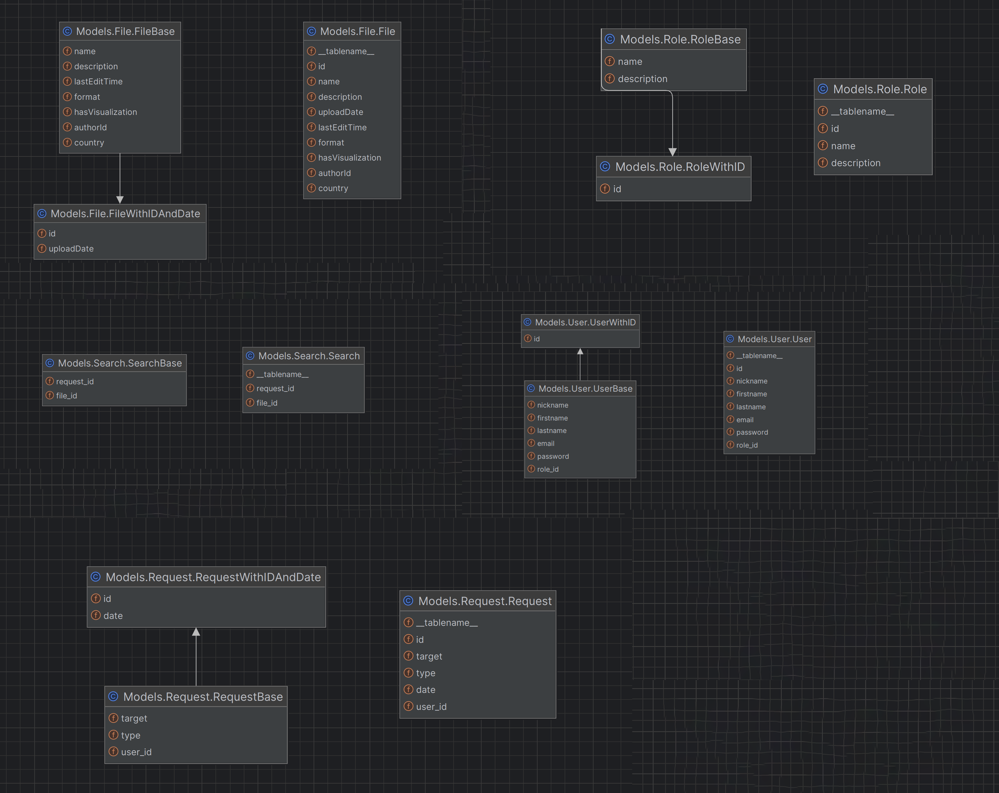

# Реалізація інформаційного та програмного забезпечення

## SQL-скрипт для створення на початкового наповнення бази даних

```sql

    -- MySQL Workbench Forward Engineering
    
    SET @OLD_UNIQUE_CHECKS=@@UNIQUE_CHECKS, UNIQUE_CHECKS=0;
    SET @OLD_FOREIGN_KEY_CHECKS=@@FOREIGN_KEY_CHECKS, FOREIGN_KEY_CHECKS=0;
    SET @OLD_SQL_MODE=@@SQL_MODE, SQL_MODE='TRADITIONAL,ALLOW_INVALID_DATES';
    
    -- -----------------------------------------------------
    -- Schema MyDB
    -- -----------------------------------------------------
    DROP SCHEMA IF EXISTS `MyDB` ;
    
    -- -----------------------------------------------------
    -- Schema MyDB
    -- -----------------------------------------------------
    CREATE SCHEMA IF NOT EXISTS `MyDB` ;
    USE `MyDB` ;
    
    -- -----------------------------------------------------
    -- Table `MyDB`.`file`
    -- -----------------------------------------------------
    DROP TABLE IF EXISTS `MyDB`.`file` ;
    
    CREATE TABLE IF NOT EXISTS `MyDB`.`file` (
      `id` INT NOT NULL,
      `name` VARCHAR(255) NOT NULL,
      `description` VARCHAR(255) NULL,
      `uploadDate` DATETIME NOT NULL,
      `lastEditTime` DATETIME NOT NULL,
      `format` VARCHAR(45) NOT NULL,
      `hasVisualization` TINYINT(1) NOT NULL,
      `authorId` INT NOT NULL,
      `country` VARCHAR(45) NOT NULL,
      PRIMARY KEY (`id`))
    ENGINE = InnoDB
    DEFAULT CHARACTER SET = utf8;
    
    
    -- -----------------------------------------------------
    -- Table `MyDB`.`role`
    -- -----------------------------------------------------
    DROP TABLE IF EXISTS `MyDB`.`role` ;
    
    CREATE TABLE IF NOT EXISTS `MyDB`.`role` (
      `id` INT UNSIGNED NOT NULL,
      `name` VARCHAR(45) NOT NULL,
      `description` VARCHAR(255) NULL,
      PRIMARY KEY (`id`),
      FULLTEXT INDEX `idx_title_description` (`name`, `description`))
    ENGINE = InnoDB;
    
    
    -- -----------------------------------------------------
    -- Table `MyDB`.`user`
    -- -----------------------------------------------------
    DROP TABLE IF EXISTS `MyDB`.`user` ;
    
    CREATE TABLE IF NOT EXISTS `MyDB`.`user` (
      `id` INT NOT NULL,
      `nickname` VARCHAR(45) NOT NULL,
      `firstname` VARCHAR(45) NOT NULL,
      `lastname` VARCHAR(45) NULL,
      `email` VARCHAR(255) NOT NULL,
      `password` VARCHAR(255) NOT NULL,
      `role_id` INT UNSIGNED NOT NULL,
      PRIMARY KEY (`id`),
      INDEX `fk_user_role1_idx` (`role_id` ASC),
      CONSTRAINT `fk_user_role1`
        FOREIGN KEY (`role_id`)
        REFERENCES `MyDB`.`role` (`id`)
        ON DELETE NO ACTION
        ON UPDATE NO ACTION)
    ENGINE = InnoDB
    DEFAULT CHARACTER SET = utf8;
    
    
    -- -----------------------------------------------------
    -- Table `MyDB`.`request`
    -- -----------------------------------------------------
    DROP TABLE IF EXISTS `MyDB`.`request` ;
    
    CREATE TABLE IF NOT EXISTS `MyDB`.`request` (
      `id` INT UNSIGNED NOT NULL AUTO_INCREMENT,
      `target` VARCHAR(255) NOT NULL,
      `type` VARCHAR(45) NOT NULL,
      `date` DATETIME NOT NULL,
      `user_id` INT NOT NULL,
      PRIMARY KEY (`id`),
      INDEX `fk_request_user1_idx` (`user_id` ASC),
      CONSTRAINT `fk_request_user1`
        FOREIGN KEY (`user_id`)
        REFERENCES `MyDB`.`user` (`id`)
        ON DELETE NO ACTION
        ON UPDATE NO ACTION)
    ENGINE = InnoDB
    DEFAULT CHARACTER SET = utf8;
    
    
    -- -----------------------------------------------------
    -- Table `MyDB`.`right`
    -- -----------------------------------------------------
    DROP TABLE IF EXISTS `MyDB`.`right` ;
    
    CREATE TABLE IF NOT EXISTS `MyDB`.`right` (
      `id` INT UNSIGNED NOT NULL,
      `name` VARCHAR(255) NOT NULL,
      PRIMARY KEY (`id`))
    ENGINE = InnoDB
    DEFAULT CHARACTER SET = utf8;
    
    
    -- -----------------------------------------------------
    -- Table `MyDB`.`filter`
    -- -----------------------------------------------------
    DROP TABLE IF EXISTS `MyDB`.`filter` ;
    
    CREATE TABLE IF NOT EXISTS `MyDB`.`filter` (
      `id` INT NOT NULL,
      `keyword` VARCHAR(255) NULL,
      `country` VARCHAR(45) NULL,
      `format` VARCHAR(45) NULL,
      `request_id` INT UNSIGNED NOT NULL,
      PRIMARY KEY (`id`),
      INDEX `fk_filter_request1_idx` (`request_id` ASC),
      CONSTRAINT `fk_filter_request1`
        FOREIGN KEY (`request_id`)
        REFERENCES `MyDB`.`request` (`id`)
        ON DELETE NO ACTION
        ON UPDATE NO ACTION)
    ENGINE = InnoDB
    DEFAULT CHARACTER SET = utf8;
    
    
    -- -----------------------------------------------------
    -- Table `MyDB`.`search`
    -- -----------------------------------------------------
    DROP TABLE IF EXISTS `MyDB`.`search` ;
    
    CREATE TABLE IF NOT EXISTS `MyDB`.`search` (
      `request_id` INT UNSIGNED NOT NULL,
      `file_id` INT NOT NULL,
      PRIMARY KEY (`request_id`, `file_id`),
      INDEX `fk_search_file1_idx` (`file_id` ASC),
      CONSTRAINT `fk_search_request1`
        FOREIGN KEY (`request_id`)
        REFERENCES `MyDB`.`request` (`id`)
        ON DELETE NO ACTION
        ON UPDATE NO ACTION,
      CONSTRAINT `fk_search_file1`
        FOREIGN KEY (`file_id`)
        REFERENCES `MyDB`.`file` (`id`)
        ON DELETE NO ACTION
        ON UPDATE NO ACTION)
    ENGINE = InnoDB
    DEFAULT CHARACTER SET = utf8;
    
    
    -- -----------------------------------------------------
    -- Table `MyDB`.`permission`
    -- -----------------------------------------------------
    DROP TABLE IF EXISTS `MyDB`.`permission` ;
    
    CREATE TABLE IF NOT EXISTS `MyDB`.`permission` (
      `id` INT UNSIGNED NOT NULL,
      `name` VARCHAR(255) NOT NULL,
      `right_id` INT UNSIGNED NOT NULL,
      PRIMARY KEY (`id`),
      INDEX `fk_permission_right1_idx` (`right_id` ASC),
      CONSTRAINT `fk_permission_right1`
        FOREIGN KEY (`right_id`)
        REFERENCES `MyDB`.`right` (`id`)
        ON DELETE NO ACTION
        ON UPDATE NO ACTION)
    ENGINE = InnoDB
    DEFAULT CHARACTER SET = utf8;
    
    
    -- -----------------------------------------------------
    -- Table `MyDB`.`grant`
    -- -----------------------------------------------------
    DROP TABLE IF EXISTS `MyDB`.`grant` ;
    
    CREATE TABLE IF NOT EXISTS `MyDB`.`grant` (
      `right_id` INT UNSIGNED NOT NULL,
      `role_id` INT UNSIGNED NOT NULL,
      PRIMARY KEY (`right_id`, `role_id`),
      INDEX `fk_grant_role1_idx` (`role_id` ASC),
      CONSTRAINT `fk_grant_right1`
        FOREIGN KEY (`right_id`)
        REFERENCES `MyDB`.`right` (`id`)
        ON DELETE NO ACTION
        ON UPDATE NO ACTION,
      CONSTRAINT `fk_grant_role1`
        FOREIGN KEY (`role_id`)
        REFERENCES `MyDB`.`role` (`id`)
        ON DELETE NO ACTION
        ON UPDATE NO ACTION)
    ENGINE = InnoDB
    DEFAULT CHARACTER SET = utf8;
    
    
    -- -----------------------------------------------------
    -- Table `MyDB`.`access`
    -- -----------------------------------------------------
    DROP TABLE IF EXISTS `MyDB`.`access` ;
    
    CREATE TABLE IF NOT EXISTS `MyDB`.`access` (
      `role_id` INT UNSIGNED NOT NULL,
      `file_id` INT NOT NULL,
      PRIMARY KEY (`role_id`, `file_id`),
      INDEX `fk_access_file1_idx` (`file_id` ASC),
      CONSTRAINT `fk_access_role1`
        FOREIGN KEY (`role_id`)
        REFERENCES `MyDB`.`role` (`id`)
        ON DELETE NO ACTION
        ON UPDATE NO ACTION,
      CONSTRAINT `fk_access_file1`
        FOREIGN KEY (`file_id`)
        REFERENCES `MyDB`.`file` (`id`)
        ON DELETE NO ACTION
        ON UPDATE NO ACTION)
    ENGINE = InnoDB
    DEFAULT CHARACTER SET = utf8;
    
    
    SET SQL_MODE=@OLD_SQL_MODE;
    SET FOREIGN_KEY_CHECKS=@OLD_FOREIGN_KEY_CHECKS;
    SET UNIQUE_CHECKS=@OLD_UNIQUE_CHECKS;


```

## RESTfull сервіс для управління даними(Python, FastAPI, sqlalchemy)
RESTfull сервіс створено на мові програмування Pyhon, використовуючи модули FastAPI та sqlalchemy.
Даний сервіс створено за моделю MVC (Model-View-Controller), з його допомогою розробник може легко взаємодіяти
з базою даних, уникаючи використання SQL-скриптів самотужки.

## Діаграма класів
<p>
    
</p>


### Моделі

#### File
```python
from Environment.database import Base
from pydantic import BaseModel, Field
from sqlalchemy import Column, Integer, String, DateTime, Boolean, func
import datetime


class File(Base):
    __tablename__ = 'file'

    id = Column(Integer, primary_key=True, index=True, autoincrement=True)
    name = Column(String(255))
    description = Column(String(255), nullable=True)
    uploadDate = Column(DateTime, default=func.now())
    lastEditTime = Column(DateTime, default=func.now())
    format = Column(String(45))
    hasVisualization = Column(Boolean)
    authorId = Column(Integer)
    country = Column(String(45))


class FileBase(BaseModel):
    name: str
    description: str
    lastEditTime: datetime.datetime
    format: str
    hasVisualization: bool
    authorId: int
    country: str

class FileWithIDAndDate(FileBase):
    id: int
    uploadDate: datetime.datetime

    class Config:
        from_attributes = True


```
