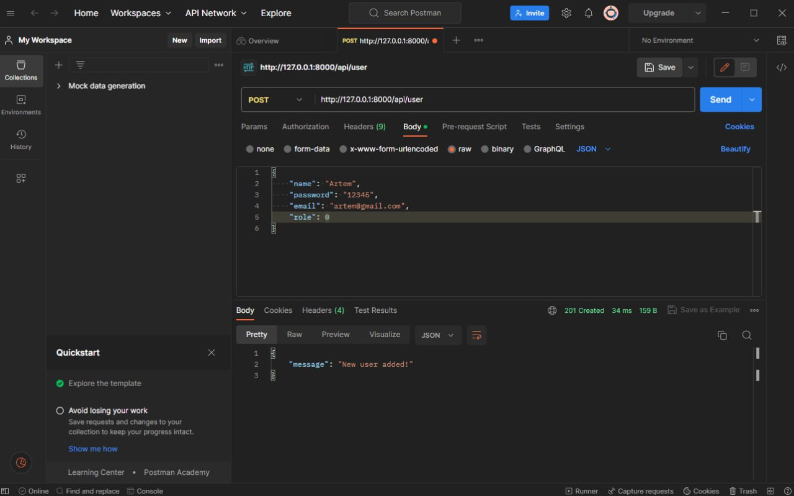
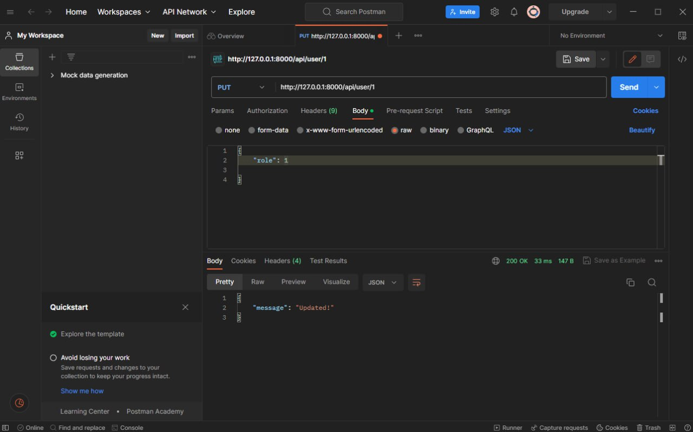
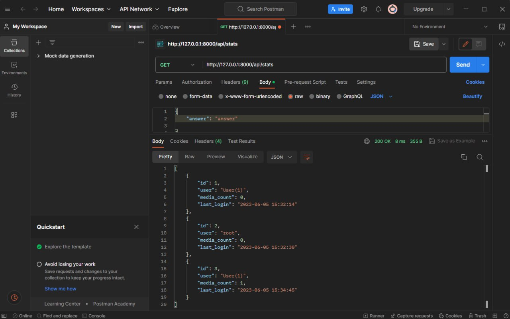
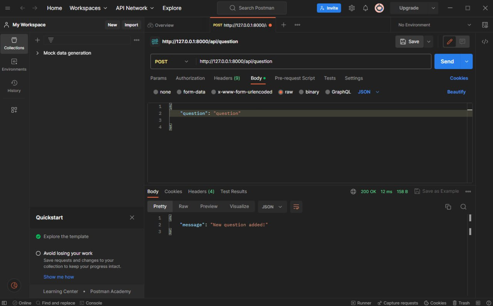
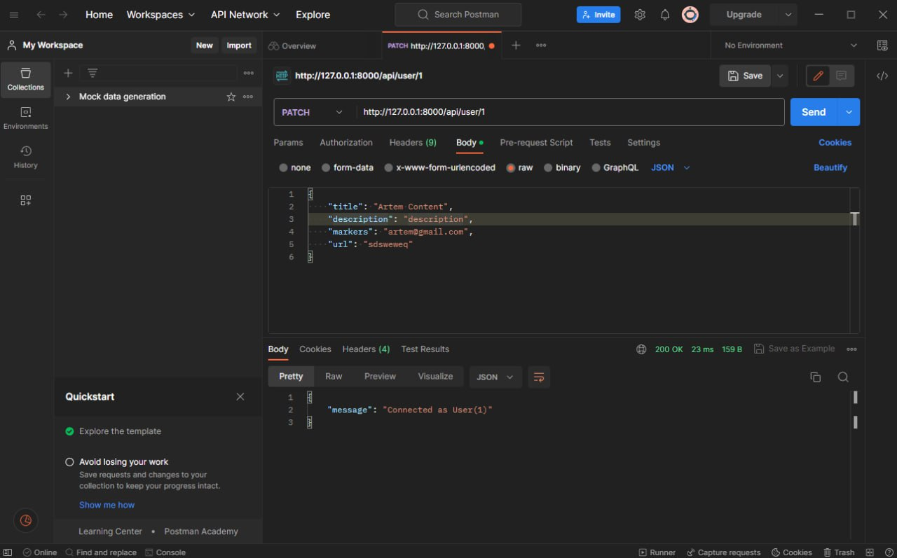
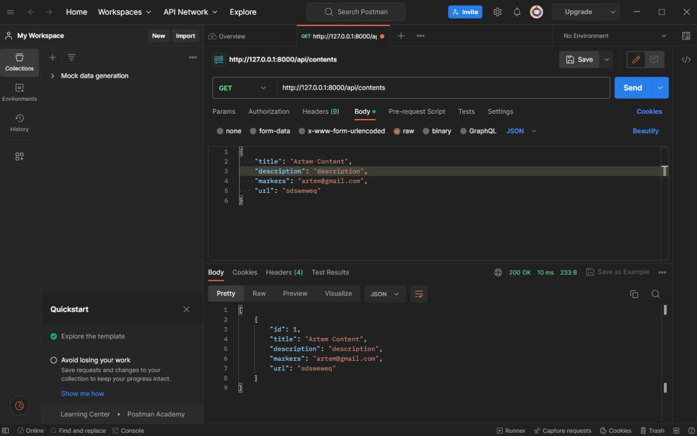

# Тестування працездатності системи

## Додати нове джерело

## Надати прав

## Отримати статистику

## Звернутись до адміністратора

## Авторизація

## Пошук даних

## Створення нового облікового запису

