# Тестування працездатності системи

*В цьому розділі необхідно вказати засоби тестування, навести вихідні коди тестів та результати тестування.*
## 1.Список всіх юзерів
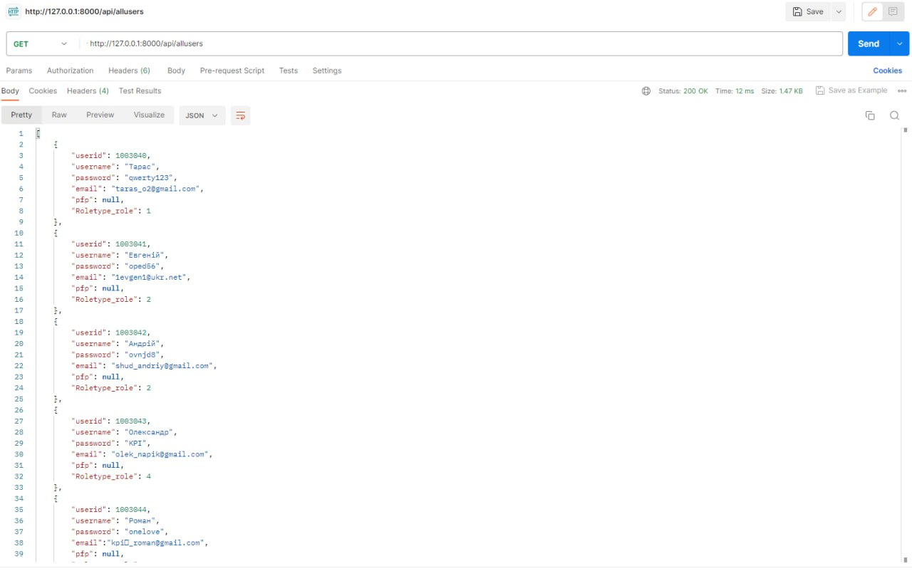

## 2.1 Додавання нового юзера (POST)
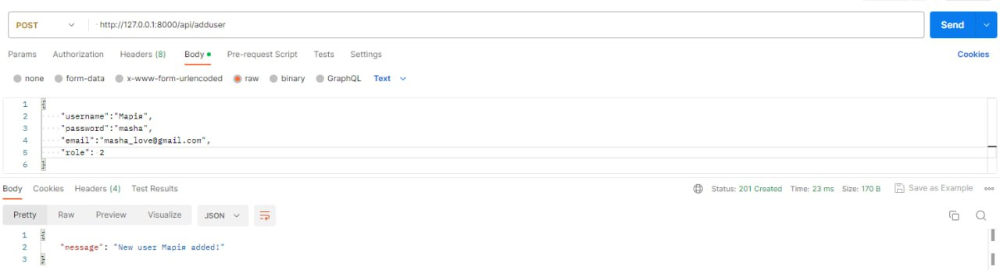

## 2.2 Додавання нового адміну (POST)
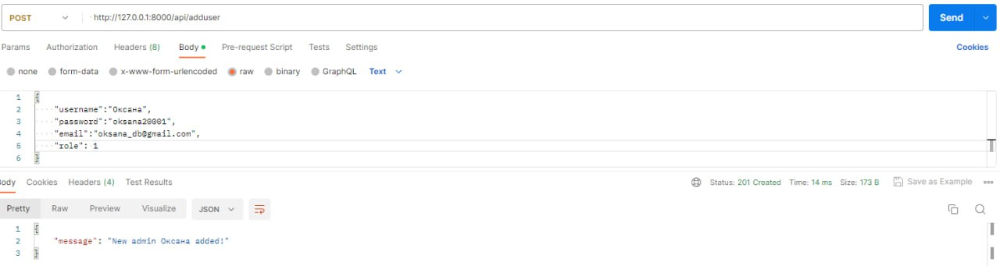

## 2.3 Перевірка додавань (POST)
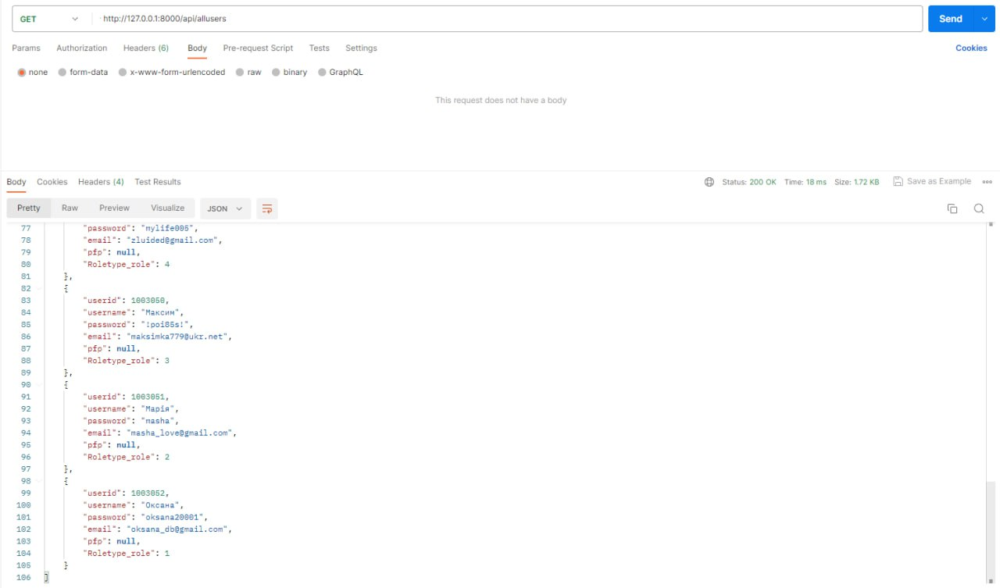

## 2.4 Передача не всіх потрібних данних (POST)
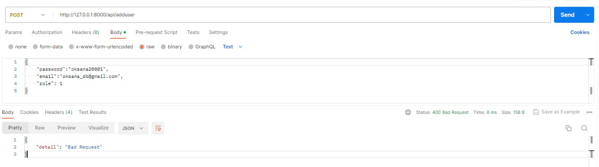

## 3.1 Пошук юзеру по id (GET)
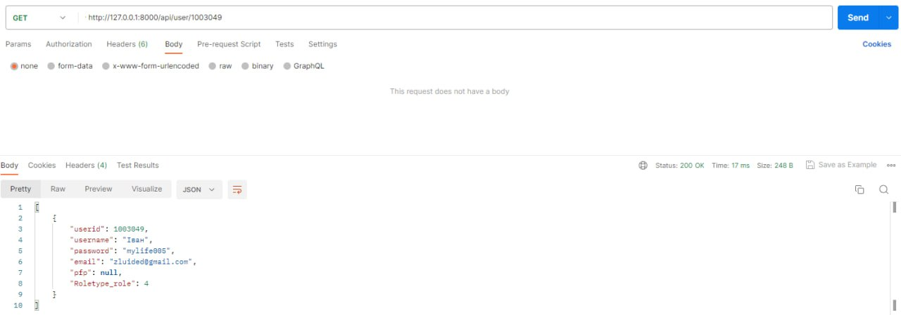

## 3.2 Пошук неіснуючого юзеру по id (GET)

## 4.1 Оновлення аккаунта (PUT)
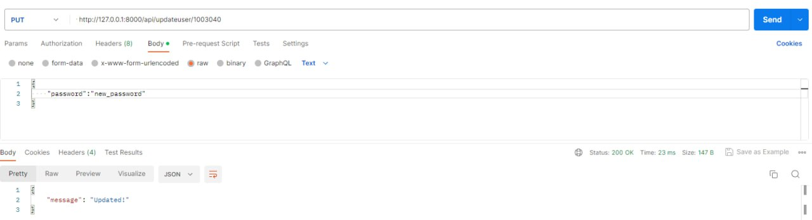

## 4.2 Перевірка оновлення аккаунта (PUT)
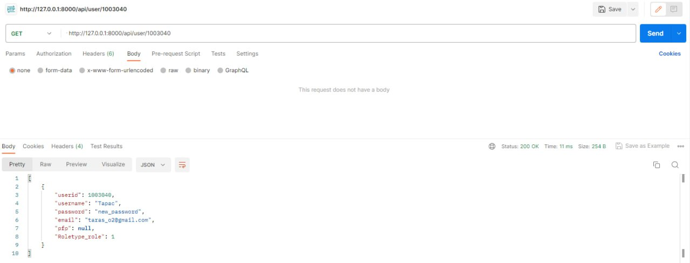

## 4.3 Спроба змінити неіснуючий аккаунт (PUT)
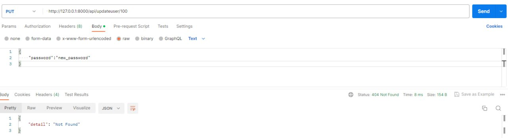

## 5.1 Видалення юзера (DELETE)
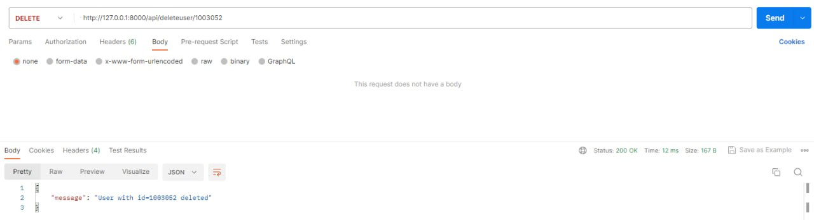

## 5.2 Перевірка видалення (DELETE)
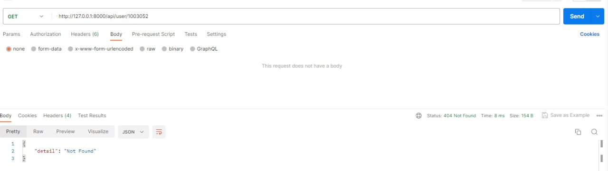

## 5.3 Спроба видалити неіснуючий аккаунт (DELETE)
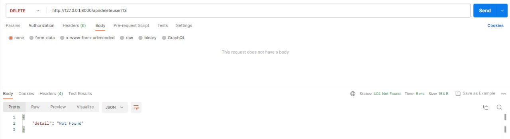