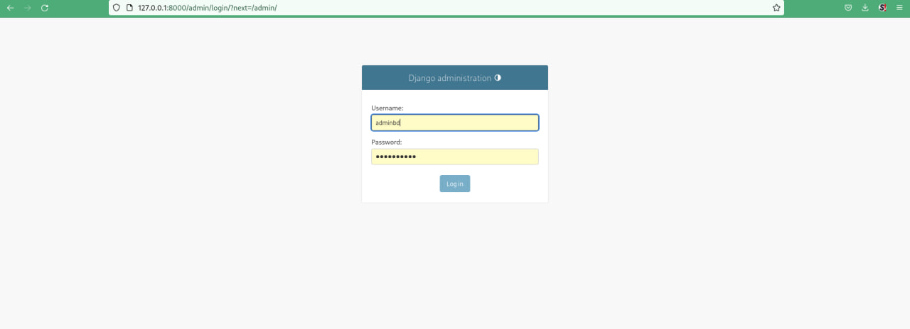

# Тестування працездатності системи

## Запуск сервера через консоль

## Тестування Rest API

Реєстрація нового користувача на сервісі

Вхід користувача до системи

Вхідний JSON для обробки запиту на порівняння та аналіз тексту (два згенеровані тексти, але частина одного тексту скопійована в інший) 

Запит на порівняння текстів з поверненою відповіддю (при запиті в вкладці "Authorization" перевіряється токен який засвідчує що системую користується зареєстрований користувач)

Приклад вихідного JSON (відповідь по запиту повернена системою)

Виконання запиту без відповідного токену (Система відмовила і повернула відповідний JSON)

## Реалізація панелі адміністратора

Авторизація на адміністративний сайт (сайт для адміністратору)

Інтерфейс адмін-панелі

Списки текстів (додані для тестування системи)

Список Юзерів, додані тестово

