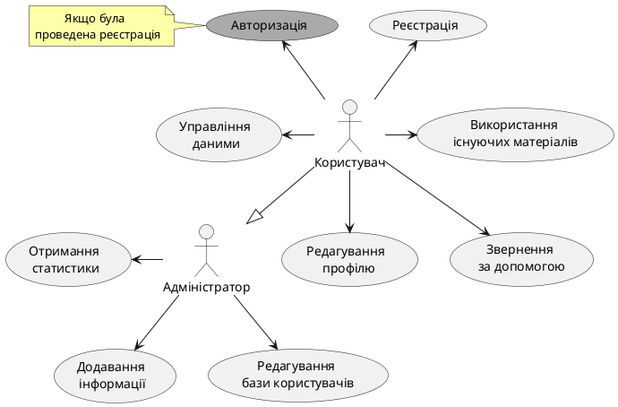
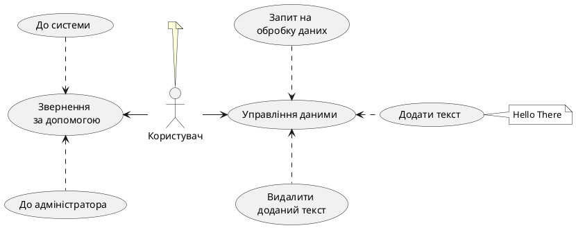
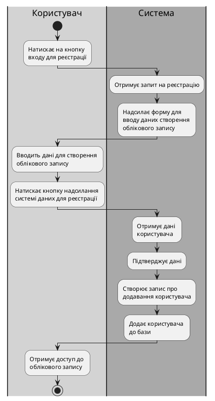

# Модель прецедентів

## Загальна діаграма

Основні можливості з груп користувачів (Діаграма №1)

Можливості користувача (Діаграма №2)

<!-- 
note right #ffaaaa
    <b> user.reg_err1
end note -->
