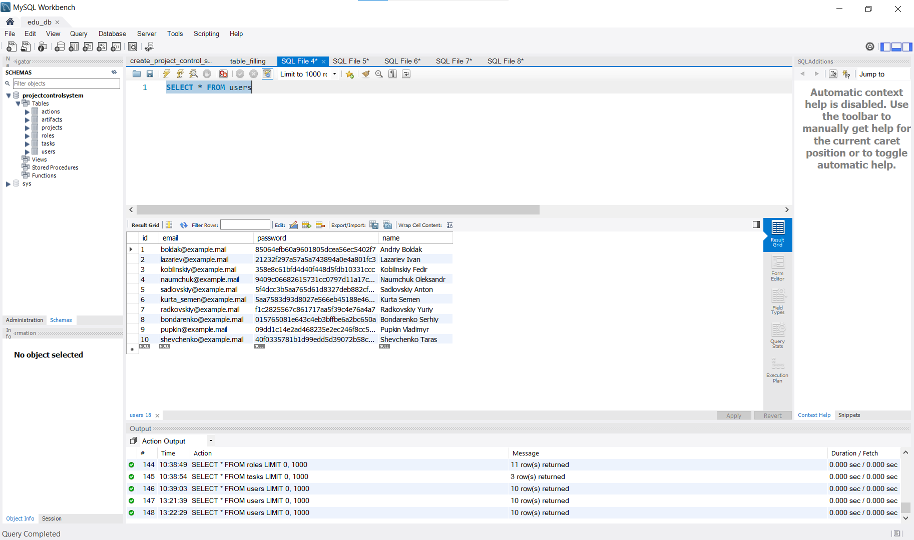
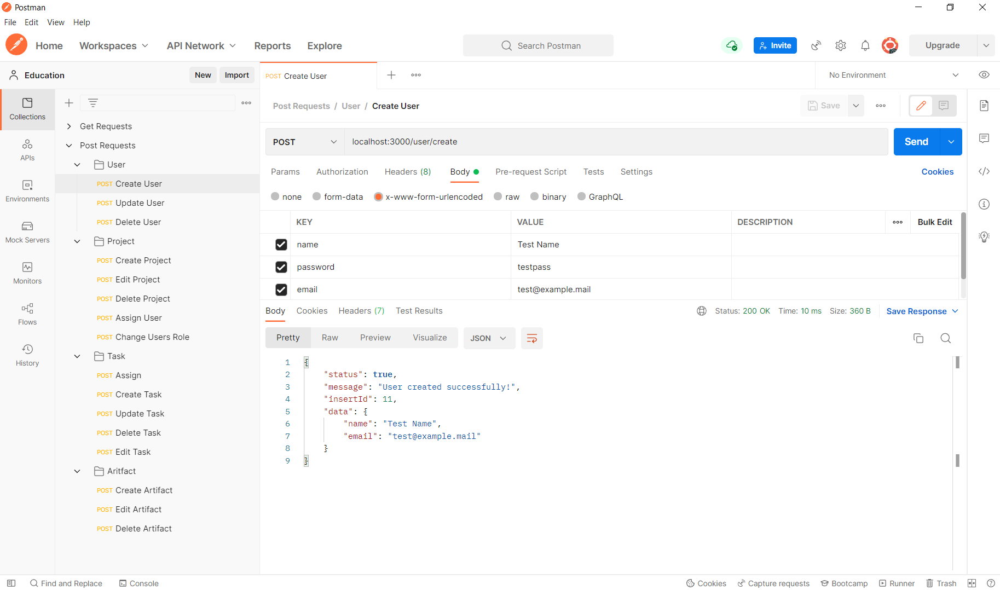
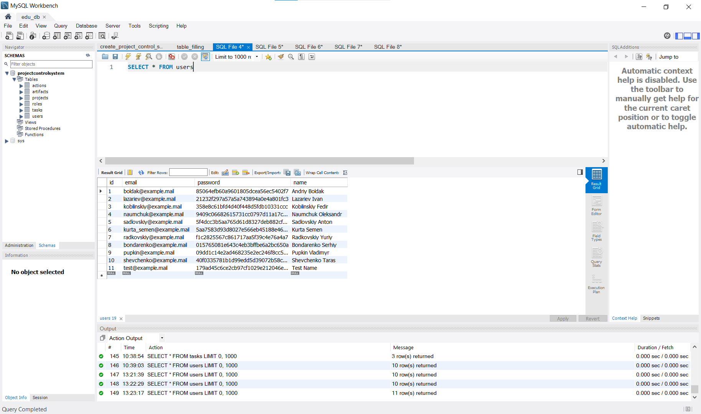
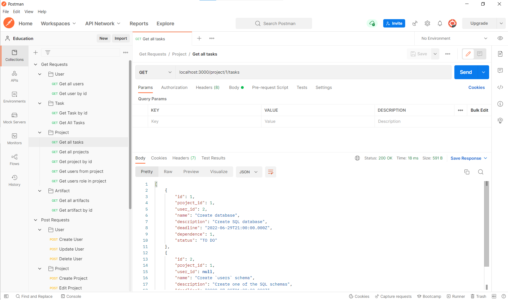
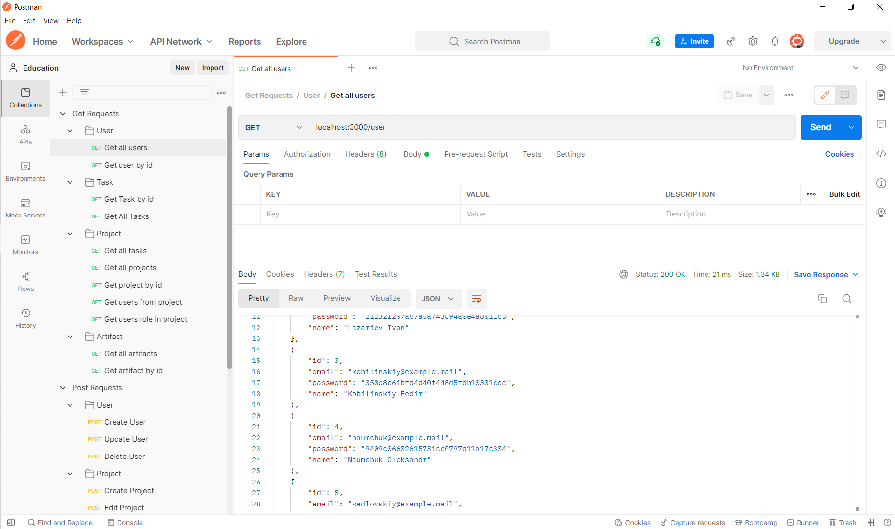

# Тестування RESTful API

## Ремарка

**Тести, які можна побачити тут - лише частина для демонстрації того, що API працює**
Для перевірки інших запросів, потрібно розгорнути версію локально та тестувати за допомогою сервісу для тестування API.
Під час виконання роботи для тестування був застосований сервіс *Postman*

## Скріншоти виконання
#### Додавання користувача
База даних до виконання запросу

Результат виконання

База даних після виконання запросу

#### Знаходження усіх завдань в проекті
Результат виконання

#### Знаходження усіх користувачів
Результат виконання

#### Інші скріншоти
**Інші наявні скріншоти можна знайти у папці docs/pictures/tests. Для зручності використання, усі вони не були додані на сторінку.**
Для повного тестування запрошуємо на зв'язок.
